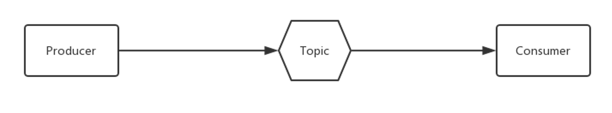

# 初识RocketMQ

我们平时使用一些体育新闻软件，会订阅自己喜欢的一些球队板块，当有作者发表文章到相关的板块，我们就能收到相关的新闻推送。

发布-订阅（Pub/Sub）是一种消息范式，消息的发送者（称为发布者、生产者、Producer）会将消息直接发送给特定的接收者（称为订阅者、消费者、Comsumer）。而RocketMQ的基础消息模型就是一个简单的Pub/Sub模型。

import Tabs from '@theme/Tabs';

import TabItem from '@theme/TabItem';

:::tip 相关概念

<Tabs>
  <TabItem value="生产者" label="生产者" default>
   负责生产消息，一般由业务系统负责生产消息。一个消息生产者会把业务应用系统里产生的消息发送到broker服务器。RocketMQ提供多种发送方式，同步发送、异步发送、顺序发送、单向发送。

更多详见  ➡️ [生产者](../02-生产者/04concept1.md)
  </TabItem>
  <TabItem value="消费者" label="消费者">
 负责消费消息，一般是后台系统负责异步消费。一个消息消费者会从Broker服务器拉取消息、并将其提供给应用程序。从用户应用的角度而言提供了两种消费形式：拉取式消费、推动式消费。

更多详见  ➡️ [消费者](../03-消费者/11concept2.md)

  </TabItem>
  <TabItem value="消息主题" label="主题">
  表示一类消息的集合，每个主题包含若干条消息，每条消息只能属于一个主题，是RocketMQ进行消息订阅的基本单位。

更多详见  ➡️ [基本概念](../02-生产者/04concept1.md)

  </TabItem>
</Tabs>

:::

## RocketMQ的基础消息模型，一个简单的Pub/Sub模型

:::note 基本消息系统模型

上图就是一个基本的消息系统模型，包括**生产者 (Producer)**，**消费者 (Consumer)**，中间进行基于**消息主题（Topic）**的消息传送。

:::

在**基于主题**的系统中，消息被发布到主题或命名通道上。消费者将收到其订阅主题上的所有消息，生产者负责定义订阅者所订阅的消息类别。这是一个基础的概念模型，而在实际的应用中，结构会更复杂。例如为了支持高并发和水平扩展，中间的消息主题需要进行分区，同一个Topic会有多个生产者，同一个信息会有多个消费者，消费者之间要进行负载均衡等。

## RocketMQ 扩展后的消息模型

:::note 扩展的消息系统模型

上图就是一个扩展后的消息模型，包括**两个生产者**，**两个消息Topic**，以及**两组消费者 Comsumer**。

存储消息Topic的 **代理服务器**( **Broker** )，是实际部署过程对应的代理服务器。

:::

- 为了消息写入能力的**水平扩展**，RocketMQ 对 Topic进行了分区，这种操作被称为**队列**（MessageQueue）。

- 为了消费能力的**水平扩展**，ConsumerGroup的概念应运而生。

:::info

- 相同的ConsumerGroup下的消费者主要有两种负载均衡模式，即**广播模式**，和**集群模式**（图中是最常用的集群模式）。
- 在集群模式下，同一个 ConsumerGroup 中的 Consumer 实例是负载均衡消费，如图中 ConsumerGroupA 订阅 TopicA，TopicA 对应 3个队列，则 GroupA 中的 Consumer1 消费的是 MessageQueue 0和 MessageQueue 1的消息，Consumer2是消费的是MessageQueue2的消息。
- 在广播模式下，同一个 ConsumerGroup 中的每个 Consumer 实例都处理全部的队列。需要注意的是，广播模式下因为每个 Consumer 实例都需要处理全部的消息，因此这种模式仅推荐在通知推送、配置同步类小流量场景使用。

:::

## RocketMQ的部署模型

Producer、Consumer又是如何找到Topic和Broker的地址呢？消息的具体发送和接收又是怎么进行的呢？

Apache RocketMQ 部署架构上主要分为四部分:

### 生产者 Producer

发布消息的角色。Producer通过 MQ 的负载均衡模块选择相应的 Broker 集群队列进行消息投递，投递的过程支持快速失败和重试。

### **消费者 Consumer**

消息消费的角色。

- 支持以推（push），拉（pull）两种模式对消息进行消费。
- 同时也支持**集群方式**和广播方式的消费。
- 提供实时消息订阅机制，可以满足大多数用户的需求。

## 名字服务器 **NameServer**

NameServer是一个简单的 Topic 路由注册中心，支持 Topic、Broker 的动态注册与发现。

主要包括两个功能：

- **Broker管理**，NameServer接受Broker集群的注册信息并且保存下来作为路由信息的基本数据。然后提供心跳检测机制，检查Broker是否还存活；
- **路由信息管理**，每个NameServer将保存关于 Broker 集群的整个路由信息和用于客户端查询的队列信息。Producer和Consumer通过NameServer就可以知道整个Broker集群的路由信息，从而进行消息的投递和消费。

NameServer通常会有多个实例部署，各实例间相互不进行信息通讯。Broker是向每一台NameServer注册自己的路由信息，所以每一个NameServer实例上面都保存一份完整的路由信息。当某个NameServer因某种原因下线了，客户端仍然可以向其它NameServer获取路由信息。

## 代理服务器 Broker

Broker主要负责消息的存储、投递和查询以及服务高可用保证。

NameServer几乎无状态节点，因此可集群部署，节点之间无任何信息同步。Broker部署相对复杂。

在 Master-Slave 架构中，Broker 分为 Master 与 Slave。一个Master可以对应多个Slave，但是一个Slave只能对应一个Master。Master 与 Slave 的对应关系通过指定相同的BrokerName，不同的BrokerId 来定义，BrokerId为0表示Master，非0表示Slave。Master也可以部署多个。

:::note 部署模型小结

- 每个 **Broker** 与 **NameServer** 集群中的所有节点建立长连接，定时注册 Topic 信息到所有 NameServer。

- **Producer** 与 **NameServer** 集群中的其中一个节点建立长连接，定期从 NameServer 获取Topic路由信息，并向提供 Topic  服务的 Master 建立长连接，且定时向 Master 发送心跳。Producer 完全无状态。
- **Consumer** 与 **NameServer** 集群中的其中一个节点建立长连接，定期从 NameServer 获取 Topic 路由信息，并向提供 Topic 服务的 Master、Slave 建立长连接，且定时向 Master、Slave发送心跳。Consumer 既可以从 Master 订阅消息，也可以从Slave订阅消息。

:::

## RocketMQ集群工作流程

### 1. 启动NameServer

启动NameServer。NameServer启动后监听端口，等待Broker、Producer、Consumer连接，相当于一个路由控制中心。

### 2. 启动 Broker

启动 Broker。与所有 NameServer 保持长连接，定时发送心跳包。心跳包中包含当前 Broker 信息以及存储所有 Topic 信息。注册成功后，NameServer 集群中就有 Topic跟Broker 的映射关系。

### 3. 创建 Topic

创建 Topic 时需要指定该 Topic 要存储在哪些 Broker 上，也可以在发送消息时自动创建Topic。

### 4. 生产者发送消息

生产者发送消息。启动时先跟  NameServer 集群中的其中一台建立长连接，并从 NameServer 中获取当前发送的 Topic存在于哪些 Broker 上，轮询从队列列表中选择一个队列，然后与队列所在的 Broker建立长连接从而向  Broker发消息。

### 5. 消费者接受消息

消费者接受消息。跟其中一台NameServer建立长连接，获取当前订阅Topic存在哪些Broker上，然后直接跟Broker建立连接通道，然后开始消费消息。
