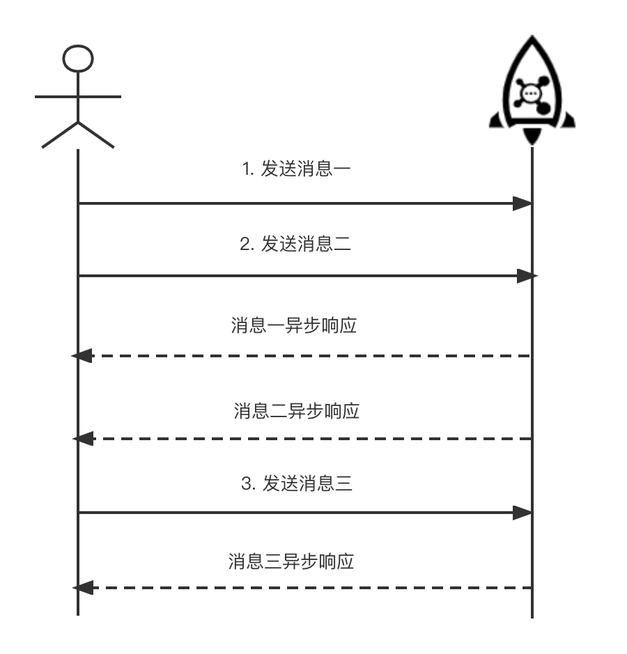

# 普通消息发送

## 1.向集群中创建 Topic

发送消息前，需要确保目标主题已经被创建和初始化。可以利用 RocketMQ Admin 工具创建目标 Topic 。

RocketMQ 部署安装包默认开启了 **autoCreateTopicEnable** 配置，会自动为发送的消息创建 Topic，但该特性仅推荐在初期测试时使用。

**生产环境强烈建议管理所有主题的生命周期，关闭自动创建参数**，以避免生产集群出现大量无效主题，无法管理和回收，造成集群注册压力增大，影响生产集群的稳定性。

```shell
$ sh bin/mqadmin updateTopic -c DefaultCluster -t TopicTest -n 127.0.0.1:9876
create topic to 127.0.0.1:10911 success.
TopicConfig [topicName=TopicTest, readQueueNums=8, writeQueueNums=8, perm=RW-, topicFilterType=SINGLE_TAG, topicSysFlag=0, order=false, attributes=null]
```

可以看到在执行完命令后，在该台Broker机器上创建了8个队列，名为TopicTest的Topic。

## 2.添加客户端依赖

首先需要在 JAVA 程序中添加 RocketMQ 的客户端依赖。

import Tabs from '@theme/Tabs';
import TabItem from '@theme/TabItem';

<Tabs>
<TabItem value="Maven" label="Maven" default >

```java
<dependency>
  <groupId>org.apache.rocketmq</groupId>
  <artifactId>rocketmq-client</artifactId>
  <version>4.9.4</version>
</dependency>
```
</TabItem>
<TabItem value="Gradle" label="Gradle">

```java 
compile 'org.apache.rocketmq:rocketmq-client:4.9.4'
```

</TabItem>

</Tabs>


## 3.消息发送

Apache RocketMQ可用于以三种方式发送消息：**同步、异步和单向传输**。前两种消息类型是可靠的，因为无论它们是否成功发送都有响应。

### 3.1 同步发送

同步发送是最常用的方式，是指消息发送方发出一条消息后，会在收到服务端同步响应之后才发下一条消息的通讯方式，可靠的同步传输被广泛应用于各种场景，如重要的通知消息、短消息通知等。


同步发送的整个代码流程如下：
1. **首先会创建一个producer**。普通消息可以创建 DefaultMQProducer，创建时需要填写生产组的名称，生产者组是指同一类Producer的集合，这类Producer发送同一类消息且发送逻辑一致。
2. **设置 NameServer 的地址**。Apache RocketMQ很多方式设置NameServer地址(客户端配置中有介绍)，这里是在代码中调用producer的API setNamesrvAddr进行设置，如果有多个NameServer，中间以分号隔开，比如"127.0.0.2:9876;127.0.0.3:9876"。 
3. **第三步是构建消息**。指定topic、tag、body等信息，tag可以理解成标签，对消息进行再归类，RocketMQ可以在消费端对tag进行过滤。
4. **最后调用send接口将消息发送出去**。同步发送等待结果最后返回SendResult，SendResult包含实际发送状态还包括SEND_OK（发送成功）, FLUSH_DISK_TIMEOUT（刷盘超时）, FLUSH_SLAVE_TIMEOUT（同步到备超时）, SLAVE_NOT_AVAILABLE（备不可用），如果发送失败会抛出异常。
``` java
public class SyncProducer {
  public static void main(String[] args) throws Exception {
    // 初始化一个producer并设置Producer group name
    DefaultMQProducer producer = new DefaultMQProducer("please_rename_unique_group_name"); //（1）
    // 设置NameServer地址
    producer.setNamesrvAddr("localhost:9876");  //（2）
    // 启动producer
    producer.start();
    for (int i = 0; i < 100; i++) {
      // 创建一条消息，并指定topic、tag、body等信息，tag可以理解成标签，对消息进行再归类，RocketMQ可以在消费端对tag进行过滤
      Message msg = new Message("TopicTest" /* Topic */,
        "TagA" /* Tag */,
        ("Hello RocketMQ " + i).getBytes(RemotingHelper.DEFAULT_CHARSET) /* Message body */
        );   //（3）
      // 利用producer进行发送，并同步等待发送结果
      SendResult sendResult = producer.send(msg);   //（4）
      System.out.printf("%s%n", sendResult);
    }
    // 一旦producer不再使用，关闭producer
    producer.shutdown();
  }
}
```

:::note
同步发送方式请务必捕获发送异常，并做业务侧失败兜底逻辑，如果忽略异常则可能会导致消息未成功发送的情况。
:::


### 3.2 异步发送




异步发送是指发送方发出一条消息后，不等服务端返回响应，接着发送下一条消息的通讯方式。
:::note
异步发送需要实现**异步发送回调接口**（SendCallback）。
:::
消息发送方在发送了一条消息后，不需要等待服务端响应即可发送第二条消息，发送方通过回调接口接收服务端响应，并处理响应结果。异步发送一般用于链路耗时较长，对响应时间较为敏感的业务场景。例如，视频上传后通知启动转码服务，转码完成后通知推送转码结果等。

如下是示例代码。

``` java
public class AsyncProducer {
  public static void main(String[] args) throws Exception {
    // 初始化一个producer并设置Producer group name
    DefaultMQProducer producer = new DefaultMQProducer("please_rename_unique_group_name");
    // 设置NameServer地址
    producer.setNamesrvAddr("localhost:9876");
    // 启动producer
    producer.start();
    producer.setRetryTimesWhenSendAsyncFailed(0);
    int messageCount = 100;
    final CountDownLatch countDownLatch = new CountDownLatch(messageCount);
    for (int i = 0; i < messageCount; i++) {
      try {
          final int index = i;
          // 创建一条消息，并指定topic、tag、body等信息，tag可以理解成标签，对消息进行再归类，RocketMQ可以在消费端对tag进行过滤
          Message msg = new Message("TopicTest",
            "TagA",
            "Hello world".getBytes(RemotingHelper.DEFAULT_CHARSET));
          // 异步发送消息, 发送结果通过callback返回给客户端
          producer.send(msg, new SendCallback() {
            @Override
            public void onSuccess(SendResult sendResult) {
              System.out.printf("%-10d OK %s %n", index,
                sendResult.getMsgId());
              countDownLatch.countDown();
            }
            @Override
            public void onException(Throwable e) {
              System.out.printf("%-10d Exception %s %n", index, e);
              e.printStackTrace();
              countDownLatch.countDown();
            }
          });
        } catch (Exception e) {
            e.printStackTrace();
            countDownLatch.countDown();
        }
    }
    //异步发送，如果要求可靠传输，必须要等回调接口返回明确结果后才能结束逻辑，否则立即关闭Producer可能导致部分消息尚未传输成功
    countDownLatch.await(5, TimeUnit.SECONDS);
    // 一旦producer不再使用，关闭producer
    producer.shutdown();
  }
}
```

:::note
异步发送与同步发送代码唯一区别在于调用send接口的参数不同，异步发送不会等待发送返回，取而代之的是send方法需要传入 SendCallback 的实现，SendCallback 接口主要有onSuccess 和 onException 两个方法，表示消息发送成功和消息发送失败。
:::

### 3.3 单向模式发送


发送方只负责发送消息，不等待服务端返回响应且没有回调函数触发，即只发送请求不等待应答。此方式发送消息的过程耗时非常短，一般在微秒级别。适用于某些耗时非常短，但对可靠性要求并不高的场景，例如日志收集。

``` java
public class OnewayProducer {
  public static void main(String[] args) throws Exception{
    // 初始化一个producer并设置Producer group name
    DefaultMQProducer producer = new DefaultMQProducer("please_rename_unique_group_name");
    // 设置NameServer地址
    producer.setNamesrvAddr("localhost:9876");
    // 启动producer
    producer.start();
    for (int i = 0; i < 100; i++) {
      // 创建一条消息，并指定topic、tag、body等信息，tag可以理解成标签，对消息进行再归类，RocketMQ可以在消费端对tag进行过滤
      Message msg = new Message("TopicTest" /* Topic */,
        "TagA" /* Tag */,
        ("Hello RocketMQ " + i).getBytes(RemotingHelper.DEFAULT_CHARSET) /* Message body */
      );
      // 由于在oneway方式发送消息时没有请求应答处理，如果出现消息发送失败，则会因为没有重试而导致数据丢失。若数据不可丢，建议选用可靠同步或可靠异步发送方式。
      producer.sendOneway(msg);
    }
     // 一旦producer不再使用，关闭producer
     producer.shutdown();
  }
}
```

单向模式调用sendOneway，不会对返回结果有任何等待和处理。
