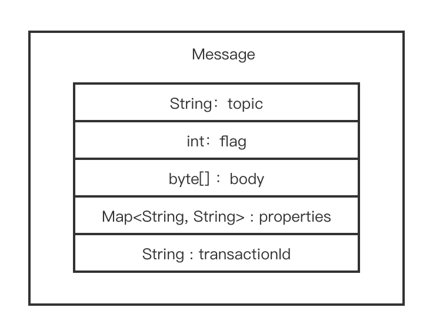
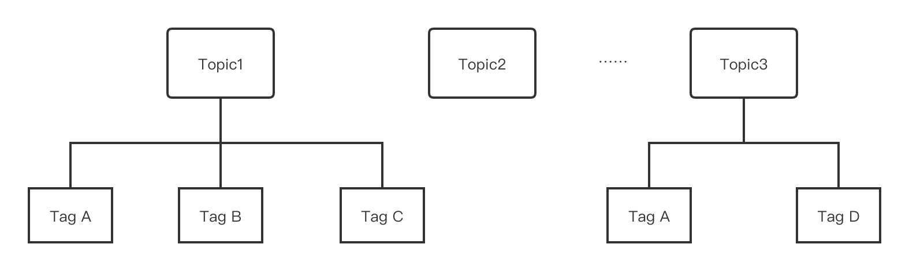
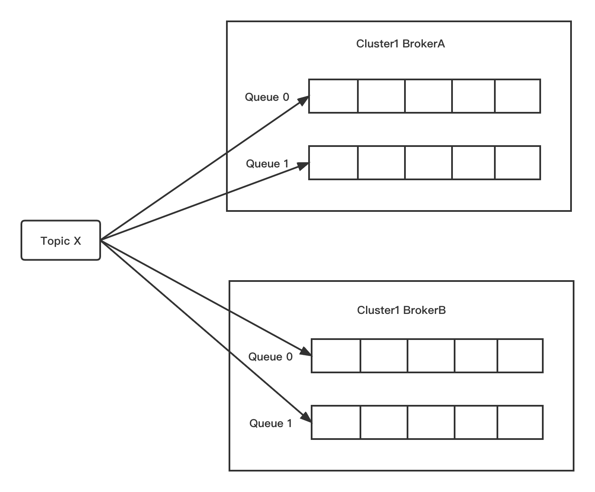

# 基本概念

在生产者一章的基本概念包括**消息，Tag，Keys，队列和生产者**的介绍。

## 消息

RocketMQ 消息构成非常简单，如下图所示。

- **topic**，表示要发送的消息的主题。
- **body** 表示消息的存储内容
- **properties** 表示消息属性
- **transactionId** 会在事务消息中使用。

:::tip
- Tag: 不管是 RocketMQ 的 Tag 过滤还是延迟消息等都会利用 Properties 消息属性机制，这些特殊信息使用了系统保留的属性Key，设置自定义属性时需要避免和系统属性Key冲突。

- Keys: 服务器会根据 keys 创建哈希索引，设置后，可以在 Console 系统根据 Topic、Keys 来查询消息，由于是哈希索引，请尽可能保证 key 唯一，例如订单号，商品 Id 等。
:::

<center>
</img>
</center>

Message 可以设置的属性值包括：


|     字段名     | 默认值 | 必要性 | 说明                                                                                                                                                                              |
| :------------: | -------- | ------------- | ------------- |
|     Topic      | null   | 必填   | 消息所属 topic 的名称                                                                                                                                                             |
|      Body      | null   | 必填   | 消息体                                                                                                                                                                            |
|      Tags      | null   | 选填   | 消息标签，方便服务器过滤使用。目前只支持每个消息设置一个                                                                                                                  |
|      Keys      | null   | 选填   | 代表这条消息的业务关键词 |
|      Flag      | 0      | 选填   | 完全由应用来设置，RocketMQ 不做干预                                                                                                                                               |
| DelayTimeLevel | 0      | 选填   | 消息延时级别，0 表示不延时，大于 0 会延时特定的时间才会被消费                                                                                                                     |
| WaitStoreMsgOK | true   | 选填   | 表示消息是否在服务器落盘后才返回应答。|

:::tip
RocketMQ系统保留的属性Key集合有如下，需要在使用过程中避免：
TRACE_ON、MSG_REGION、KEYS、TAGS、DELAY、RETRY_TOPIC、REAL_TOPIC、REAL_QID、TRAN_MSG、PGROUP、MIN_OFFSET、MAX_OFFSET、BUYER_ID、ORIGIN_MESSAGE_ID、TRANSFER_FLAG、CORRECTION_FLAG、MQ2_FLAG、RECONSUME_TIME、UNIQ_KEY、MAX_RECONSUME_TIMES、CONSUME_START_TIME、POP_CK、POP_CK_OFFSET、1ST_POP_TIME、TRAN_PREPARED_QUEUE_OFFSET、DUP_INFO、EXTEND_UNIQ_INFO、INSTANCE_ID、CORRELATION_ID、REPLY_TO_CLIENT、TTL、ARRIVE_TIME、PUSH_REPLY_TIME、CLUSTER、MSG_TYPE、INNER_MULTI_QUEUE_OFFSET、_BORNHOST
:::

## Tag

Topic 与 Tag 都是业务上用来归类的标识，区别在于 Topic 是一级分类，而 Tag 可以理解为是二级分类。使用 Tag 可以实现对 Topic 中的消息进行过滤。

:::tip
- Topic：消息主题，通过 Topic 对不同的业务消息进行分类。
- Tag：消息标签，用来进一步区分某个 Topic 下的消息分类，消息从生产者发出即带上的属性。
:::


Topic 和 Tag 的关系如下图所示。



### 什么时候该用 Topic，什么时候该用 Tag？

可以从以下几个方面进行判断：

- 消息类型是否一致：如普通消息、事务消息、定时（延时）消息、顺序消息，不同的消息类型使用不同的 Topic，无法通过 Tag 进行区分。

- 业务是否相关联：没有直接关联的消息，如淘宝交易消息，京东物流消息使用不同的 Topic 进行区分；而同样是天猫交易消息，电器类订单、女装类订单、化妆品类订单的消息可以用 Tag 进行区分。

- 消息优先级是否一致：如同样是物流消息，盒马必须小时内送达，天猫超市 24 小时内送达，淘宝物流则相对会慢一些，不同优先级的消息用不同的 Topic 进行区分。

- 消息量级是否相当：有些业务消息虽然量小但是实时性要求高，如果跟某些万亿量级的消息使用同一个 Topic，则有可能会因为过长的等待时间而“饿死”，此时需要将不同量级的消息进行拆分，使用不同的 Topic。

总的来说，针对消息分类，您可以选择创建多个 Topic，或者在同一个 Topic 下创建多个 Tag。但通常情况下，不同的 Topic 之间的消息没有必然的联系，而 Tag 则用来区分同一个 Topic 下相互关联的消息，例如全集和子集的关系、流程先后的关系。

## Keys

Apache RocketMQ 每个消息可以在业务层面的设置唯一标识码 keys 字段，方便将来定位消息丢失问题。 Broker 端会为每个消息创建索引（哈希索引），应用可以通过 topic、key 来查询这条消息内容，以及消息被谁消费。由于是哈希索引，请务必保证 key 尽可能唯一，这样可以避免潜在的哈希冲突。

```java
   // 订单Id
   String orderId = "20034568923546";
   message.setKeys(orderId);
```

## 队列

为了支持高并发和水平扩展，需要对 Topic 进行分区，在 RocketMQ 中这被称为队列，一个 Topic 可能有多个队列，并且可能分布在不同的 Broker 上。



一般来说一条消息，如果没有重复发送（比如因为服务端没有响应而进行重试），则只会存在在 Topic 的其中一个队列中，消息在队列中按照先进先出的原则存储，每条消息会有自己的位点，每个队列会统计当前消息的总条数，这个称为最大位点 MaxOffset；队列的起始位置对应的位置叫做起始位点 MinOffset。队列可以提升消息发送和消费的并发度。

## 生产者

生产者（Producer）就是消息的发送者，Apache RocketMQ 拥有丰富的消息类型，可以支持不用的应用场景，在不同的场景中，需要使用不同的消息进行发送。比如在电商交易中超时未支付关闭订单的场景，在订单创建时会发送一条延时消息。这条消息将会在 30 分钟以后投递给消费者，消费者收到此消息后需要判断对应的订单是否已完成支付。如支付未完成，则关闭订单。如已完成支付则忽略，此时就需要用到延迟消息；电商场景中，业务上要求同一订单的消息保持严格顺序，此时就要用到顺序消息。在日志处理场景中，可以接受的比较大的发送延迟，但对吞吐量的要求很高，希望每秒能处理百万条日志，此时可以使用批量消息。在银行扣款的场景中，要保持上游的扣款操作和下游的短信通知保持一致，此时就要使用事务消息，下一节将会介绍各种类型消息的发送。

:::note 需要注意的是，生产环境中不同消息类型需要使用不同的主题，不要在同一个主题内使用多种消息类型，这样可以避免运维过程中的风险和错误。 :::