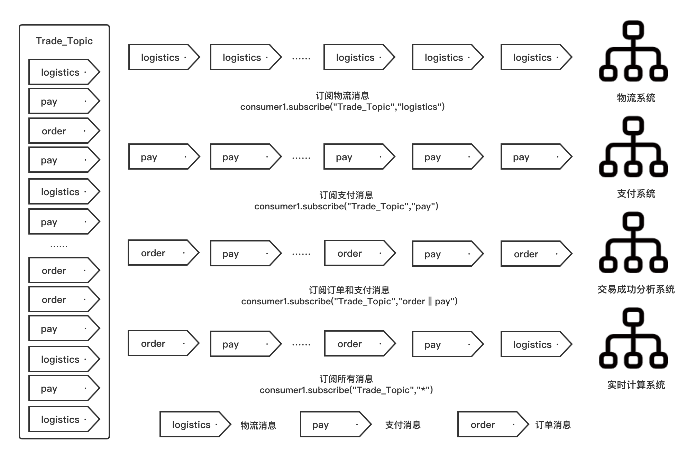
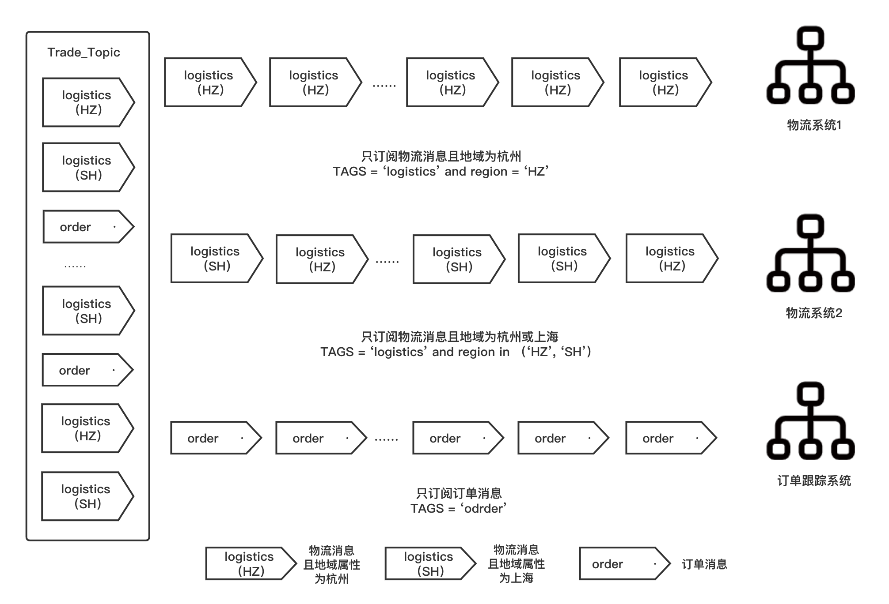

# Push消费

RocketMQ Push消费的示例代码如下

```javascript
public class Consumer {
  public static void main(String[] args) throws InterruptedException, MQClientException {
    // 初始化consumer，并设置consumer group name
    DefaultMQPushConsumer consumer = new DefaultMQPushConsumer("please_rename_unique_group_name");
   
    // 设置NameServer地址 
    consumer.setNamesrvAddr("localhost:9876");
    // 订阅一个或多个topic，并指定tag过滤条件，这里指定*表示接收所有tag的消息
    consumer.subscribe("TopicTest", "*");
    // 注册回调接口来处理从Broker中收到的消息
    consumer.registerMessageListener(new MessageListenerConcurrently() {
      @Override
      public ConsumeConcurrentlyStatus consumeMessage(List<MessageExt> msgs, ConsumeConcurrentlyContext context) {
        System.out.printf("%s Receive New Messages: %s %n", Thread.currentThread().getName(), msgs);
        // 返回消息消费状态，ConsumeConcurrentlyStatus.CONSUME_SUCCESS为消费成功
        return ConsumeConcurrentlyStatus.CONSUME_SUCCESS;
      }
    });
    // 启动Consumer
    consumer.start();
    System.out.printf("Consumer Started.%n");
  }
}
```

首先需要初始化消费者，初始化消费者时，必须填写ConsumerGroupName，同一个消费组的ConsumerGroupName是相同的，这是判断消费者是否属于同一个消费组的重要属性。然后是设置NameServer地址，这里与Producer一样不再介绍。然后是调用subscribe方法订阅Topic，subscribe方法需要指定需要订阅的Topic名，也可以增加消息过滤的条件，比如TagA等，上述代码中指定*表示接收所有tag的消息。除了订阅之外，还需要注册回调接口编写消费逻辑来处理从Broker中收到的消息，调用registerMessageListener方法，需要传入MessageListener的实现，上述代码中是并发消费，因此是MessageListenerConcurrently的实现，其接口如下

:::note  MessageListenerConcurrently 接口
```javascript 
/**
 * A MessageListenerConcurrently object is used to receive asynchronously delivered messages concurrently
 */
public interface MessageListenerConcurrently extends MessageListener {
    /**
     * It is not recommend to throw exception,rather than returning ConsumeConcurrentlyStatus.RECONSUME_LATER if
     * consumption failure
     *
     * @param msgs msgs.size() >= 1<br> DefaultMQPushConsumer.consumeMessageBatchMaxSize=1,you can modify here
     * @return The consume status
     */
    ConsumeConcurrentlyStatus consumeMessage(final List<MessageExt> msgs,
        final ConsumeConcurrentlyContext context);
}
```
:::

其中，msgs是从Broker端获取的需要被消费消息列表，用户实现该接口，并把自己对消息的消费逻辑写在consumeMessage方法中，然后返回消费状态，ConsumeConcurrentlyStatus.CONSUME_SUCCESS表示消费成功，或者用RECONSUME_LATER表示消费失败，一段时间后再重新消费。

可以看到RocketMQ提供的消费者API却非常简单，用户并不需要关注重平衡或者拉取的逻辑，只需要写好自己的消费逻辑即可。

## 集群模式和广播模式

我们可以通过以下代码来设置采用集群模式，RocketMQ Push Consumer默认为集群模式，同一个消费组内的消费者分担消费。

```java
consumer.setMessageModel(MessageModel.CLUSTERING);
```

通过以下代码来设置采用广播模式，广播模式下，消费组内的每一个消费者都会消费全量消息。

```java
consumer.setMessageModel(MessageModel.BROADCASTING);
```

## 并发消费和顺序消费

上面已经介绍设置Push Consumer并发消费的方法，通过在注册消费回调接口时传入MessageListenerConcurrently接口的实现来完成。在并发消费中，可能会有多个线程同时消费一个队列的消息，因此即使发送端通过发送顺序消息保证消息在同一个队列中按照FIFO的顺序，也无法保证消息实际被顺序消费。

因此RocketMQ提供了顺序消费的方式， 顺序消费设置与并发消费API层面只有一处不同，在注册消费回调接口时传入MessageListenerOrderly接口的实现。

```javascript
consumer.registerMessageListener(new MessageListenerOrderly() {
            AtomicLong consumeTimes = new AtomicLong(0);
            @Override
            public ConsumeOrderlyStatus consumeMessage(List<MessageExt> msgs, ConsumeOrderlyContext context) {
                System.out.printf("%s Receive New Messages: %s %n", Thread.currentThread().getName(), msgs);
                this.consumeTimes.incrementAndGet();
                if ((this.consumeTimes.get() % 2) == 0) {
                    return ConsumeOrderlyStatus.SUCCESS;
                } else if ((this.consumeTimes.get() % 5) == 0) {
                    context.setSuspendCurrentQueueTimeMillis(3000);
                    return ConsumeOrderlyStatus.SUSPEND_CURRENT_QUEUE_A_MOMENT;
                }
                return ConsumeOrderlyStatus.SUCCESS;
            }
        });
```

顺序消费也有两种返回结果，ConsumeOrderlyStatus.SUCCESS表示消费成功，ConsumeOrderlyStatus.SUSPEND_CURRENT_QUEUE_A_MOMENT表示消费失败。

## 消息过滤

消息过滤是指消息生产者向Topic中发送消息时，设置消息属性对消息进行分类，消费者订阅Topic时，根据消息属性设置过滤条件对消息进行过滤，只有符合过滤条件的消息才会被投递到消费端进行消费。

消费者订阅Topic时若未设置过滤条件，无论消息发送时是否有设置过滤属性，Topic中的所有消息都将被投递到消费端进行消费。

RocketMQ支持的消息过滤方式有两种，Tag过滤和SQL92过滤。

| 过滤方式    | 说明                                             | 场景                  |
|---------|------------------------------------------------|---------------------|
| Tag过滤   | 消费者订阅的Tag和发送者设置的消息Tag相互匹配，则消息被投递给消费端进行消费。      | 简单过滤场景。一条消息支持设置一个Tag，仅需要对Topic中的消息进行一级分类并过滤时可以使用此方式。      |
| SQL92过滤 | 发送者设置Tag或消息属性，消费者订阅满足SQL92过滤表达式的消息被投递给消费端进行消费。 | 复杂过滤场景。一条消息支持设置多个属性，可根据SQL语法自定义组合多种类型的表达式对消息进行多级分类并实现多维度的过滤。 |

### Tag过滤

Tag在生产者章节已经介绍过，用于对某个Topic下的消息进行分类。生产者在发送消息时，指定消息的Tag，消费者需根据已经指定的Tag来进行订阅。

以下图电商交易场景为例，从客户下单到收到商品这一过程会生产一系列消息，以如下消息为例：
- 订单消息
- 支付消息
- 物流消息

这些消息会发送到名称为Trade_Topic的Topic中，被各个不同的系统所订阅，以如下系统为例：
- 支付系统：只需订阅支付消息。
- 物流系统：只需订阅物流消息。
- 实时计算系统：需要订阅所有和交易相关的消息。
- 交易成功率分析系统：需订阅订单和支付消息。

过滤示意图如下所示



对于物流系统和支付系统来说，它们都只订阅单个Tag，此时只需要在调用subcribe接口时明确标明Tag即可。

```java
consumer.subscribe("TagFilterTest", "TagA");
```

对于实时计算系统来说，它订阅交易Topic下所有的消息，Tag用星号（*）表示即可。

```java
consumer.subscribe("TagFilterTest", "*");
```

对于交易成功率分析系统来说，它订阅了订单和支付两个Tag的消息，在多个Tag之间用两个竖线（||）分隔即可。

```java
consumer.subscribe("TagFilterTest", "TagA||TagB");
```

这里需要注意的是，如果同一个消费者多次订阅某个Topic下的Tag，以最后一次订阅为准。

```java
//如下错误代码中，Consumer只能订阅到TagFilterTest下TagB的消息，而不能订阅TagA的消息。
consumer.subscribe("TagFilterTest", "TagA");
consumer.subscribe("TagFilterTest", "TagB");
```

### SQL92过滤

SQL92过滤是在消息发送时设置消息的Tag或自定义属性，消费者订阅时使用SQL语法设置过滤表达式，根据自定义属性或Tag过滤消息。
>Tag属于一种特殊的消息属性，在SQL语法中，Tag的属性值为TAGS。
开启属性过滤首先要在Broker端设置配置enablePropertyFilter=true，该值默认为false。

以下图电商交易场景为例，从客户下单到收到商品这一过程会生产一系列消息，按照类型将消息分为订单消息和物流消息，其中给物流消息定义地域属性，按照地域分为杭州和上海：
- 订单消息
- 物流消息
    - 物流消息且地域为杭州
    - 物流消息且地域为上海

这些消息会发送到名称为Trade_Topic的Topic中，被各个不同的系统所订阅，以如下系统为例：
- 物流系统1：只需订阅物流消息且消息地域为杭州。
- 物流系统2：只需订阅物流消息且消息地域为杭州或上海。
- 订单跟踪系统：只需订阅订单消息。

SQL92过滤示意图如下所示：



地域将作为自定义属性设置在消息中。

- 消息发送端：
  设置消息的自定义属性。

```java
Message msg = new Message("topic", "tagA", "Hello MQ".getBytes());
// 设置自定义属性A，属性值为1。
msg.putUserProperties("a", "1");
```

- 消息消费端：
  使用SQL语法设置过滤表达式，并根据自定义属性过滤消息。
```java
consumer.subscribe("SqlFilterTest",
    MessageSelector.bySql("(TAGS is not null and TAGS in ('TagA', 'TagB'))" +
        "and (a is not null and a between 0 and 3)"));
```

## 消息重试和死信队列

### 消息重试

若Consumer消费某条消息失败，则RocketMQ会在重试间隔时间后，将消息重新投递给Consumer消费，若达到最大重试次数后消息还没有成功被消费，则消息将被投递至死信队列
>消息重试只针对集群消费模式生效；广播消费模式不提供失败重试特性，即消费失败后，失败消息不再重试，继续消费新的消息
- 最大重试次数：消息消费失败后，可被重复投递的最大次数。
```java
consumer.setMaxReconsumeTimes(10);
```
- 重试间隔：消息消费失败后再次被投递给Consumer消费的间隔时间，只在顺序消费中起作用。
```java
consumer.setSuspendCurrentQueueTimeMillis(5000);
```

顺序消费和并发消费的重试机制并不相同，顺序消费消费失败后会先在客户端本地重试直到最大重试次数，这样可以避免消费失败的消息被跳过，消费下一条消息而打乱顺序消费的顺序，而并发消费消费失败后会将消费失败的消息重新投递回服务端，再等待服务端重新投递回来，在这期间会正常消费队列后面的消息。
>并发消费失败后并不是投递回原Topic，而是投递到一个特殊Topic，其命名为%RETRY%ConsumerGroupName，集群模式下并发消费每一个ConsumerGroup会对应一个特殊Topic，并会订阅该Topic。
两者参数差别如下

| 消费类型 | 重试间隔                                       | 最大重试次数                                                       |
|------|--------------------------------------------|--------------------------------------------------------------|
| 顺序消费 | 间隔时间可通过自定义设置，SuspendCurrentQueueTimeMillis | 最大重试次数可通过自定义参数MaxReconsumeTimes取值进行配置。该参数取值无最大限制。若未设置参数值，默认最大重试次数为Integer.MAX |
| 并发消费 | 间隔时间根据重试次数阶梯变化，取值范围：1秒～2小时。不支持自定义配置  | 最大重试次数可通过自定义参数MaxReconsumeTimes取值进行配置。默认值为16次，该参数取值无最大限制，建议使用默认值 |

并发消费重试间隔如下，可以看到与延迟消息第三个等级开始的时间完全一致。

| 第几次重试 | 与上次重试的间隔时间 | 第几次重试 | 与上次重试的间隔时间 |
|-------|------------|-------|------------|
| 1     | 10s        | 9     | 7min       |
| 2     | 30s        | 10    | 8min       |
| 3     | 1min       | 11    | 9min       |
| 4     | 2min       | 12    | 10min      |
| 5     | 3min       | 13    | 20min      |
| 6     | 4min       | 14    | 30min      |
| 7     | 5min       | 15    | 1h         |
| 8     | 6min       | 16    | 2h         |

###  死信队列

当一条消息初次消费失败，RocketMQ会自动进行消息重试，达到最大重试次数后，若消费依然失败，则表明消费者在正常情况下无法正确地消费该消息。此时，该消息不会立刻被丢弃，而是将其发送到该消费者对应的特殊队列中，这类消息称为死信消息（Dead-Letter Message），存储死信消息的特殊队列称为死信队列（Dead-Letter Queue），死信队列是死信Topic下分区数唯一的单独队列。如果产生了死信消息，那对应的ConsumerGroup的死信Topic名称为%DLQ%ConsumerGroupName，死信队列的消息将不会再被消费。可以利用RocketMQ Admin工具或者RocketMQ Dashboard上查询到对应死信消息的信息。
