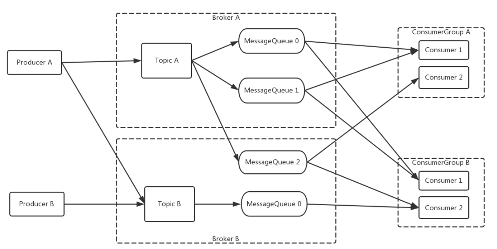

# 初识RocketMQ

就像我们平时使用一些体育新闻软件，会订阅自己喜欢的一些球队板块，当有作者发表文章到相关的板块，我们就能收到相关的新闻推送。RocketMQ的基础消息模型就是一个简单的Pub/Sub模型。

上图就是是一个基本的消息系统模型，一个生产者Producer，一个消费者Consumer，中间是Topic，Topic是消息主题，通过Topic我们对不同的业务消息进行分类，Producer把消息发送到某一个Topic，Consumer订阅Topic来接收消息。这是一个基础的概念模型，在实际的生产中，结构会更复杂，例如为了支持高并发和水平扩展，我们需要对中间的Topic进行分区，比如我们对于同一个Topic会有多个发送者，同一个信息的发送方会有多个订阅者，订阅者之间要进行负载均衡等。

上图是Topic、Producer、Consumer扩展后的模型。左边有2个Producer，中间就是2个Topic，右边是2个ConsumerGroup，Topic存储在Broker中，Broker是实际部署过程的对应的代理服务器。这边有两个点需要注意，一个是为了水平扩展，RocketMQ对Topic进行了分区，在RocketMQ里称为队列（MessageQueue），另一点是为了Consumer能并发消费，有了Consumer Group的概念，Consumer主要有两种消费方式，一个是广播模式，一个是集群模式，图中是最常用的集群模式，同一个Consumer Group中的Consumer实例是负载均衡消费，比如图中ConsumerGroupA它订阅TopicA，TopicA有3个队列，那GroupA中的consumer1消费的是MessageQueue0和MessageQueue1的消息，Consumer2是消费的是MessageQueue2的消息。

Producer、Consumer又是如何找到Topic和Broker的地址呢？消息的具体发送和接收又是怎么进行的呢？RocketMQ的部署模型如下图所示

Apache RocketMQ部署架构上主要分为四部分:

- Producer：消息发布的角色。Producer通过MQ的负载均衡模块选择相应的Broker集群队列进行消息投递，投递的过程支持快速失败和重试。

- Consumer：消息消费的角色。支持以push推，pull拉两种模式对消息进行消费。同时也支持集群方式和广播方式的消费，它提供实时消息订阅机制，可以满足大多数用户的需求。

- NameServer：NameServer是一个非常简单的Topic路由注册中心，支持Topic、Broker的动态注册与发现。主要包括两个功能：Broker管理，NameServer接受Broker集群的注册信息并且保存下来作为路由信息的基本数据。然后提供心跳检测机制，检查Broker是否还存活；路由信息管理，每个NameServer将保存关于Broker集群的整个路由信息和用于客户端查询的队列信息。Producer和Consumer通过NameServer就可以知道整个Broker集群的路由信息，从而进行消息的投递和消费。NameServer通常会多个实例部署，各实例间相互不进行信息通讯。Broker是向每一台NameServer注册自己的路由信息，所以每一个NameServer实例上面都保存一份完整的路由信息。当某个NameServer因某种原因下线了，客户端仍然可以向其它NameServer获取路由信息。

- Broker：Broker主要负责消息的存储、投递和查询以及服务高可用保证。

NameServer是一个几乎无状态节点，可集群部署，节点之间无任何信息同步。Broker部署相对复杂，在Master-Slave架构中，Broker分为Master与Slave，一个Master可以对应多个Slave，但是一个Slave只能对应一个Master，Master与Slave 的对应关系通过指定相同的BrokerName，不同的BrokerId 来定义，BrokerId为0表示Master，非0表示Slave。Master也可以部署多个。每个Broker与NameServer集群中的所有节点建立长连接，定时注册Topic信息到所有NameServer。

Producer与NameServer集群中的其中一个节点建立长连接，定期从NameServer获取Topic路由信息，并向提供Topic 服务的Master建立长连接，且定时向Master发送心跳。Producer完全无状态。

Consumer与NameServer集群中的其中一个节点建立长连接，定期从NameServer获取Topic路由信息，并向提供Topic服务的Master、Slave建立长连接，且定时向Master、Slave发送心跳。Consumer既可以从Master订阅消息，也可以从Slave订阅消息。

结合部署架构图，描述RocketMQ集群工作流程：

- 启动NameServer，NameServer起来后监听端口，等待Broker、Producer、Consumer连上来，相当于一个路由控制中心。
- Broker启动，跟所有的NameServer保持长连接，定时发送心跳包。心跳包中包含当前Broker信息以及存储所有Topic信息。注册成功后，NameServer集群中就有Topic跟Broker的映射关系。
- 收发消息前，先创建Topic，创建Topic时需要指定该Topic要存储在哪些Broker上，也可以在发送消息时自动创建Topic。
- Producer发送消息，启动时先跟NameServer集群中的其中一台建立长连接，并从NameServer中获取当前发送的Topic存在哪些Broker上，轮询从队列列表中选择一个队列，然后与队列所在的Broker建立长连接从而向Broker发消息。
- Consumer跟Producer类似，跟其中一台NameServer建立长连接，获取当前订阅Topic存在哪些Broker上，然后直接跟Broker建立连接通道，然后开始消费消息。
