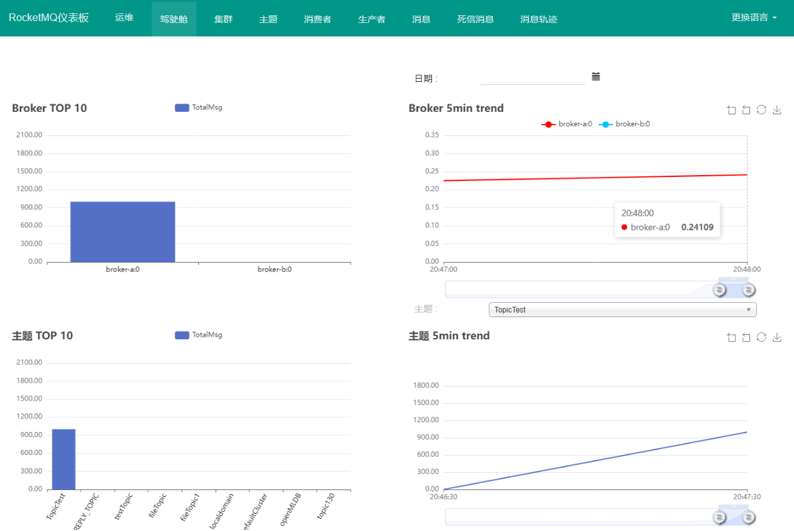
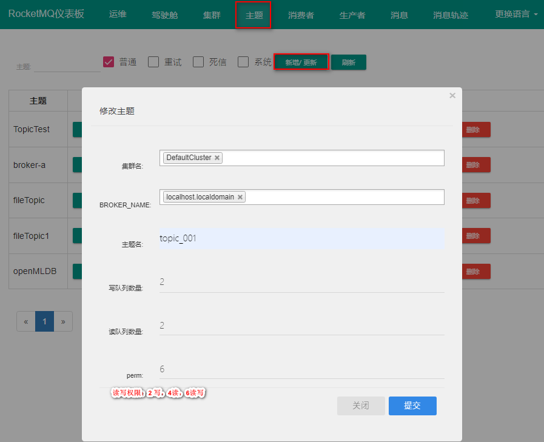

# RocketMQ Dashboard

`RocketMQ Dashboard` 是 RocketMQ 的管控利器，为用户提供客户端和应用程序的各种事件、性能的统计信息，支持以可视化工具代替 Topic 配置、Broker 管理等命令行操作。

## 介绍

### 功能概览

| 面板   | 功能                                                         |
| ------ | ------------------------------------------------------------ |
| 运维   | 修改nameserver 地址;  选用 ```VIPChannel```                  |
| 驾驶舱 | 查看 broker, topic 消息量                                    |
| 集群   | 集群分布，broker 配置、运行信息                              |
| 主题   | 搜索、筛选、删除、更新/新增主题，消息路由，发送消息，重置消费位点 |
| 消费者 | 搜索、删除、新增/更新消费者组，终端，消费详情，配置          |
| 消息   | 消息记录，私信消息，消息轨迹等消息详情                       |

操作面板：



## 快速开始

系统要求：

1. Linux/Unix/Mac
2. 64bit JDK 1.8+
3. Maven 3.2.x
4. 启动 [RocketMQ](https://rocketmq.apache.org/docs/quick-start/) 

网络配置：

1. 云服务器可远程访问或本地虚拟机可 PING 通外网
2. ```rocketmq``` 配置文件 ```broker.conf / broker-x.properties``` 设置 nameserver 地址和端口号
3. 用配置文件启动 broker

### 1. docker 镜像安装

① 安装docker，拉取 ```rocketmq-dashboard``` 镜像

```shell
docker pull apacherocketmq/rocketmq-dashboard:latest
```

② docker 容器中运行 ```rocketmq-dashboard```

```shell
docker run -d --name rocketmq-dashboard -e "JAVA_OPTS=-Drocketmq.namesrv.addr=127.0.0.1:9876" -p 8080:8080 -t apacherocketmq/rocketmq-dashboard:latest
```

:::tip

```namesrv.addr:port``` 替换为 ```rocketmq```  中配置的 nameserver 地址：端口号

开放端口号：8080，9876，10911，11011 端口

- 云服务器：设置安全组访问规则
- 本地虚拟机：关闭防火墙，或 ```-add-port```

:::

### 2. 源码安装

源码地址：[apache/rocketmq-dashboard](https://github.com/apache/rocketmq-dashboard) 

下载并解压，切换至源码目录 ```rocketmq-dashboard-master/```

① 编译 ```rocketmq-dashboard``` 

```shell
mvn clean package -Dmaven.test.skip=true
```

② 运行 ```rocketmq-dashboard```

```shell
java -jar target/rocketmq-dashboard-1.0.1-SNAPSHOT.jar
```

提示：**Started App in x.xxx seconds (JVM running for x.xxx)** 启动成功

浏览器页面访问：namesrv.addr:8080

关闭 ```rocketmq-dashboard``` : ctrl + c

再次启动：执行 ②

**tips**：下载后的源码需要上传到 Linux 系统上编译，本地编译可能会报错。

## 使用教程

### 1. 创建主题 Topic 

主题 ```>``` 新增/更新



### 2. 创建消费者组 consumer

消费者 ```>``` 新增/更新


### 3. 重置消费位点

主题 ```>``` 重置消费位点


**tips**:

- 集群消费支持重置消费位点, 广播模式不支持.
- 消费者不在线不能重置消费位点

### 4. 扩容 Topic 队列

主题 ```>``` TOPIC配置


### 5. 扩容 Broker

- 安装部署一个新的 broker, nameserver 地址和当前集群一样


- 更新 Topic 的BROKER_NAME

  主题 ```>``` 新增/更新 ```>``` BROKER_NAME


### 6. 发送消息

- 向指定 Topic 发送消息

  主题 ```>``` 发送消息


- 发送结果


更多操作详情： [阿里云知行动手实验室-在浏览器沉浸式学习最新云原生技术 (aliyun.com)](https://start.aliyun.com/?accounttraceid=8fda44777a19460a925d871eb408e704qoln) 

