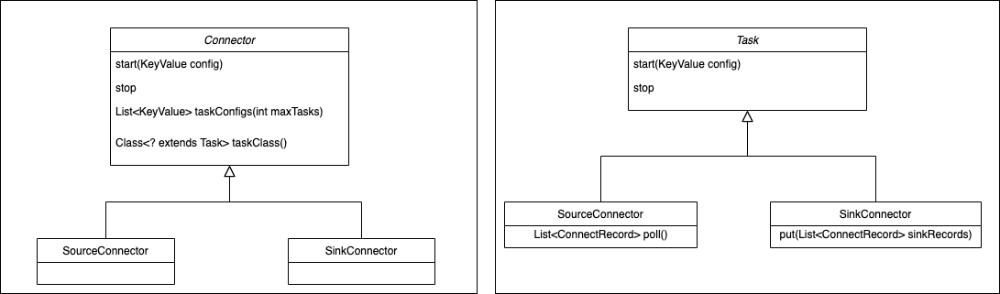
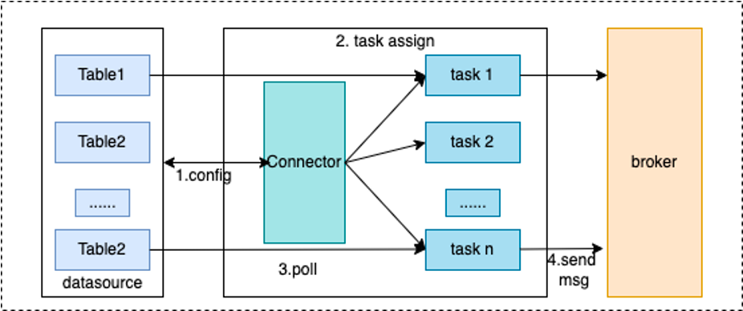

# 概念

## Connector

连接器，定义数据从哪复制到哪，是从源数据系统读取数据写入RocketMQ，这种是SourceConnector
，或从RocketMQ读数据写入到目标系统,这种是SinkConnector。Connector决定需要创建任务的数量，从Worker接收配置传递给任务。

## Task

是Connector任务分片的最小分配单位，是实际将源数据源数据复制数据到RocketMQ（SourceTask），或者将数据从RocketMQ读取数据写入到目标系统（SinkTask）真正的执行者，Task是无状态的可以动态的启停任务，多个Task是可以并行执行的，Connector复制数据的并行度主要体现在Task数量上。

通过Connect的Api也可以看到Connector和Task各自的职责，Connector实现时就已经确定数据复制的流向，Connector接收数据源相关的配置，taskClass获取需要创建的任务类型，通过taskConfigs指定最大任务数量，并且为task分配好配置。task拿到配置以后从数据源取数据写入到目标存储。

通过下面的两张图可以清楚的看到，Connecotr和Task处理基本流程。

## Worker

worker 进程是Connector和Task运行环境，它提供RESTFul能力，接受HTTP请求，将获取到的配置传递给Connector和Task。
除此之外它还负责启动Connector和Task，保存Connector配置信息，保存Task同步数据的位点信息，负载均衡能力，Connect集群高可用，扩缩容，故障处理主要依赖Worker的负载均衡能力实现的。

从上面面这张图，看到Worker通过提供的REST Api接收http请求，将接收到的配置信息传递给配置管理服务，配置管理服务将配置保存到本地并同步给其它worker节点，同时触发负载均衡。
