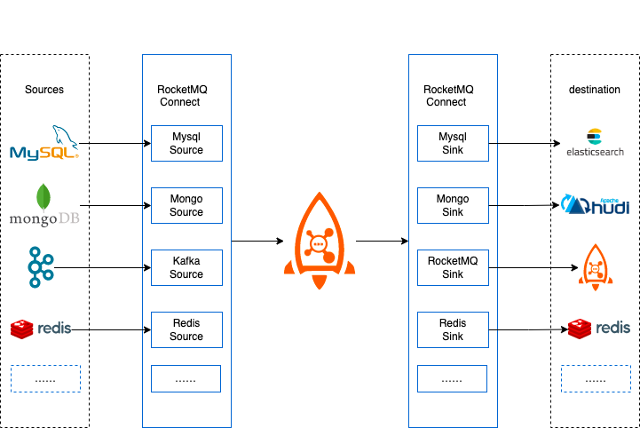
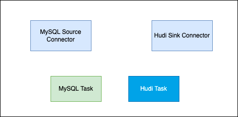
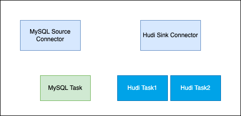
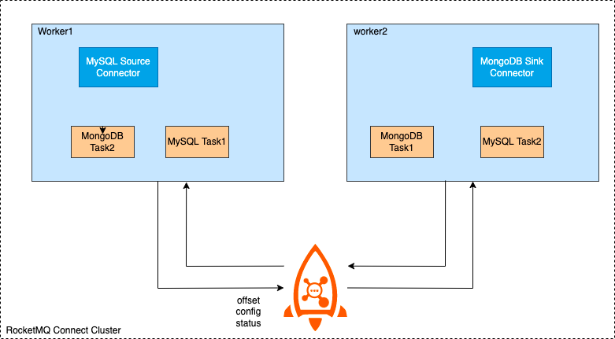
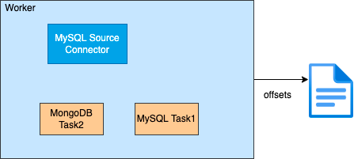

# RocketMQ Connect 概览

RocketMQ Connect是RocketMQ数据集成重要组件，可将各种系统中的数据通过高效，可靠，流的方式，流入流出到RocketMQ，它是独立于RocketMQ的一个单独的分布式，可扩展，可容错系统，
它具备低延时，高可靠性，高性能，低代码，扩展性强等特点，可以实现各种异构数据系统的连接，构建数据管道，ETL，CDC，数据湖等能力。

### Connector工作原理

RocketMQ Connect是一个独立的的分布式，可伸缩，容错的系统，它主要为RocketMQ提供与各种外部系统的数据的流入流出能力。用户不需要编程，只需要简单的配置即可使用RocketMQ Connect，例如从MySQL同步数据到RocketMQ，只需要配置同步所需的MySQL的账号密码，链接地址，和需要同步的数据库，表名就可以了。

### Connector的使用场景

##### 构建流式数据管道

在业务系统中，利用MySQL完善的事务支持，处理数据的增删改，使用ElasticSearch，Solr等实现强大的搜索能力,或者将产生的业务数据同步到数据分析系统，数据湖中（例如hudi），对数据进一步处理从而让数据产生更高的价值。使用RocketMQ Connect很容易实现这样的数据管道的能力，只需要配置3个任务，第一个从MySQL获取数据的任务，第二，三个是从RocketMQ消费数据到ElasticSearch，Hudi的任务，配置3个任务就实现了从MySQL到ElasticSearch，MySQL到hudi的两条数据管道，既可以满足业务中事务的需求，搜索的需求，又可以构建数据湖。

##### CDC

CDC作为ETL模式之一，可以通过近乎实时的增量捕获数据库的 INSERT、UPDATE，DELETE变化，RocketMQ Connect流试数据传输，具备高可用，低延时等特性，通过Connector很容易实现CDC。

### Connector 部署

在创建Connector时，一般是通过配置完成的，Connector一般包含逻辑的Connector连接器和执行数据复制的Task即物理线程，如下图所示，两个Connector连接器和它们对应的运行Task任务。

一个Connector也可以同时运行多个任务，提高Connector的并行度，例如下图所示的Hudi Sink Connector有2个任务，每个任务处理不同的分片数据，从而Connector的并行度，进而提高处理性能。

RocketMQ Connect Worker支持两种运行模式，集群和单机
集群模式，顾名思义，有多个Worker节点组成，推荐最少有2个Worker节点，组成高可用集群。集群间的配置信息，offset信息，status信息通过指定RocketMQ Topic存储，新增Worker节点也会获取到集群中的这些配置，offset，status信息，并且触发负载均衡，重新分配集群中的任务，使集群达到均衡的状态，减少Woker节点或者Worker宕机也会触发负载均衡，从而保障集群中所有的任务都可以均衡的在集群中存活的节点中正常运行。

单机模式，Connector任务运行在单机上，Worker本身没有高可用，任务offset信息持久化在本地。适合一些对高可没有什么要求或者不需要Worker保障高可用的场景，例如部署在k8s集群中，由k8s集群保障高可用。

