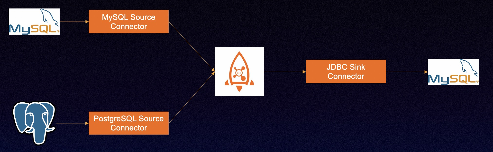

# RocketMQ Connect实战3



## 准备

### 启动RocketMQ

1. Linux/Unix/Mac
2. 64bit JDK 1.8+;
3. Maven 3.2.x或以上版本;
4. 启动 [RocketMQ](https://rocketmq.apache.org/docs/quick-start/);


**tips** : ${ROCKETMQ_HOME} 位置说明

>bin-release.zip 版本：/rocketmq-all-4.9.4-bin-release
>
>source-release.zip 版本：/rocketmq-all-4.9.4-source-release/distribution


### 启动Connect


#### Connector插件编译

Debezium RocketMQ Connector
```
$ cd rocketmq-connect/connectors/rocketmq-connect-debezium/
$ mvn clean package -Dmaven.test.skip=true
```

将 Debezium MySQL PostgreSQL RocketMQ Connector 编译好的包放入Runtime加载目录。命令如下：
```
mkdir -p /usr/local/connector-plugins
cp rocketmq-connect-debezium-postgresql/target/rocketmq-connect-debezium-postgresql-0.0.1-SNAPSHOT-jar-with-dependencies.jar /usr/local/connector-plugins

cp rocketmq-connect-debezium-mysql/target/rocketmq-connect-debezium-mysql-0.0.1-SNAPSHOT-jar-with-dependencies.jar /usr/local/connector-plugins

```

JDBC Connector

将 JDBC Connector 编译好的包放入Runtime加载目录。命令如下：
```
$ cd rocketmq-connect/connectors/rocketmq-connect-jdbc/
$ mvn clean package -Dmaven.test.skip=true
cp rocketmq-connect-jdbc/target/rocketmq-connect-jdbc-0.0.1-SNAPSHOT-jar-with-dependencies.jar /usr/local/connector-plugins

```

#### 启动Connect Runtime

```
cd  rocketmq-connect

mvn -Prelease-connect -DskipTests clean install -U

```

修改配置`connect-standalone.conf` ，重点配置如下
```
$ cd distribution/target/rocketmq-connect-0.0.1-SNAPSHOT/rocketmq-connect-0.0.1-SNAPSHOT
$ vim conf/connect-standalone.conf
```

```
workerId=standalone-worker
storePathRootDir=/tmp/storeRoot

## Http port for user to access REST API
httpPort=8082

# Rocketmq namesrvAddr
namesrvAddr=localhost:9876

# RocketMQ acl
aclEnable=false
accessKey=rocketmq
secretKey=12345678

autoCreateGroupEnable=false
clusterName="DefaultCluster"

# 核心配置，将之前编译好debezium包的插件目录配置在此；
# Source or sink connector jar file dir,The default value is rocketmq-connect-sample
pluginPaths=/usr/local/connector-plugins
```


```
cd distribution/target/rocketmq-connect-0.0.1-SNAPSHOT/rocketmq-connect-0.0.1-SNAPSHOT

sh bin/connect-standalone.sh -c conf/connect-standalone.conf &

```

### Postgres镜像

使用debezium的Postgres docker搭建环境MySQL数据库
```
# starting a pg instance
docker run -d --name postgres -p 5432:5432 -e POSTGRES_USER=start_data_engineer -e POSTGRES_PASSWORD=password debezium/postgres:14

# bash into postgres instance
docker exec -ti postgres /bin/bash
```
Postgres信息
端口：5432
账号：start_data_engineer/password
同步的源数据库：bank.user


### MySQL镜像

使用debezium的MySQL docker搭建环境MySQL数据库
```
docker run -it --rm --name mysql -p 3306:3306 -e MYSQL_ROOT_PASSWORD=debezium -e MYSQL_USER=mysqluser -e MYSQL_PASSWORD=mysqlpw quay.io/debezium/example-mysql:1.9
```

MySQL信息

端口：3306

账号：root/debezium
同步的源数据库：bank.user

目标库：bank1.user


### 测试数据

通过root/debezium账号登录数据库
源数据库表：bank.user

```
create database bank;
use bank;

create table bank.user
(
    id       bigint NOT NULL AUTO_INCREMENT,
    user_id          integer,
    name    varchar(8),
    age integer,
    birthday date,
    datetime_created timestamp(3),
    datetime_updated timestamp(3),
    height           decimal(11, 2) null,
    PRIMARY KEY (`id`)
);

insert into bank.user values (1003, 1, 'lilei2', 10, now(), now(), now(), 1.72);
update bank.user set user_id = 1003 where id = 1003;

```


通过start_data_engineer/password账号登录PostgreSQL数据库

源数据库表：bank.user

```
CREATE SCHEMA bank;
SET search_path TO bank,public;
create table bank.user
(
    id       integer not null
        constraint user_pkey
            primary key,
    user_id          integer,
    name    varchar(8),
    age integer,
    birthday date,
    datetime_created timestamp(3),
    datetime_updated timestamp(3),
    height           numeric(11, 2)
);

insert into bank.user values (1001, 1, 'lilei1', 10, now(), now(), now(), 1.72);
update bank.user set user_id = 1001 where id = 1001;

```

目标表：bank1.user
```
create database bank1;
create table bank1.user
(
    id               bigint auto_increment
        primary key,
    user_id          int            null,
    name             varchar(8)     null,
    age              int            null,
    birthday         date           null,
    datetime_created timestamp(3)   null,
    datetime_updated timestamp(3)   null,
    height           decimal(11, 2) null
);

```

## 启动Connector

### 启动Debezium source connector

同步原表数据：bank.user
作用：通过解析MySQL binlog 封装成通用的ConnectRecord对象，发送的RocketMQ Topic当中

```
curl -X POST -H "Content-Type: application/json" http://127.0.0.1:8082/connectors/MySQLCDCSource1000 -d '{
"connector.class": "org.apache.rocketmq.connect.debezium.mysql.DebeziumMysqlConnector",
"max.task": "1",
"connect.topicname": "debezium-source-topic1000",
"kafka.transforms": "Unwrap",
"kafka.transforms.Unwrap.delete.handling.mode": "none",
"kafka.transforms.Unwrap.type": "io.debezium.transforms.ExtractNewRecordState",
"kafka.transforms.Unwrap.add.headers": "op,source.db,source.table",
"database.history.skip.unparseable.ddl": true,
"database.history.name.srv.addr": "localhost:9876",
"database.history.rocketmq.topic": "db-history-debezium-topic1000",
"database.history.store.only.monitored.tables.ddl": true,
"include.schema.changes": false,
"database.server.name": "dbserver1",
"database.port": 3306,
"database.hostname": "数据库ip",
"database.connectionTimeZone": "UTC",
"database.user": "debezium",
"database.password": "dbz",
"table.include.list": "bank.user",
"max.batch.size": 50,
"database.include.list": "bank",
"snapshot.mode": "when_needed",
"database.server.id": "184054",
"key.converter": "org.apache.rocketmq.connect.runtime.converter.record.json.JsonConverter",
"value.converter": "org.apache.rocketmq.connect.runtime.converter.record.json.JsonConverter"
}'
```

同步原表数据：bank.user
作用：通过解析Postgres binlog 封装成通用的ConnectRecord对象，发送的RocketMQ Topic当中

```
curl -X POST -H "Content-Type: application/json" http://127.0.0.1:8082/connectors/postgres-connector1000 -d  '{
  "connector.class": "org.apache.rocketmq.connect.debezium.postgres.DebeziumPostgresConnector",
  "max.task": "1",
  "connect.topicname": "debezium-source-topic1000",
  "kafka.transforms": "Unwrap",
  "kafka.transforms.Unwrap.delete.handling.mode": "none",
  "kafka.transforms.Unwrap.type": "io.debezium.transforms.ExtractNewRecordState",
  "kafka.transforms.Unwrap.add.headers": "op,source.db,source.table",
  "database.history.skip.unparseable.ddl": true,
  "database.server.name": "bankserver1",
  "database.port": 5432,
  "database.hostname": "数据库ip",
  "database.connectionTimeZone": "UTC",
  "database.user": "start_data_engineer",
  "database.dbname": "start_data_engineer",
  "database.password": "password",
  "table.whitelist": "bank.user",
  "key.converter": "org.apache.rocketmq.connect.runtime.converter.record.json.JsonConverter",
  "value.converter": "org.apache.rocketmq.connect.runtime.converter.record.json.JsonConverter"
}'
```

### 启动 jdbc sink connector

作用：通过消费Topic中的数据，通过JDBC协议写入到目标表当中

```
curl -X POST -H "Content-Type: application/json" http://127.0.0.1:8082/connectors/jdbcmysqlsinktest1000 -d '{
  "connector.class": "org.apache.rocketmq.connect.jdbc.connector.JdbcSinkConnector",
  "max.task": "2",
  "connect.topicnames": "debezium-source-topic1000",
  "connection.url": "jdbc:mysql://数据库ip:3306/bank1",
  "connection.user": "root",
  "connection.password": "debezium",
  "pk.fields": "id",
  "table.name.from.header": "true",
  "pk.mode": "record_key",
  "insert.mode": "UPSERT",
  "db.timezone": "UTC",
  "table.types": "TABLE",
  "errors.deadletterqueue.topic.name": "dlq-topic",
  "errors.log.enable": "true",
  "errors.tolerance": "ALL",
  "delete.enabled": "true",
  "key.converter": "org.apache.rocketmq.connect.runtime.converter.record.json.JsonConverter",
  "value.converter": "org.apache.rocketmq.connect.runtime.converter.record.json.JsonConverter"
}'

```

以上三个Connector任务创建成功以后
通过start_data_engineer/password账号登录PostgreSQL数据库
账号登录数据库
或者通过root/debezium账号登录MySQL数据库

对源数据库表：bank.user增删改
都会同步到同步到目标表MySQL bank1.user


