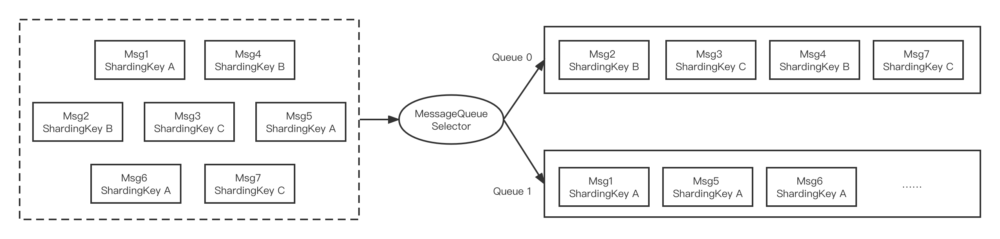

# 顺序消息发送

## 顺序消息介绍
顺序消息是一种对消息发送和消费顺序有严格要求的消息。

对于一个指定的Topic，消息严格按照先进先出（FIFO）的原则进行消息发布和消费，即先发布的消息先消费，后发布的消息后消费。在 Apache RocketMQ 中支持分区顺序消息，如下图所示。我们可以按照某一个标准对消息进行分区（比如图中的ShardingKey），同一个ShardingKey的消息会被分配到同一个队列中，并按照顺序被消费。



顺序消息的应用场景也非常广泛，比如在创建订单的例子中，需要保证同一个订单的生成、付款和发货，这三个操作被顺序执行。如果是普通消息，订单A的消息可能会被轮询发送到不同的队列中，不同队列的消息将无法保持顺序，而顺序消息发送时将ShardingKey相同（同一订单号）的消息序路由到一个逻辑队列中。

## 顺序消息示例代码

顺序消息的代码如下所示：

```jsx {13}
public class Producer {
    public static void main(String[] args) throws UnsupportedEncodingException {
        try {
            DefaultMQProducer producer = new DefaultMQProducer("please_rename_unique_group_name");
            producer.start();

            String[] tags = new String[] {"TagA", "TagB", "TagC", "TagD", "TagE"};
            for (int i = 0; i < 100; i++) {
                int orderId = i % 10;
                Message msg =
                    new Message("TopicTest", tags[i % tags.length], "KEY" + i,
                        ("Hello RocketMQ " + i).getBytes(RemotingHelper.DEFAULT_CHARSET));
                SendResult sendResult = producer.send(msg, new MessageQueueSelector() {
                    @Override
                    public MessageQueue select(List<MessageQueue> mqs, Message msg, Object arg) {
                        Integer id = (Integer) arg;
                        int index = id % mqs.size();
                        return mqs.get(index);
                    }
                }, orderId);

                System.out.printf("%s%n", sendResult);
            }

            producer.shutdown();
        } catch (MQClientException | RemotingException | MQBrokerException | InterruptedException e) {
            e.printStackTrace();
        }
    }
}
```

这里的区别主要是调用了```SendResult send(Message msg, MessageQueueSelector selector, Object arg)```方法，MessageQueueSelector 是队列选择器，arg 是一个 Java Object 对象，可以传入作为消息发送分区的分类标准。

:::tip
MessageQueueSelector的接口如下：

```jsx
public interface MessageQueueSelector {
    MessageQueue select(final List<MessageQueue> mqs, final Message msg, final Object arg);
}
```

其中 mqs 是可以发送的队列，msg是消息，arg是上述send接口中传入的Object对象，返回的是该消息需要发送到的队列。上述例子里，是以orderId作为分区分类标准，对所有队列个数取余，来对将相同orderId的消息发送到同一个队列中。
:::


## 顺序消息的一致性

如果一个Broker掉线，那么此时队列总数是否会发化？

如果发生变化，那么同一个 ShardingKey 的消息就会发送到不同的队列上，造成乱序。如果不发生变化，那消息将会发送到掉线Broker的队列上，必然是失败的。因此 Apache RocketMQ 提供了两种模式，如果要保证严格顺序而不是可用性，创建 Topic 是要指定 ```-o``` 参数（--order）为true，表示顺序消息:

```shell {1}
> sh bin/mqadmin updateTopic -c DefaultCluster -t TopicTest -o true -n 127.0.0.1:9876
create topic to 127.0.0.1:10911 success.
TopicConfig [topicName=TopicTest, readQueueNums=8, writeQueueNums=8, perm=RW-, topicFilterType=SINGLE_TAG, topicSysFlag=0, order=true, attributes=null]
```

其次要保证NameServer中的配置 ```orderMessageEnable``` 和 ```returnOrderTopicConfigToBroker``` 必须是 true。如果上述任意一个条件不满足，则是保证可用性而不是严格顺序。
