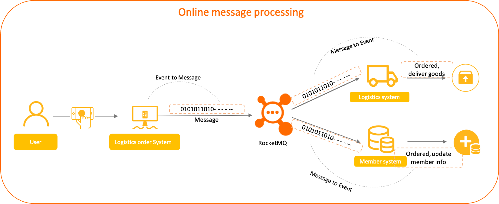
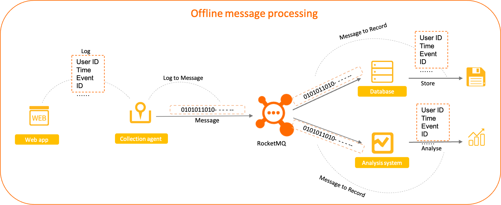

# 普通消息

普通消息为 Apache RocketMQ 中最基础的消息，区别于有特性的顺序消息、定时/延时消息和事务消息。本文为您介绍普通消息的应用场景、功能原理、使用方法和使用建议。

## 应用场景

普通消息一般应用于微服务解耦、事件驱动、数据集成等场景，这些场景大多数要求数据传输通道具有可靠传输的能力，且对消息的处理时机、处理顺序没有特别要求。

**典型场景一：微服务异步解耦**


如上图所示，以在线的电商交易场景为例，上游订单系统将用户下单支付这一业务事件封装成独立的普通消息并发送至Apache RocketMQ服务端，下游按需从服务端订阅消息并按照本地消费逻辑处理下游任务。每个消息之间都是相互独立的，且不需要产生关联。

**典型场景二：数据集成传输**


如上图所示，以离线的日志收集场景为例，通过埋点组件收集前端应用的相关操作日志，并转发到 Apache RocketMQ 。每条消息都是一段日志数据，Apache RocketMQ 不做任何处理，只需要将日志数据可靠投递到下游的存储系统和分析系统即可，后续功能由后端应用完成。

## 功能原理

**什么是普通消息**

定义：普通消息是Apache RocketMQ基本消息功能，支持生产者和消费者的异步解耦通信。


**普通消息生命周期**

* 初始化：消息被生产者构建并完成初始化，待发送到服务端的状态。

* 待消费：消息被发送到服务端，对消费者可见，等待消费者消费的状态。

* 消费中：消息被消费者获取，并按照消费者本地的业务逻辑进行处理的过程。 此时服务端会等待消费者完成消费并提交消费结果，如果一定时间后没有收到消费者的响应，Apache RocketMQ会对消息进行重试处理。具体信息，请参见[消费重试](./10consumerretrypolicy.md)。

* 消费提交：消费者完成消费处理，并向服务端提交消费结果，服务端标记当前消息已经被处理（包括消费成功和失败）。 Apache RocketMQ默认支持保留所有消息，此时消息数据并不会立即被删除，只是逻辑标记已消费。消息在保存时间到期或存储空间不足被删除前，消费者仍然可以回溯消息重新消费。

* 消息删除：Apache RocketMQ按照消息保存机制滚动清理最早的消息数据，将消息从物理文件中删除。更多信息，请参见[消息存储和清理机制](./11messagestorepolicy.md)。

## 使用限制

普通消息仅支持使用MessageType为Normal主题，即普通消息只能发送至类型为普通消息的主题中，发送的消息的类型必须和主题的类型一致。

## 使用示例

普通消息支持设置消息索引键、消息过滤标签等信息，用于消息过滤和搜索查找。以Java语言为例，收发普通消息的示例代码如下：

```java
//普通消息发送。
MessageBuilder messageBuilder = new MessageBuilder();
Message message = messageBuilder.setTopic("topic")
    //设置消息索引键，可根据关键字精确查找某条消息。
    .setKeys("messageKey")
    //设置消息Tag，用于消费端根据指定Tag过滤消息。
    .setTag("messageTag")
    //消息体。
    .setBody("messageBody".getBytes())
    .build();
try {
    //发送消息，需要关注发送结果，并捕获失败等异常。
    SendReceipt sendReceipt = producer.send(message);
    System.out.println(sendReceipt.getMessageId());
} catch (ClientException e) {
    e.printStackTrace();
}
//消费示例一：使用PushConsumer消费普通消息，只需要在消费监听器中处理即可。
MessageListener messageListener = new MessageListener() {
    @Override
    public ConsumeResult consume(MessageView messageView) {
        System.out.println(messageView);
        //根据消费结果返回状态。
        return ConsumeResult.SUCCESS;
    }
};
//消费示例二：使用SimpleConsumer消费普通消息，主动获取消息进行消费处理并提交消费结果。
List<MessageView> messageViewList = null;
try {
    messageViewList = simpleConsumer.receive(10, Duration.ofSeconds(30));
    messageViewList.forEach(messageView -> {
        System.out.println(messageView);
        //消费处理完成后，需要主动调用ACK提交消费结果。
        try {
            simpleConsumer.ack(messageView);
        } catch (ClientException e) {
            e.printStackTrace();
        }
    });
} catch (ClientException e) {
    //如果遇到系统流控等原因造成拉取失败，需要重新发起获取消息请求。
    e.printStackTrace();
}
```

## 使用建议

**设置全局唯一业务索引键，方便问题追踪** 

Apache RocketMQ支持自定义索引键（消息的Key），在消息查询和轨迹查询时，可以通过索引键高效精确地查询到消息。

因此，发送消息时，建议设置业务上唯一的信息作为索引，方便后续快速定位消息。例如，订单ID，用户ID等。
