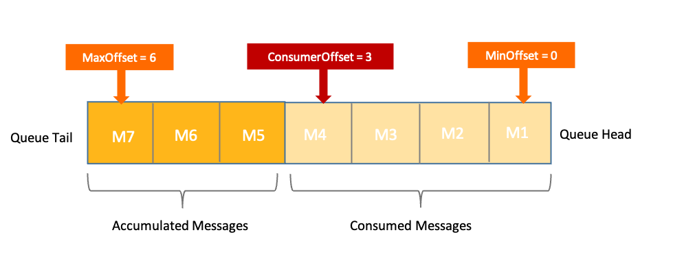

# 消费进度管理
Apache RocketMQ 通过消费位点管理消费进度，本文为您介绍 Apache RocketMQ 的消费进度管理机制。

## 背景信息

Apache RocketMQ 的生产者和消费者在进行消息收发时，必然会涉及以下场景，消息先生产后订阅或先订阅后生产。这两种场景下，消费者客户端启动后从哪里开始消费？如何标记已消费的消息？这些都是由 Apache RocketMQ 的消费进度管理机制来定义的。

通过了解 Apache RocketMQ 的消费进度管理机制，可以帮助您解答以下问题：

* 消费者启动后从哪里开始消费消息？

* 消费者每次消费成功后如何标记消息状态，确保下次不会再重复处理该消息？

* 某消息被指定消费者消费过一次后，如果业务出现异常需要做故障恢复，该消息能否被重新消费？

## 消费进度原理 

**消息位点（Offset）** 

参考 Apache RocketMQ [主题](../03-领域模型/02topic.md)和[队列](../03-领域模型/03messagequeue.md)的定义，消息是按到达服务端的先后顺序存储在指定主题的多个队列中，每条消息在队列中都有一个唯一的Long类型坐标，这个坐标被定义为消息位点。

任意一个消息队列在逻辑上都是无限存储，即消息位点会从0到Long.MAX无限增加。通过主题、队列和位点就可以定位任意一条消息的位置，具体关系如下图所示：

Apache RocketMQ 定义队列中最早一条消息的位点为最小消息位点（MinOffset）；最新一条消息的位点为最大消息位点（MaxOffset）。虽然消息队列逻辑上是无限存储，但由于服务端物理节点的存储空间有限， Apache RocketMQ 会滚动删除队列中存储最早的消息。因此，消息的最小消费位点和最大消费位点会一直递增变化。

**消费位点（ConsumerOffset）**

Apache RocketMQ 领域模型为发布订阅模式，每个主题的队列都可以被多个消费者分组订阅。若某条消息被某个消费者消费后直接被删除，则其他订阅了该主题的消费者将无法消费该消息。

因此，Apache RocketMQ 通过消费位点管理消息的消费进度。每条消息被某个消费者消费完成后不会立即在队列中删除，Apache RocketMQ 会基于每个消费者分组维护一份消费记录，该记录指定消费者分组消费某一个队列时，消费过的最新一条消息的位点，即消费位点。

当消费者客户端离线，又再次重新上线时，会严格按照服务端保存的消费进度继续处理消息。如果服务端保存的历史位点信息已过期被删除，此时消费位点向前移动至服务端存储的最小位点。
:::info
消费位点的保存和恢复是基于 Apache RocketMQ 服务端的存储实现，和任何消费者无关。因此 Apache RocketMQ 支持跨消费者的消费进度恢复。
:::

队列中消息位点MinOffset、MaxOffset和每个消费者分组的消费位点ConsumerOffset的关系如下：

* ConsumerOffset≤MaxOffset：
  * 当消费速度和生产速度一致，且全部消息都处理完成时，最大消息位点和消费位点相同，即ConsumerOffset=MaxOffset。
  
  * 当消费速度较慢小于生产速度时，队列中会有部分消息未消费，此时消费位点小于最大消息位点，即ConsumerOffset\<MaxOffset，两者之差就是该队列中堆积的消息量。

* ConsumerOffset≥MinOffset：正常情况下有效的消费位点ConsumerOffset必然大于等于最小消息位点MinOffset。消费位点小于最小消息位点时是无效的，相当于消费者要消费的消息已经从队列中删除了，是无法消费到的，此时服务端会将消费位点强制纠正到合法的消息位点。

**消费位点初始值**

消费位点初始值指的是消费者分组首次启动消费者消费消息时，服务端保存的消费位点的初始值。

Apache RocketMQ 定义消费位点的初始值为消费者首次获取消息时，该时刻队列中的最大消息位点。相当于消费者将从队列中最新的消息开始消费。

## 重置消费位点

若消费者分组的初始消费位点或当前消费位点不符合您的业务预期，您可以通过重置消费位点调整您的消费进度。

**适用场景**

* 初始消费位点不符合需求：因初始消费位点为当前队列的最大消息位点，即客户端会直接从最新消息开始消费。若业务上线时需要消费部分历史消息，您可以通过重置消费位点功能消费到指定时刻前的消息。

* 消费堆积快速清理：当下游消费系统性能不足或消费速度小于生产速度时，会产生大量堆积消息。若这部分堆积消息可以丢弃，您可以通过重置消费位点快速将消费位点更新到指定位置，绕过这部分堆积的消息，减少下游处理压力。

* 业务回溯，纠正处理：由于业务消费逻辑出现异常，消息被错误处理。若您希望重新消费这些已被处理的消息，可以通过重置消费位点快速将消费位点更新到历史指定位置，实现消费回溯。

**重置功能**

Apache RocketMQ 的重置消费位点提供以下能力：

* 重置到队列中的指定位点。

* 重置到某一时刻对应的消费位点，匹配位点时，服务端会根据自动匹配到该时刻最接近的消费位点。

**使用限制**

* 重置消费位点后消费者将直接从重置后的位点开始消费，对于回溯重置类场景，重置后的历史消息大多属于存储冷数据，可能会造成系统压力上升，一般称为冷读现象。因此，需要谨慎评估重置消费位点后的影响。建议严格控制重置消费位点接口的调用权限，避免无意义、高频次的消费位点重置。

* Apache RocketMQ 重置消费位点功能只能重置对消费者可见的消息，不能重置定时中、重试等待中的消息。更多信息，请参见[定时/延时消息](./02delaymessage.md)和[消费重试](./10consumerretrypolicy.md)。

## 版本兼容性

关于消费者分组的消费位点初始值，不同的服务端版本中定义如下：

* 服务端历史版本（4.x/3.x版本）：消息位点初始值受当前队列消息状态的影响。

* 服务端5.x版本：明确定义消费位点初始值为消费者获取消息时刻队列中的最大消息位点。

因此，若您将服务端版本从历史版本升级到最新的5.x版本时，需要自行对消费者首次启动时的情况做兼容性判断。

## 使用建议

**严格控制消费位点重置的权限**

重置消费位点会给系统带来额外处理压力，可能会影响新消息的读写性能。 因此该操作请在适用场景下谨慎执行，并提前做好合理性和必要性评估。
