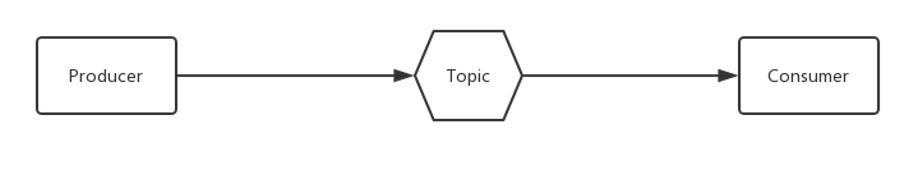

# What is RocketMQ

People subscribe to some of their favorites by applications.
When an author publishes an article to the relevant section, we can receive relevant news feeds.

Pub/Sub is a messaging paradigm where message senders(called publishers, producers) send messages directly to specific recipients (called subscribers, consumers). The basic message model of RocketMQ is a simple Pub/Sub model.

import Tabs from '@theme/Tabs';	

import TabItem from '@theme/TabItem';

:::tip Concepts

<Tabs>
  <TabItem value="Producer" label="Producer" default>
   The producer is responsible for producing messages, and the business system is generally responsible for producing messages. A producer sends messages generated in the business application system to the broker server.RocketMQ provides a variety of sending methods, synchronous sending, asynchronous sending, sequential sending, and one-way sending.

learn more  ➡️ [Producer](../02-producer/01concept1.md)
  </TabItem>
  <TabItem value="Consumer" label="Consumer">
   Aims to consume messages, which are generally responsible by the backend system (asynchronous consumption). A message consumer pulls messages from the Broker server and serves them to the application. From the perspective of user applications, two consumption methods are provided: pull consumption and push consumption.

learn more  ➡️ [Consumer](../03-consumer/01concept2.md)

  </TabItem>
  <TabItem value="Topic" label="Topic">
  RocketMQ's fundamental unit of event organization is called Topic. Each Topic contains several messages, and each message can only belong to one topic.

learn more  ➡️ [basic concept](../02-producer/01concept1.md)

  </TabItem>
</Tabs>

:::

## RocketMQ's message model, a simple Pub/Sub model

:::note Basic Messaging System Model

 The figure above is an extended message model, including **two Producers**, **two Topics**, and **two sets of Consumers**.

:::

In a **topic-based** system, messages are published on topics or channels.Consumers will receive all messages on the topics they subscribe to, and producers are responsible for defining the message categories that subscribers subscribe to.This is a basic conceptual model, and in practical applications, the structure will be more complex.For example, in order to support high concurrency and horizontal scaling, the topics need to be partitioned.The same topic will have multiple producers, the same information will have multiple consumers, and load balancing should be performed between consumers.

## RocketMQ extended message model

:::note Extended message model

The above picture is an extended message model, including **two producers**, **two topics**, and **two sets of consumers Comsumer**.

The **Broker** that stores message topics is the proxy server for the actual deployment process.
:::

- for**Horizontal scaling**, RocketMQ partitions Topic through **MessageQueue**

- for**Concurrent consumption**, the concept of Consumer Group came into being.

:::info

- Consumer mainly has two consumption modes, namely **broadcast mode** and **cluster mode** (the most commonly used cluster mode is shown in the figure).
- Consumer instances in the same Consumer Group are load balancing consumption.As shown in the figure, ConsumerGroupA subscribes to TopicA and TopicA corresponds to 3 queues.Then Consumer1 in GroupA consumes messages from MessageQueue 0 and MessageQueue 1, and Consumer2 consumes messages from MessageQueue2.

:::

## RocketMQ Architecture

How do Producer and Consumer find the addresses of Topic and Broker? How are messages sent and received?

The main Apache RocketMQ components are Producers, Consumers, NameServers, and Brokers:

###  **Producer**

A  producer serves as a data source that optimizes, writes, and publishes messages to one or more  topics.Producers load balance data among brokers through MessageQueue.It supports fail-fast and retries during sending messages.

### **Consumer**

Consumers read data by reading messages from the topics to which they subscribe.

- Supports message consumption in two modes: push and pull.
- Supports **cluster mode** and broadcast mode consumption
- Provide real-time message subscription mechanism

##  **NameServer**

NameServer is a simple Topic routing registry that supports dynamic registration and discovery of Topic and Broker.

Mainly includes two functions：
- **Broker management**:The NameServer accepts the registration information of the Broker cluster and saves it as the basic data of the routing information.And it provides a heartbeat detection mechanism to check whether the Broker is still alive.
- **Routing Information Management**:Each NameServer will hold the entire routing information about the Broker cluster and queue information for client queries.The Producer and Consumer can know the routing information of the entire Broker cluster through the NameServer, so as to produce and consume messages.

NameServer usually has multiple instances deployed, and each instance does not communicate with each other.Broker registers its own routing information with each NameServer, so each NameServer instance saves a complete routing information.The client can still obtain routing information from other NameServers, When a NameServer goes offline for some reason.

##  Broker

Broker is mainly responsible for message storage, delivery and query, as well as service high availability guarantee.

NameServer is stateless, so it can be deployed in clusters without any information synchronization between nodes.Compared with nameserver, broker is more complicated.

In the Master-Slave architecture, the Broker is divided into Master and Slave.
A Master can correspond to multiple Slaves, but a Slave can only correspond to one Master.
The correspondence between Master and Slave is defined by specifying the same BrokerName and different BrokerId. A BrokerId of 0 means Master, and non-0 means Slave.Master can also deploy multiple.

:::note RocketMQ Architecture Summary

- Each **Broker** establishes long-term connections with all nodes in the **NameServer** cluster, and regularly registers Topic information to all NameServers.
- **Producer** establishes a persistent connection with one of the nodes in the **NameServer** cluster, regularly obtains topic routing information from NameServer, establishes a persistent connection to the Master that provides Topic services, and regularly sends a heartbeat to the Master.Producers are completely stateless.
- **Consumer** establishes a persistent connection to one of the nodes in the **NameServer** cluster
，regularly obtains Topic routing information from NameServer,establishes long connections to Master and Slave that provide Topic services, and send heartbeats to Master and Slave regularly.Consumer subscribes to topic from Master or Slave.

:::

## RocketMQ Workflow

### 1. Start the RocketMQ NameServer

The NameServer listens to the port and waits for the connection of the Broker, Producer, and Consumer after startup.

### 2. Start the RocketMQ Broker

The Broker maintains long connections with all NameServers, gets current Broker information, and stores all Topic information after startup. After successful registration, a mapping relationship will be built between Topic and Broker in the NameServer cluster.

### 3. Create a topic

The Broker should be specified before creating a Topic, or automatically create one while sending messages.

### 4. Write messages to the topic

The Producer starts by establishing a long-term connection with one device of the NameServer clusters, obtains the Broker information where the current topic exists from the NameServer, polls to select a queue from the queue list, and establishes a long-term connection where the queue is located. This enables the Producer to send messages to the Broker.

### 5. Read messages from the topic

The Consumer establishes a long-term connection with one of the NameServers, obtains which brokers the current subscription topic exists on, and then directly establishes a connection channel with the Broker, and then starts to consume messages.

