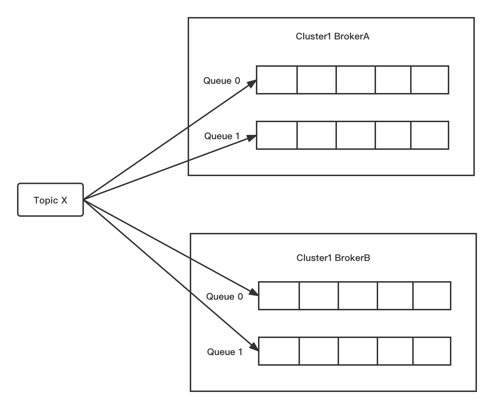

# Core Concept

Introduction to the basic concepts of the Producer section, including **Message, Tag, Keys, Message Queue and Producer**.

## Message

The composition of RocketMQ messages is simple, as shown in the following figure.

- **topic**: the topic of the message to be sent.
- **body**: the storage content of the message.
- **properties**: the message properties.
- **transactionId**: the id of the transaction message.

:::tip
- Tag: Whether it is RocketMQ Tag filtering or delayed message feature, etc., the capabilities of Properties will be used.

- Keys: The server will create a hash index based on Keys. You are able to query messages based on Topic and Keys in the Console after setting. Please ensure that the keys (e.g. order number, product ID, etc) are unique since it is a hash index.
  :::

<center>
</img>
</center>

The properties that could be set in the Message include:


|     Field      | Default | Required | Description                                                                                                  |
| :------------: | ------- | -------- |--------------------------------------------------------------------------------------------------------------|
|     Topic      | null    | Required | Topic name to which the message belongs.                                                                     |
|      Body      | null    | Required | Message body.                                                                                                |
|      Tags      | null    | Optional | Message tag, which is for filtering in server. Currently only one per message is supported.                  |
|      Keys      | null    | Optional | Keywords representing the message.                                                                           |
|      Flag      | 0       | Optional | Completely set by the client, RocketMQ does not intervene.                                                   |
| DelayTimeLevel | 0       | Optional | Message delay level, 0 means no delay, greater than 0 will delay a specific time before it will be consumed. |
| WaitStoreMsgOK | true    | Optional | Indicates whether the response is returned after the server is flushed.                                      |

## Tag

Topic and Tag are both business identifiers for classification. The difference is that Topic is a first-level classification, and Tag can be regarded as a second-level classification. Tag can be used to achieve message filtering in Topic.

:::tip
- Topic：Message topic, which categorizes different business messages through Topic.
- Tag：Message tag, which is used to further distinguish the message under a topic. This is the property that the message carries when it is sent from the producer.
  :::


The relationship between Topic and Tag is shown in the following figure.


### When to use Topic/Tag?

It can be determined from the following aspects:

- Whether the message types are consistent: Such as simple messages, transaction messages, timed (delayed) messages, and ordered messages. Different message types use different Topics, which cannot be distinguished by Tags.

- Whether the business is related: The messages that are not directly related, such as Taobao messages and  JD Logistics messages, are distinguished by different Topics. In contrast, the messages belonging to Tmall transaction, including electrical order, women's clothing order, cosmetics order messages could be distinguished by Tags.

- Whether the message priority is identical：For example, as logistics message, Hema must be delivered within an hour, Tmall supermarket must be delivered within 24 hours, and Taobao logistics is relatively slower. Messages with different priorities could be distinguished by different topics.

- Whether the message volume is equivalent: Some business messages are small in volume but require high real-time performance. If they stay under the same Topic with trillion-level messages, it may be "starve" due to the long waiting time. Therefore, it is necessary to split messages of different volumes into different Topics.

In general, you can choose to create multiple Topics, or create multiple Tags under a single Topic for message classification. There is no necessary connection between messages under different Topics, and Tags are used to distinguish interrelated messages under the same topic, such as the complete sets and subsets, or the sequence of processes.

## Keys

Each message of Apache RocketMQ can place a unique identification —— Keys field at the business level, which is convenient for locating the problem of message loss in the future. The broker side will create an index (hash index) for each message so that the client can query the content of the message through Topic and Key, as well as who consumes the message. Since it is a hash index, please make sure that the key is as unique as possible to avoid potential hash collisions.

```java
   // Order Id
   String orderId = "20034568923546";
   message.setKeys(orderId);
```

## Message Queue

To support high concurrency and horizontal expansion, Topic needs to be partitioned, which is called Message Queue in RocketMQ. A Topic may have multiple queues and may be distributed on different Brokers.



In general, a message will only exist in one of the queues under a Topic if it is not sent repeatedly (e.g., a client resents messages since the server does not respond). The message will be stored in a queue according to the principle of FIFO (First In, First Out). Each message will have its own position, and each queue will calculate the total number of the messages, which is called MaxOffset; the position corresponding to the starting point of the queue is called MinOffset. Message Queue can improve the concurrency of message production and consumption.

## Producer

The Producer is the sender of the message. Apache RocketMQ owns rich message types and is able to support various scenarios.

For instance, an order will be closed due to the payment timeout in an e-commerce transaction, so a delayed message should be sent when the order is created. This message will be delivered to the Consumer after 30 minutes. After receiving the message, the Consumer needs to determine whether the corresponding order has been paid. If the payment is not completed, the order will be closed. If the payment has been completed, then ignore it.

In the e-commerce scenario, the business requires the messages of the same order to be kept in strict sequence, the ordered messages could therefore be applied.

In the log processing scenario, a relatively large sending delay is acceptable, but it has a high throughput requirement. It is expected that millions of logs need to be processed within a second. In this case, the batch messages could be sent.

In the bank deduction scenarios, in order to keep the upstream deduction operation consistent with the downstream SMS notification, transaction messages could be utilized.

The next section will introduce the sending of various types of messages.