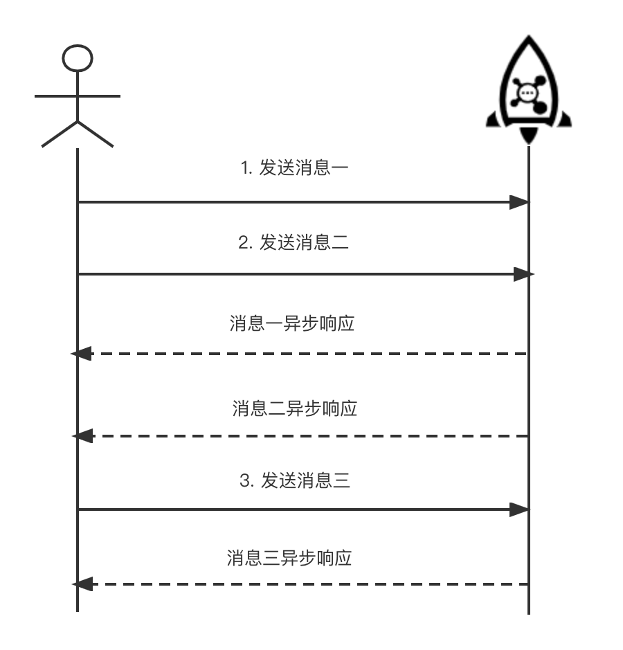

# Simple Message Sending

## 1.Creating Topic in Cluster

RocketMQ cluster is enabled by default with **autoCreateTopicEnable** configuration, which will automatically create Topics for the sent messages. If autoCreateTopicEnable is not enabled, you can also use the RocketMQ Admin tool to create the target Topic.

```shell
$ sh bin/mqadmin updateTopic -c DefaultCluster -t TopicTest -n 127.0.0.1:9876
create topic to 127.0.0.1:10911 success.
TopicConfig [topicName=TopicTest, readQueueNums=8, writeQueueNums=8, perm=RW-, topicFilterType=SINGLE_TAG, topicSysFlag=0, order=false, attributes=null]
```

After executing the command above, 8 queues are created on the Broker machine with the Topic named TopicTest.

## 2.Adding Client-Side Dependency

Firstly, add RocketMQ client-side dependency to JAVA application.

import Tabs from '@theme/Tabs';
import TabItem from '@theme/TabItem';

<Tabs>
<TabItem value="Maven" label="Maven" default >

```java
<dependency>
  <groupId>org.apache.rocketmq</groupId>
  <artifactId>rocketmq-client</artifactId>
  <version>4.9.4</version>
</dependency>
```
</TabItem>
<TabItem value="Gradle" label="Gradle">

```java 
compile 'org.apache.rocketmq:rocketmq-client:4.9.4'
```

</TabItem>

</Tabs>


## 3.Message Sending

Apache RocketMQ sends messages in three ways: **synchronous, asynchronous, and one-way**. The first two message types are reliable since the response will be returned from the server regardless of whether their messages are successfully sent or not.

### 3.1 Synchronous Sending

Synchronous Sending is a communication method in which the message sender sends a message and will send the next message only after receiving a synchronous response from the server. Reliable synchronous transmission is widely used in various scenarios, such as important notification messages, short message notifications, etc.


The entire code for synchronous sending is as follows: 
1. **Create a Producer**. Create a DefaultMQProducer in advance. The Producer should contain the name of the Producer group, which is a collection of Producer, they would send the same type of messages with identical logic.
2. **Set the address of NameServer**. Apache RocketMQ is able to set the address of the NameServer (described in the client configuration) in many ways. The following example is set by calling the producer's setNamesrvAddr() method in the code, separated by a semicolon if there is more than one NameServer, such as "127.0.0.2:9876;127.0.0.3:9876".
3. **Build the message**. Set the topic, tag, body, and so on. The tag can be understood as a label to categorize the message, and RocketMQ can filter the tag on the Consumer side.
4. **Call the send() method to send the message**. Ultimately, the send() method will return a SendResult. The SendResut contains the actual send status including SEND_OK (send success), FLUSH_DISK_TIMEOUT (disk flush timeout), FLUSH_SLAVE_TIMEOUT (sync to slave timeout), SLAVE_NOT_AVAILABLE (slave can not be used), and an exception is thrown if it fails.

``` javascript {16,15}
public class SyncProducer {
  public static void main(String[] args) throws Exception {
    // Initialize a producer and set the Producer group name
    DefaultMQProducer producer = new DefaultMQProducer("please_rename_unique_group_name"); //（1）
    // Set the address of NameServer
    producer.setNamesrvAddr("localhost:9876");  //（2）
    // Start Producer
    producer.start();
    for (int i = 0; i < 100; i++) {
      // Create a message and set the topic, tag, body and so on. The tag can be understood as a label to categorize the message, and RocketMQ can filter the tag on the consumer side.
      Message msg = new Message("TopicTest" /* Topic */,
        "TagA" /* Tag */,
        ("Hello RocketMQ " + i).getBytes(RemotingHelper.DEFAULT_CHARSET) /* Message body */
        );   //（3）
      // Use the producer to send and wait for the result of sending synchronously
      SendResult sendResult = producer.send(msg);   //（4）
      System.out.printf("%s%n", sendResult);
    }
    // Close the producer once it is no longer in use
    producer.shutdown();
  }
}
```


### 3.2 Asynchronous Sending




Asynchronous sending is a sending method in which the sender sends messages continuously without waiting for the server to return a response.
Asynchronous sending requires the implementation of the **Asynchronous Send Callback Interface** (SendCallback).
:::note
Asynchronous sending requires the implementation of the **Asynchronous SendCallback Interface**.
:::
After sending a message, the sender does not need to wait for a response from the server to send the next message. The sender receives the response from the server through the callback interface and handles the result. Asynchronous sending is generally used in time-consuming and response time sensitive business scenarios. For example, the video upload notifies the start of transcoding service, and notifies the push of transcoding result after transcoding is completed.

The following is the sample code.

``` javascript {16,17}
public class AsyncProducer {
  public static void main(String[] args) throws Exception {
    // Initialize a producer and set the Producer group name
    DefaultMQProducer producer = new DefaultMQProducer("please_rename_unique_group_name");
    // Set the address of NameServer
    producer.setNamesrvAddr("localhost:9876");
    // Start Producer
    producer.start();
    producer.setRetryTimesWhenSendAsyncFailed(0);
    for (int i = 0; i < 100; i++) {
      final int index = i;
      // Create a message and set the topic, tag, body and so on. The tag can be understood as a label to categorize the message, and RocketMQ can filter the tag on the consumer side.
      Message msg = new Message("TopicTest",
        "TagA",
        "Hello world".getBytes(RemotingHelper.DEFAULT_CHARSET));
      // Send a message asynchronously, the result is returned to the client by callback
      producer.send(msg, new SendCallback() {
        @Override
        public void onSuccess(SendResult sendResult) {
          System.out.printf("%-10d OK %s %n", index,
            sendResult.getMsgId());
        }
        @Override
        public void onException(Throwable e) {
          System.out.printf("%-10d Exception %s %n", index, e);
          e.printStackTrace();
        }
      });
    }
    // Close the producer once it is no longer in use
    producer.shutdown();
  }
}
```

:::note
The only difference between asynchronous and synchronous sending methods is the parameters for calling the sending interface. Asynchronous sending does not wait for the return of send() method, instead, it will carry the SendCallback implementation. The SendCallback interface has two methods (onSuccess and onException), indicating that the message is sent successfully or failed.
:::

### 3.3 One-Way Sending


The sender is only responsible for sending the message and does not wait for the server to return a response and no callback function is triggered, in other words, it only sends the request and does not wait for the answer. The process of sending messages in this way is very short, usually in the microsecond level. It is suitable for some scenarios where the time consumption is very short, but the reliability requirement is not high, such as log collection.

``` javascript {16}
public class OnewayProducer {
  public static void main(String[] args) throws Exception{
    // Initialize a producer and set the Producer group name
    DefaultMQProducer producer = new DefaultMQProducer("please_rename_unique_group_name");
    // Set the address of NameServer
    producer.setNamesrvAddr("localhost:9876");
    // Start Producer
    producer.start();
    for (int i = 0; i < 100; i++) {
      // Create a message and set the topic, tag, body and so on. The tag can be understood as a label to categorize the message, and RocketMQ can filter the tag on the consumer side.
      Message msg = new Message("TopicTest" /* Topic */,
        "TagA" /* Tag */,
        ("Hello RocketMQ " + i).getBytes(RemotingHelper.DEFAULT_CHARSET) /* Message body */
      );
      // Since there is no request-answer processing when sending messages in the oneway method, if there is a message sending failure, data will be lost because there is no retry. If data cannot be lost, it is recommended to use the reliable synchronous or reliable asynchronous sending method.
      producer.sendOneway(msg);
    }
     // Close the producer once it is no longer in use
     producer.shutdown();
  }
}
```

One-way mode will call the sendOneway() method, which does not wait or process the returned result.
