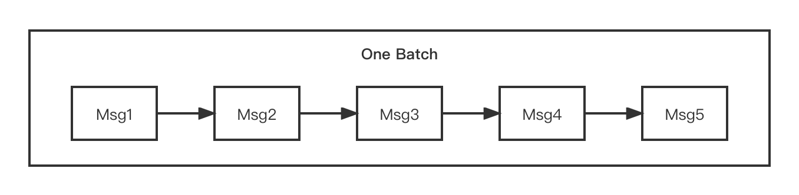

# Batch Message Sending

In the case of certain requirements on throughput, Apache RocketMQ can send messages after grouping them into batches. The approach is able to increase throughput and decrease the times of API and network calls.



```javascript {10,11,12,13}
public class SimpleBatchProducer {

    public static void main(String[] args) throws Exception {
        DefaultMQProducer producer = new DefaultMQProducer("BatchProducerGroupName");
        producer.start();

        //If you just send messages of no more than 1MiB at a time, it is easy to use batch
        //Messages of the same batch should have: same topic, same waitStoreMsgOK and no schedule support
        String topic = "BatchTest";
        List<Message> messages = new ArrayList<>();
        messages.add(new Message(topic, "Tag", "OrderID001", "Hello world 0".getBytes()));
        messages.add(new Message(topic, "Tag", "OrderID002", "Hello world 1".getBytes()));
        messages.add(new Message(topic, "Tag", "OrderID003", "Hello world 2".getBytes()));

        producer.send(messages);
    }
}
```

:::note
The call here is simple, where it packages the message as `Collection<Message> msgs` and passes it into the method as a parameter. There are two things to note here. First of all, the size of the batch message cannot exceed 1 MiB, otherwise, it needs to be split. Secondly, the message topic within the same batch must be identical.
:::