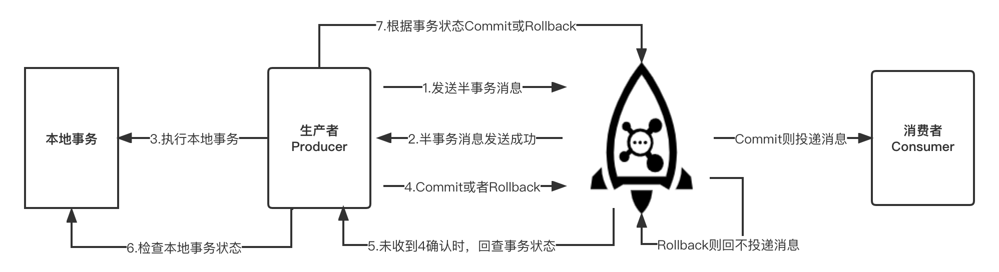

# Transactional Message Sending

## Introduction

In some scenarios where there is a strong need for data consistency, Apache RocketMQ transactional messages can be used to ensure consistency of upstream and downstream data.


Transactional messages are send in two phases. At first, a half message will be delivered, which refers to a message is successfully sent to the MQ server, but the server did not receive the second acknowledgement of the message from the Producer, then the message will be marked as “temporarily undeliverable” state.

The local transaction will be executed if the message is sent successfully, and a half message status (commit or rollback) will be delivered to the Broker depending on the local transaction results.

If the second acknowledgement of a transactional message is lost due to network flashback, Producer restart, etc., the Broker will find the message which is in "half message" state for a long time, and take the initiative to check the transaction status of the message (Commit or Rollback) from the Producer. Therefore, the downstream will receive the message if the local transaction is executed successfully, otherwise it will not. This ultimately ensures the consistency of the upstream and downstream data.

The detailed execute flow of the transactional message is shown in the following diagram:



## Transactional Message Sending Procedure

1. The Producer sends the half message to the `RocketMQ Broker`.
2. After the `RocketMQ Broker` persists the message successfully, it returns an Ack to the Producer confirming that the message was sent successfully and it is a half message.
3. The Producer starts executing the local transaction.
4. The Producer submits a second acknowledgement (Commit or Rollback) to the server based on the result of the local transaction, and the server receives the acknowledgment and processes the logic as follows.
   - If the second acknowledgement result is Commit: the server marks the half message as deliverable and delivers it to the Consumer.
   - If the second acknowledgement result is Rollback: the server will rollback the transaction and will not deliver the half message to the Consumer.

4. In the special case of network disconnection or the Producer restarts, if the server does not receive the second acknowledgment result from the Producer, or the second acknowledgment result received by the server is Unknown, the server will initiate a rollback message to a Producer after a fixed time.

The procedure of the transaction status check are as follows.
1. After receiving the transaction status check request, the Producer needs to verify the final result of the local transaction of the corresponding message.
2. The producer submits the second acknowledgment again based on the final result of the local transaction, and the server side will still processes the half message according to step 4.

## Example

```java
public class TransactionProducer {
    public static void main(String[] args) throws MQClientException, InterruptedException {
        TransactionListener transactionListener = new TransactionListenerImpl();
        TransactionMQProducer producer = new TransactionMQProducer("please_rename_unique_group_name");
        ExecutorService executorService = new ThreadPoolExecutor(2, 5, 100, TimeUnit.SECONDS, new ArrayBlockingQueue<Runnable>(2000), new ThreadFactory() {
            @Override
            public Thread newThread(Runnable r) {
                Thread thread = new Thread(r);
                thread.setName("client-transaction-msg-check-thread");
                return thread;
            }
        });

        producer.setExecutorService(executorService);
        producer.setTransactionListener(transactionListener);
        producer.start();

        String[] tags = new String[] {"TagA", "TagB", "TagC", "TagD", "TagE"};
        for (int i = 0; i < 10; i++) {
            try {
                Message msg =
                    new Message("TopicTest", tags[i % tags.length], "KEY" + i,
                        ("Hello RocketMQ " + i).getBytes(RemotingHelper.DEFAULT_CHARSET));
                SendResult sendResult = producer.sendMessageInTransaction(msg, null);
                System.out.printf("%s%n", sendResult);

                Thread.sleep(10);
            } catch (MQClientException | UnsupportedEncodingException e) {
                e.printStackTrace();
            }
        }

        for (int i = 0; i < 100000; i++) {
            Thread.sleep(1000);
        }
        producer.shutdown();
    }

    static class TransactionListenerImpl implements TransactionListener {
        private AtomicInteger transactionIndex = new AtomicInteger(0);

        private ConcurrentHashMap<String, Integer> localTrans = new ConcurrentHashMap<>();

        @Override
        public LocalTransactionState executeLocalTransaction(Message msg, Object arg) {
            int value = transactionIndex.getAndIncrement();
            int status = value % 3;
            localTrans.put(msg.getTransactionId(), status);
            return LocalTransactionState.UNKNOW;
        }

        @Override
        public LocalTransactionState checkLocalTransaction(MessageExt msg) {
            Integer status = localTrans.get(msg.getTransactionId());
            if (null != status) {
                switch (status) {
                    case 0:
                        return LocalTransactionState.UNKNOW;
                    case 1:
                        return LocalTransactionState.COMMIT_MESSAGE;
                    case 2:
                        return LocalTransactionState.ROLLBACK_MESSAGE;
                    default:
                        return LocalTransactionState.COMMIT_MESSAGE;
                }
            }
            return LocalTransactionState.COMMIT_MESSAGE;
        }
    }
}
```

Transactional messages are no longer sent by DefaultMQProducer, but using `TransactionMQProducer`. The above sample sets the thread pool for the transactional message check, if not, one will be generated by default. The most important thing is to implement the `TransactionListener` interface and pass `TransactionMQProducer` into it.

:::note

The TransactionListener interface is defined as follows:

````java
public interface TransactionListener {
    /**
     * When send transactional prepare(half) message succeed, this method will be invoked to execute local transaction.
     *
     * @param msg Half(prepare) message
     * @param arg Custom business parameter
     * @return Transaction state
     */
    LocalTransactionState executeLocalTransaction(final Message msg, final Object arg);

    /**
     * When no response to prepare(half) message. broker will send check message to check the transaction status, and this
     * method will be invoked to get local transaction status.
     *
     * @param msg Check message
     * @return Transaction state
     */
    LocalTransactionState checkLocalTransaction(final MessageExt msg);
}
````
:::

`executeLocalTransaction` is the method that executes the local transaction after the half message has been sent successfully. After executing the local transaction, the following three states can be returned in this method.

- `LocalTransactionState.COMMIT_MESSAGE`: the transaction is committed, allowing the consumer to consume the message.
- `LocalTransactionState.ROLLBACK_MESSAGE`: the transaction is rolled back, and the message will be discarded without being allowed to be consumed.
- `LocalTransactionState.UNKNOW`: temporarily unable to determine the state. After waiting for a fixed time, the Broker send the transaction status check message back to the producer.

`checkLocalTransaction` is a method to check the transaction state on the Broker side because the second acknowledgement is not received. Transaction status check rule: After the execution of the local transaction is completed, if the local transaction returns LocalTransactionState.UNKNOW status to the Broker, or the Producer exits causing no status returned from the Producer. Then the Broker will initiate a transaction status check message to the Producer, and it will check again at regular intervals if the transaction status is still not obtained.

:::caution

It is important to note that the ProducerGroupName of a transactional message cannot be set arbitrarily. Transactional messages have a transaction status check mechanism. If the original Producer is found to have crashed and collapsed, the Broker will contact other Producer instances within the same Producer group to check the local transaction execution and Commit or Rollback half messages.

:::
