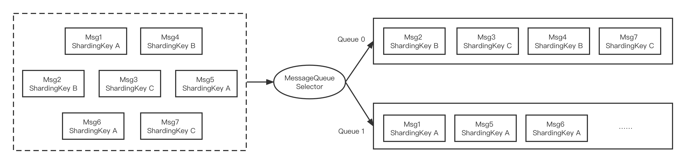

# Ordered Message Sending

## Ordered Message Introduction
Ordered messages have strict requirements on the order in which they are sent and consumed. 

For a given Topic, messages are published and consumed strictly on a first-in-first-out (FIFO) basis, i.e., messages published first will be consumed first. Furthermore, as shown in the following figure, partitioned ordered messages are supported in Apache RocketMQ. The messages can be partitioned according to a certain criterion (e.g., ShardingKey). Messages with the same ShardingKey are assigned to the identical queue and consumed in order.


Ordered messages are also used in a wide range of application scenarios, such as the example of creating orders, the same order generation, payment, and shipment should be executed sequentially. In the case of simple messages, the messages of Order A may be polled and sent to different queues. The messages of different queues will not be able to maintain order. In contrast, ordered messages are sent by routing the sequence of messages with the same ShardingKey (same order number) to a logical queue.

## Ordered Message Sample Code

The ordered message sample code is as follows:

```jsx {13}
public class Producer {
    public static void main(String[] args) throws UnsupportedEncodingException {
        try {
            DefaultMQProducer producer = new DefaultMQProducer("please_rename_unique_group_name");
            producer.start();

            String[] tags = new String[] {"TagA", "TagB", "TagC", "TagD", "TagE"};
            for (int i = 0; i < 100; i++) {
                int orderId = i % 10;
                Message msg =
                    new Message("TopicTest", tags[i % tags.length], "KEY" + i,
                        ("Hello RocketMQ " + i).getBytes(RemotingHelper.DEFAULT_CHARSET));
                SendResult sendResult = producer.send(msg, new MessageQueueSelector() {
                    @Override
                    public MessageQueue select(List<MessageQueue> mqs, Message msg, Object arg) {
                        Integer id = (Integer) arg;
                        int index = id % mqs.size();
                        return mqs.get(index);
                    }
                }, orderId);

                System.out.printf("%s%n", sendResult);
            }

            producer.shutdown();
        } catch (MQClientException | RemotingException | MQBrokerException | InterruptedException e) {
            e.printStackTrace();
        }
    }
}
```

The difference here is mainly the call to the ```SendResult send(Message msg, MessageQueueSelector selector, Object arg)``` method, where MessageQueueSelector is the queue selector and arg is a Object in Java that can be passed in as a sorting criterion for sending partitioned messages.

:::tip
MessageQueueSelector interface is as follows:

```jsx
public interface MessageQueueSelector {
    MessageQueue select(final List<MessageQueue> mqs, final Message msg, final Object arg);
}
```

In the interface, mqs is the queue, msg is the message, and arg is the object passed in, the queue that message are sent to will be returned. In the above example, the orderId is used as the partitioning criterion, and the remainder of all queues is used to send messages with the same orderId to the same queue.
:::


## Consistency of Ordered Messages

If a Broker drops out, does the total number of queues change at that point? 

If a change occurs, messages with the same ShardingKey will be sent to a different queue causing disorder. If no change occurs, messages will be sent to the queue of the offline Broker, which is bound to fail. Therefore, Apache RocketMQ provides two modes, to guarantee strict order over availability, create Topic by specifying the ```-o``` parameter (--order) to be true, which represents ordered messages:

```shell {1}
$ sh bin/mqadmin updateTopic -c DefaultCluster -t TopicTest -o true -n 127.0.0.1:9876
create topic to 127.0.0.1:10911 success.
TopicConfig [topicName=TopicTest, readQueueNums=8, writeQueueNums=8, perm=RW-, topicFilterType=SINGLE_TAG, topicSysFlag=0, order=true, attributes=null]
```

Secondly, make sure that the configuration ```orderMessageEnable``` and ```returnOrderTopicConfigToBroker``` in the NameServer must be true. If either of the above conditions is not met, availability is guaranteed rather than strict order.
