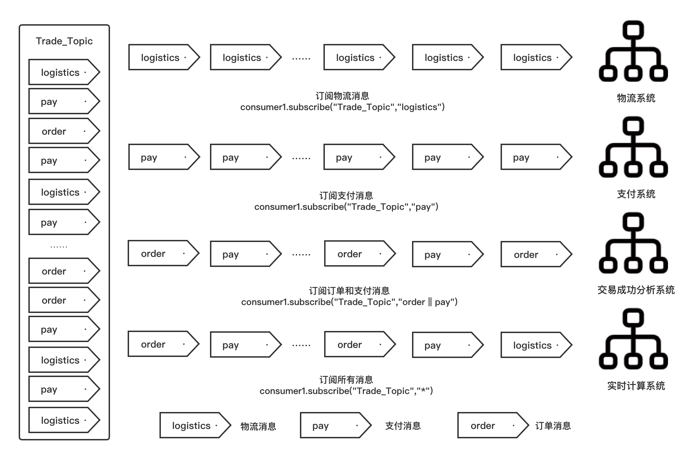
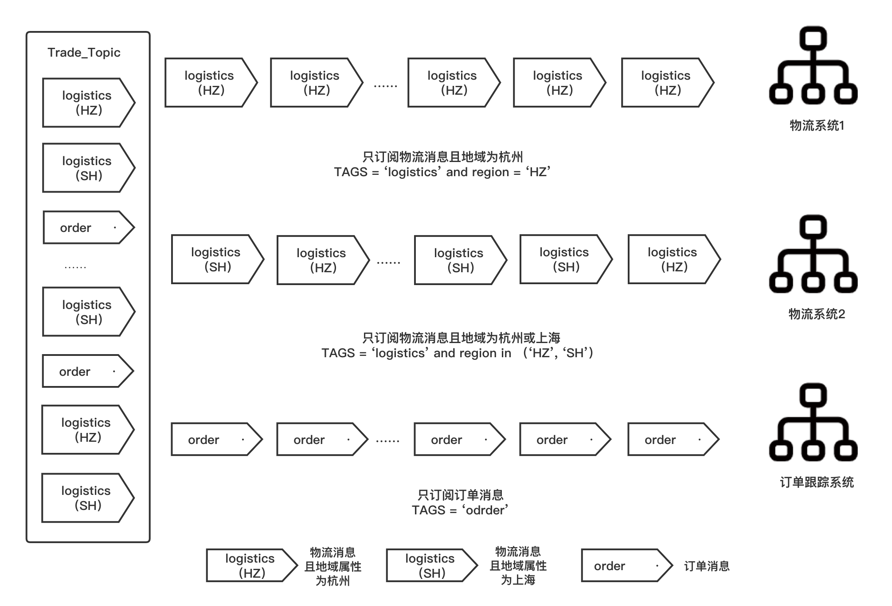

# Push Consume

The simple code of RocketMQ Push Consumer is as follows:

```javascript
public class Consumer {
  public static void main(String[] args) throws InterruptedException, MQClientException {
    // Initialize Consumer and set Consumer Goup Name
    DefaultMQPushConsumer consumer = new DefaultMQPushConsumer("please_rename_unique_group_name");
   
    // Set the address of NameServer 
    consumer.setNamesrvAddr("localhost:9876");
    // Subscribe One or more of topics，and specify the tag filtering conditions, here specify * means receive all tag messages
    consumer.subscribe("TopicTest", "*");
    // Register a callback interface to handle messages received from the Broker
    consumer.registerMessageListener(new MessageListenerConcurrently() {
      @Override
      public ConsumeConcurrentlyStatus consumeMessage(List<MessageExt> msgs, ConsumeConcurrentlyContext context) {
        System.out.printf("%s Receive New Messages: %s %n", Thread.currentThread().getName(), msgs);
        // Return to the message consumption status, ConsumeConcurrentlyStatus.CONSUME_SUCCESS for successful consumption
        return ConsumeConcurrentlyStatus.CONSUME_SUCCESS;
      }
    });
    // Start Consumer
    consumer.start();
    System.out.printf("Consumer Started.%n");
  }
}
```

First, initialize the consumer.  When initializing the consumer, the consumer must with the ConsumerGroupName, the ConsumerGroupName of the same consumer group is the same, which is an important attribute to determine whether the consumer belongs to the same consumer group. Then, set the NameServer address, which is not introduced here as like Producer. Then, call the subscribe method to subscribe to Topic. The subscribe method needs to specify the Topic name needed to subscribe to, it can also add the message filtering conditions, such as TagA, etc. The above code to specify * means to receive all tag messages. In addition to subscribing, it also needs to register the callback interface to write the consumption logic to handle the messages received from the Broker. If call the registerMessageListener method, it needs to pass in the MessageListener implementation. The above code is concurrent consumption, so it is MessageListenerConcurrently implementation, its interface is as follows:

:::note  MessageListenerConcurrently Interface
```javascript 
/**
 * A MessageListenerConcurrently object is used to receive asynchronously delivered messages concurrently
 */
public interface MessageListenerConcurrently extends MessageListener {
    /**
     * It is not recommend to throw exception,rather than returning ConsumeConcurrentlyStatus.RECONSUME_LATER if
     * consumption failure
     *
     * @param msgs msgs.size() >= 1<br> DefaultMQPushConsumer.consumeMessageBatchMaxSize=1,you can modify here
     * @return The consume status
     */
    ConsumeConcurrentlyStatus consumeMessage(final List<MessageExt> msgs,
        final ConsumeConcurrentlyContext context);
}
```
:::

where msgs is the list of messages to be consumed obtained from the Broker, and the user implements the interface and writes the consumption logic for the messages in the consumeMessage method, and then returns the consumption status, ConsumeConcurrentlyStatus.CONSUME_SUCCESS indicates successful consumption, or CONSUME_LATER means that the consumption has failed and will be re-consumed after a period of time.

The RocketMQ provides a very simple consumer API, users don't need to focus on rebalancing or pulling logic, they just need to write their own consumption logic.

## Cluster and Broadcast Mode

We can set it to use cluster mode by the following code. RocketMQ Push Consumer uses cluster mode by default, where consumers in the same consumer group consume together.

```java
consumer.setMessageModel(MessageModel.CLUSTERING);
```

Set up the use of broadcast mode with the following code. In broadcast mode, each consumer within the consumer group consumes the full messages.

```java
consumer.setMessageModel(MessageModel.BROADCASTING);
```

## Concurrent Consumption and Order Consumption

Setting up Push Consumer concurrent consumption has been described above and is accomplished by passing in the implementation of the MessageListenerConcurrently interface when registering the consumption callback interface. In concurrent consumption, there may be multiple threads consuming messages from a queue at the same time, so even if the sender ensures that messages are in the same queue in FIFO order by sending order messages, there is no guarantee that the messages are actually consumed orderly.

RocketMQ therefore provides a order consumption approach. The only difference between order consumption setup and concurrent consumption at the API level is that the implementation of the MessageListenerOrderly interface is passed in when registering the consumption callback interface.

```javascript
consumer.registerMessageListener(new MessageListenerOrderly() {
            AtomicLong consumeTimes = new AtomicLong(0);
            @Override
            public ConsumeOrderlyStatus consumeMessage(List<MessageExt> msgs, ConsumeOrderlyContext context) {
                System.out.printf("%s Receive New Messages: %s %n", Thread.currentThread().getName(), msgs);
                this.consumeTimes.incrementAndGet();
                if ((this.consumeTimes.get() % 2) == 0) {
                    return ConsumeOrderlyStatus.SUCCESS;
                } else if ((this.consumeTimes.get() % 5) == 0) {
                    context.setSuspendCurrentQueueTimeMillis(3000);
                    return ConsumeOrderlyStatus.SUSPEND_CURRENT_QUEUE_A_MOMENT;
                }
                return ConsumeOrderlyStatus.SUCCESS;
            }
        });
```

There are also two return results for order consumption, ConsumeOrderlyStatus.SUCCESS for successful consumption and ConsumeOrderlyStatus.SUSPEND_CURRENT_QUEUE_A_MOMENT for failed consumption.

## Message Filtering

Message filtering means that message producers set message attributes to classify messages when sending messages to a Topic, and consumers set filtering conditions according to the message attributes when subscribing to a Topic, so that only messages that meet the filtering conditions are delivered to the consumer side for consumption.

If the consumer subscribes to a Topic without setting filter conditions, all messages in the Topic will be delivered to the consumer for consumption, regardless of whether the filter attributes are set when the message is sent.

There are two types of message filtering supported by RocketMQ, Tag filtering and SQL92 filtering.

| Message Filtering    | Instruct                                             | Scenario                   |
|---------|------------------------------------------------|---------------------|
| Tag filtering   | If the Tag subscribed by the consumer and the message Tag set by the sender match each other, the message is cast to the consumer for consumption. | Simple filtering Scenario: a message supports setting one Tag, which can be used when only one level of classification and filtering of messages in Topic is required.|
| SQL92 filtering | The sender sets the Tag or message attribute, and the consumer subscribes to the message that satisfies the SQL92 filter expression is cast to the consumer for consumption. | Complex filtering Scenarios: a message supports setting multiple attributes and can be customized to combine multiple types of expressions according to SQL syntax to classify messages at multiple levels and achieve multi-dimensional filtering. |

### Tag Filtering

Tag has been introduced in the Producers chapter and is used to classify messages under a certain Topic. When sending a message, the producer specifies the Tag of the message, and the consumer has to subscribe according to the Tag already specified.

Take the following e-commerce transaction scenario as an example, the process from the customer's order to the receipt of goods will produce a series of messages, as follows:
- Order News
- Payment News
- Logistics News

These messages are sent to a Topic with the name Trade_Topic and are subscribed to by various systems, as exemplified by the following:
- Payment system: subscribe to payment messages only.
- Logistics system: subscribe to logistics messages only.
- Real-time calculation system: subscribe to all transaction-related messages.
- Transaction success rate analysis system: subscribe to order and payment messages.

The filtering schematic is shown below



For logistics systems and payment systems, they both subscribe to a single Tag, at which point it is sufficient to mark the Tag when calling the subcribe interface.

```java
consumer.subscribe("TagFilterTest", "TagA");
```

For a real-time computing system, it subscribes to all messages under the transaction Topic, and the Tag is simply indicated by an asterisk (*).

```java
consumer.subscribe("TagFilterTest", "*");
```

For the transaction success rate analysis system, it subscribes to messages for both Order and Payment Tags, and it is fine to separate multiple Tags with two vertical lines (||).
```java
consumer.subscribe("TagFilterTest", "TagA||TagB");
```

It should be noted here that if the same consumer subscribes to a Tag under a Topic multiple times, the last subscription will prevail.

```java
//In the following error code, the Consumer can only subscribe to the message of TagB under TagFilterTest, but not the message of TagA.
consumer.subscribe("TagFilterTest", "TagA");
consumer.subscribe("TagFilterTest", "TagB");
```

### SQL92 Filtering

SQL92 filtering is to set the Tag or custom attribute of the message when the message is sent, and the consumer subscribes to set the filter expression using SQL syntax to filter the message based on the custom attribute or Tag.
>Tag belongs to a special kind of message property, and the property value of Tag is TAGS in the SQL syntax.
Enable property filtering first set the configuration enablePropertyFilter=true on the Broker side, the value is false by default.

Take the following e-commerce transaction scenario as an example, the process from the customer's order to the receipt of goods will produce a series of messages, according to the type of messages into order messages and logistics messages, which define the geographical attributes of logistics messages, according to the region into Hangzhou and Shanghai:
- Order News
- Logistics News
  - Logistics information and the region is Hangzhou
  - Logistics information and the region is Shanghai

These messages are sent to the Topic with the name Trade_Topic and are subscribed by various systems, as an example, the following system:
- Logistics system 1: only need to subscribe to the logistics message and the message area is Hangzhou.
- Logistics system 2: only need to subscribe to the logistics news and the news area is Hangzhou or Shanghai.
- Order tracking system: only need to subscribe to order information.

The SQL92 filtering schematic is shown below:



The locale will be set as a custom property in the message.

- Message sender.
  Set the custom properties of the message.

```java
Message msg = new Message("topic", "tagA", "Hello MQ".getBytes());
// Set custom property A with property value 1.
msg.putUserProperties("a", "1");
```

- Message consumer.
  Set filter expressions using SQL syntax and filter messages based on custom properties.
```java
consumer.subscribe("SqlFilterTest",
    MessageSelector.bySql("(TAGS is not null and TAGS in ('TagA', 'TagB'))" +
        "and (a is not null and a between 0 and 3)"));
```

## Message Retry and Dead-Letter Queue

### Message Retry

If the Consumer fails to consume a message, RocketMQ will re-pitch the message to the Consumer after the retry interval, and if the message is not successfully consumed after the maximum number of retries, the message will be pitched to the dead message queue.
>Message retry is only effective for cluster mode; broadcast  mode does not provide the message retry feature. In the broadcast  mode, after a failed consumption, the failed message will not be retry and continue to consume new messages.

- Maximum number of retries: the maximum number of times a message can be repeatedly delivered after a failed consumption.
```java
consumer.setMaxReconsumeTimes(10);
```
Retry interval: the interval after the message consumption fails to be cast to the Consumer again for consumption, which only works in sequential consumption.
```java
consumer.setSuspendCurrentQueueTimeMillis(5000);
```

The retry mechanism of order consumption and concurrent consumption is not the same. After the order consumption fails to consume, it will first retry locally on the client side until the maximum number of retries, so as to avoid the failed messages being skipped and consuming the next message and disrupting the order of order consumption, while the concurrent consumption will re-cast the failed messages back to the server after the failed consumption, and then wait for the server to re-cast them back, during which it will normally consume the messages behind the queue.
>When concurrent consumption fails, it is not cast back to the original Topic, but to a special Topic named %RETRY%ConsumerGroupName, and each ConsumerGroup in cluster mode will correspond to a special Topic and will subscribe to that Topic.
The difference between the two parameters is as follows

| Consumption type | Retry interval | Maximum number of retries                                                       |
|------|--------------------------------------------|--------------------------------------------------------------|
| Order consumption | The retry interval time is configured with the custom parameter SuspendCurrentQueueTimeMillis | The maximum number of retries can be configured with the custom parameter MaxReconsumeTimes. There is no maximum limit to the value of this parameter. If the parameter is not set, the default maximum number of retries is Integer.MAX . |
| Concurrent consumption | The retry interval time changes in steps according to the number of retries, the value range: 1 second ~ 2 hours. Custom configuration is not supported | The maximum number of retries can be configured by the custom parameter MaxReconsumeTimes. The default value is 16 times. There is no maximum limit for this parameter, and it is recommended to use the default value. |

The retry interval for concurrent consumption is as follows, which can be seen to be exactly the same as the time when the third level of delayed messages starts.

| Retry number of times | The time between the last retry | Retry number of times | The time between the last retry |
|-------|------------|-------|------------|
| 1     | 10s        | 9     | 7min       |
| 2     | 30s        | 10    | 8min       |
| 3     | 1min       | 11    | 9min       |
| 4     | 2min       | 12    | 10min      |
| 5     | 3min       | 13    | 20min      |
| 6     | 4min       | 14    | 30min      |
| 7     | 5min       | 15    | 1h         |
| 8     | 6min       | 16    | 2h         |

###  Dead-Letter Queue

When a message fails to be consumed for the first time, RocketMQ will automatically retry the message. After reaching the maximum number of retries, if the consumption still fails, it means that the consumer cannot consume the message correctly under normal circumstances. At this point, the message is not immediately discarded, but sent to a special queue corresponding to that consumer, which is called a Dead-Letter Message, and the special queue storing the dead message is called a Dead-Letter Queue, which is a separate queue with a unique number of partitions under the Dead-Letter Topic. If a Dead-Letter Message is generated, the corresponding ConsumerGroup's Dead-Letter Topic name is %DLQ%ConsumerGroupName, and the messages in the Dead-Letter Queue will not be consumed again. You can use RocketMQ Admin tool or RocketMQ Dashboard to find out the information of the corresponding dead message.