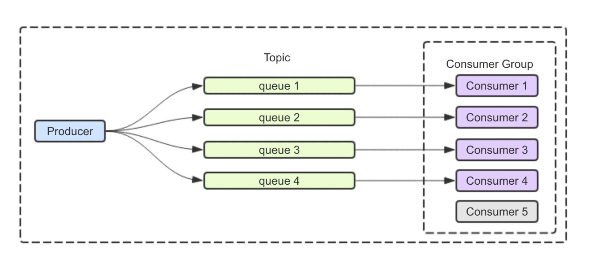
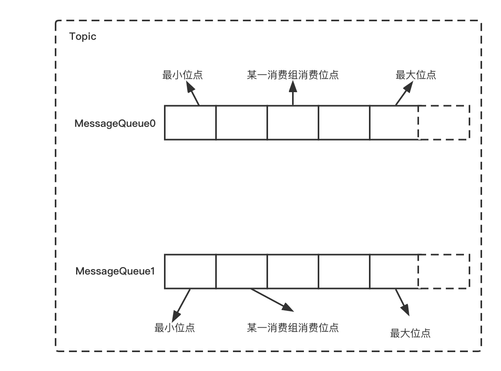

# Core Concept

RocketMQ's messages will be sent to a Topic by a Producer, and a corresponding Consumer should be created to subscribe to the Topic and consume the messages within it. Before introducing the usage of Consumers, we will first clarify the concepts of Consumer Group, Consumer Offset, Push and Pull mode, etc.

## Consumer and Consumer Group

One of the essential roles of the messaging system is to shave peaks and fill valleys. However, take the e-commerce scenario as an example, if the downstream Consumers do not have enough ability to consume messages, a large amount of transient traffic entering will pile the messages up on the server side. At this point, the end-to-end delay of the message (the time from a message being sent until being consumed) will increase. In addition, for the server side, continuing consuming historical data might generate cold reads. Therefore, the consumption ability needs to be improved to solve this problem, besides optimizing the time of message consumption, the simplest way is to expand the capacity of the Consumer.

However, is it possible to increase the consumption ability by adding a random number of Consumers? First of all, the Consumer Group plays an essential role on the Consumer side. Multiple Consumers will be regarded as being in the same Consumer Group if they have the same Consumer Group set up.

There are two consumption modes in Apache RocketMQ, which are:

- Clustering: While applying the Clustering mode, each message requires to be processed by one consumer within the Consumer Group.
- Broadcasting: While applying the Broadcasting mode, RocketMQ broadcasts each message to all Consumers within the Consumer Group, ensuring that the message is consumed at least once by each consumer.

The Clustering mode is suitable for scenarios where each message only needs to be processed once, which means the entire Consumer Group will receive the full amount of messages from Topic, and the Consumers within the Consumer Group share the consumption of these messages. Thus, the consumption ability can be increased or decreased by expanding or shrinking the number of consumers, as shown in the following figure, which is the most common consumption method.


The Broadcasting mode is suitable for scenarios where each message needs to be processed by every consumer in the Consumer Group, which means that each consumer in the Consumer Group receives the full amount of messages from the subscribed Topic. Thus, even if the number of consumers is expanded, the consumption ability cannot be enhanced or reduced, as shown in the following example.


## Load Balancing

What is the allocation strategy under the Clustering mode where Consumers within the same Consumer Group share the full volume of messages received? Does it necessarily improve consumption ability if the number of consumers expands?

Apache RocketMQ provides various allocation policies in the Clustering mode, including average allocation strategy, machine room priority allocation strategy, consistent hash allocation strategy, etc. You can set the corresponding load balancing strategy by the following code:

```java
consumer.setAllocateMessageQueueStrategy(new AllocateMessageQueueAveragely());
```

The default allocation policy is the average allocation strategy, which is the most common strategy. Consumers within a Consumer Group under the average allocation strategy will consume equally according to a paging-like strategy.

With the average allocation strategy, the parallelism of consumption can be increased by expanding the number of consumers.


However, it may not possible to increase the consumption ability by simply expanding the number of Consumers. For example, in the figure below, if the total queue number of Topic is less than the number of Consumers, the extra Consumers will not be assigned to the queue, and it will not be able to improve the consumption capacity even if there are more Consumers.



## Consumer Offset



As shown in the figure above, each queue in Apache RocketMQ records its own minimum and maximum offset. For Consumer Groups, there is also the concept of Consumer offsets. In Clustering mode, Consumer offsets are committed by the client and saved by the server. In contrast, Consumer offsets are saved by the client itself in Broadcasting mode. Normally the Consumer offsets are updated without message duplication, but if a Consumer crashes or a new Consumer joins the cluster, the load rebalancing will be triggered. After the rebalance is completed, each consumer may be assigned to a new queue instead of the previously processed queue. In order to be able to continue the previous work, the consumer needs to read the last submitted Consumer offset of each queue and then continue pulling messages from it. However, during the actual process, since the Consumer offsets submitted by the client to the server are not real-time, load rebalancing may result in a small number of duplicate messages.

## Push, Pull, and Long Polling

The consumption mode of Message Queue can be roughly divided into two kinds, which are Push and Pull.

- Push mode is the server actively pushing messages to the client. The advantage is that the efficiency is better, but if the client does not run good flow control, once the server pushes a large number of messages to the client, it will cause the client messages to pile up or even crash.
- Pull mode is the client needs to take the initiative to fetch data from the server. The advantage is that the client can consume according to its own consumption ability, but the frequency of pulling messages also needs to be controlled by the user. The frequent pull is possible to put pressure on the server and the client, and a long pull interval is easy to cause untimely consumption.

Apache RocketMQ provides both Push mode and Pull mode.