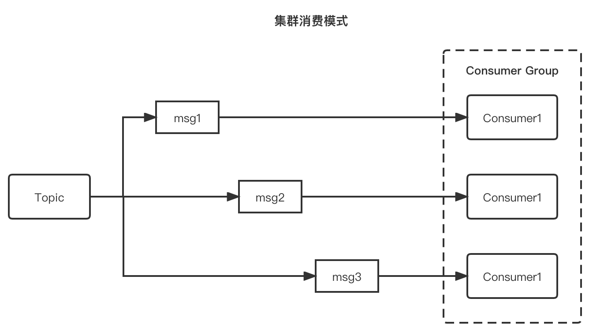
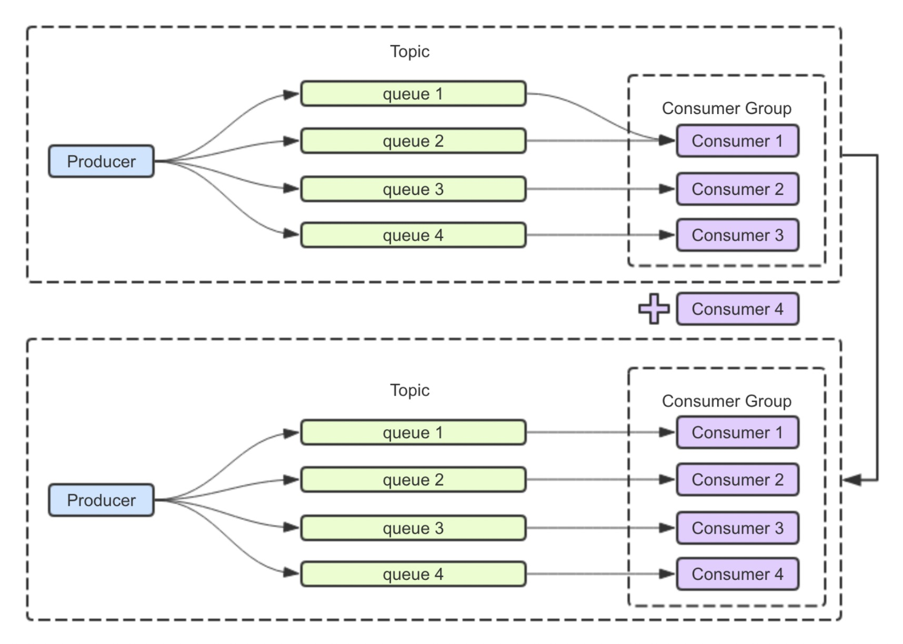

# 基础概念

消息通过生产者发送到某一个Topic，如果需要订阅该Topic并消费里面的消息的话，就要创建对应的消费者进行消费。在介绍消费者的使用方法之前，我们先介绍**消费组**、**消费位点**、**推和拉**等概念。

## 消费者与消费组

消息系统的重要作用之一是削峰填谷，但比如在电商大促的场景中，如果下游的消费者消费能力不足的话，大量的瞬时流量进入会后堆积在服务端。此时，消息的端到端延迟（从发送到被消费的时间）就会增加，对服务端而言，一直消费历史数据也会产生冷读。因此需要增加消费能力来解决这个问题，除了去优化消息消费的时间，最简单的方式就是扩容消费者。

但是否随意增加消费者就能提升消费能力？ 首先需要了解消费组的概念。在消费者中消费组的有非常重要的作用，如果多个消费者设置了相同的Consumer Group，我们认为这些消费者在同一个消费组内。

在 Apache RocketMQ 有两种消费模式，分别是：

- 集群消费模式：当使用集群消费模式时，RocketMQ 认为任意一条消息只需要被消费组内的任意一个消费者处理即可。
- 广播消费模式：当使用广播消费模式时，RocketMQ 会将每条消息推送给消费组所有的消费者，保证消息至少被每个消费者消费一次。

集群消费模式适用于每条消息只需要被处理一次的场景，也就是说整个消费组会Topic收到全量的消息，而消费组内的消费分担消费这些消息，因此可以通过扩缩消费者数量，来提升或降低消费能力，具体示例如下图所示，是最常见的消费方式。



广播消费模式适用于每条消息需要被消费组的每个消费者处理的场景，也就是说消费组内的每个消费者都会收到订阅Topic的全量消息，因此即使扩缩消费者数量也无法提升或降低消费能力，具体示例如下图所示。


## 负载均衡

集群模式下，同一个消费组内的消费者会分担收到的全量消息，这里的分配策略是怎样的？如果扩容消费者是否一定能提升消费能力？

Apache RocketMQ 提供了多种集群模式下的分配策略，包括平均分配策略、机房优先分配策略、一致性hash分配策略等，可以通过如下代码进行设置相应负载均衡策略

```java
 consumer.setAllocateMessageQueueStrategy(new AllocateMessageQueueAveragely());
```

默认的分配策略是平均分配，这也是最常见的策略。平均分配策略下消费组内的消费者会按照类似分页的策略均摊消费。

在平均分配的算法下，可以通过增加消费者的数量来提高消费的并行度。比如下图中，通过增加消费者来提高消费能力。




但也不是一味地增加消费者就能提升消费能力的，比如下图中Topic的总队列数小于消费者的数量时，消费者将分配不到队列，即使消费者再多也无法提升消费能力。


## 消费位点


如上图所示，在Apache RocketMQ中每个队列都会记录自己的最小位点、最大位点。针对于消费组，还有消费位点的概念，在集群模式下，消费位点是由客户端提给交服务端保存的，在广播模式下，消费位点是由客户端自己保存的。一般情况下消费位点正常更新，不会出现消息重复，但如果消费者发生崩溃或有新的消费者加入群组，就会触发重平衡，重平衡完成后，每个消费者可能会分配到新的队列，而不是之前处理的队列。为了能继续之前的工作，消费者需要读取每个队列最后一次的提交的消费位点，然后从消费位点处继续拉取消息。但在实际执行过程中，由于客户端提交给服务端的消费位点并不是实时的，所以重平衡就可能会导致消息少量重复。

## 推、拉和长轮询

MQ的消费模式可以大致分为两种，一种是推Push，一种是拉Pull。

- Push是服务端主动推送消息给客户端，优点是及时性较好，但如果客户端没有做好流控，一旦服务端推送大量消息到客户端时，就会导致客户端消息堆积甚至崩溃。

- Pull是客户端需要主动到服务端取数据，优点是客户端可以依据自己的消费能力进行消费，但拉取的频率也需要用户自己控制，拉取频繁容易造成服务端和客户端的压力，拉取间隔长又容易造成消费不及时。

Apache RocketMQ既提供了Push模式也提供了Pull模式。