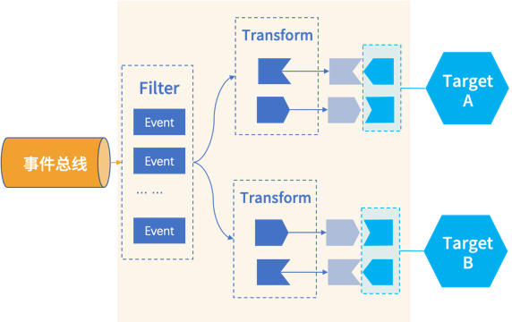

# RocketMQ EventBridge Core Concept

Understanding the core concepts in EventBridge can help us better analyze and use EventBridge. This article focuses on introducing the terms included in EventBridge:

- EventSource: the source of the event. Used to manage events sent to EventBridge, all events sent to EventBridge must be marked with the source name information, corresponding to the source field in the CloudEvent event body.
- EventBus: the event bus. Used to store events sent to EventBridge.
- EventRule: event rule. When a consumer needs to subscribe to events, they can configure filtering and transformation information through rules to push events to the designated target endpoint.
- FilterPattern: event filtering pattern, used to configure filtering of target endpoints in rules.
- Transform: event transformation, converting the event format to the data format required by the target endpoint.
- EventTarget: the target endpoint of the event, which is the actual event consumer.

Next, we will expand on these concepts in more detail.

## EventSource

Event source represents the origin of the event and is used to describe a category of events, generally corresponding one-to-one with microservice systems. For example: transaction event source, attendance event source, etc. Event source is a large classification for events, and a single event source often contains multiple event types (type), such as a transaction event source may contain: order events, payment events, refund events, etc.

Additionally, it is worth noting that event source is not used to describe the entity that caused the event. Instead, in CloudEvent, we generally use subject to represent the entity resource that caused the event. The event source is similar to the large category divisions in a market economy department store, such as fresh food area, daily necessities area, household appliances area, etc. In the event center "department store", we can quickly find the event we need through the event source.

## EventBus

The event bus is where events are stored, and it can have multiple implementations including Local, RocketMQ, Kafka, etc.

When the event producer sends an event, they must specify the event bus. The event bus is a first-class citizen in EventBridge, and all other resources form logical isolation around the event bus, that is: event sources and event rules must belong to a specific event bus. Event sources and event rules under different event buses can have the same name, but event sources and rules under the same event bus must have unique names.

## EventRule

When a consumer needs to subscribe to events, they can configure filtering and transformation information through event rules, and push events to the designated target endpoint. Therefore, event rules include three parts: event filtering + event transformation + event target.

## FilterPattern

By using event filtering patterns, we can filter events on the event bus and only push the events that the target endpoint needs, thus reducing unnecessary opening and relieving the pressure on the consumer's target endpoint. Currently, EventBridge supports the following event filtering capabilities:

* Specified value matching
* Prefix matching
* Suffix matching
* Exclusion matching
* Numeric matching
* Array matching
* And complex combination logic matching

(Details will be covered in other articles)

## Transform

Event producers' events may be subscribed to by multiple consumers, but the data format needed by different consumers is often different. In this case, it is necessary to convert the event produced by the producer into the event format that the consumer target end needs. Currently, EventBridge supports the following event conversion capabilities:

* Complete events: No conversion, directly delivering the original CloudEvents;
* Partial events: Extracting the content that needs to be delivered to the event target through JsonPath syntax from CloudEvents;
* Constants: The event only serves as a trigger, and the delivered content is a constant;
* Template converter: Flexibly rendering the delivered event format through the definition of a template.

(Details to be seen in other articles)

## EventTarget

The event target is the event consumer in the EventBridge architecture. In this architecture, consumers only need to design their own business models and provide a common API (this API can be used to receive events and also for front-end management operations). EventBridge will then safely and reliably push events to the target consumer according to the data format defined by the API.
