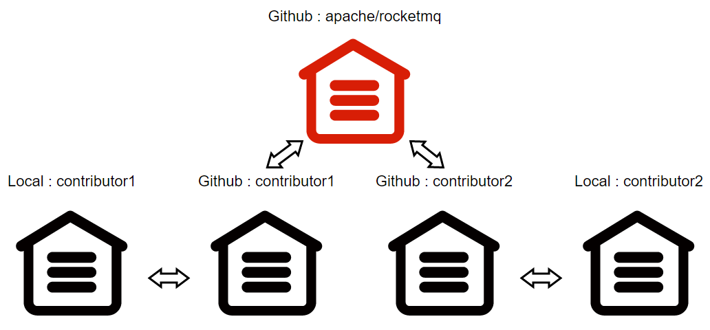

#  GitHub Submit PR

This article walks you through contributing RocketMQ through Git

## GitHub Remote Repository

As a prerequisite, this section briefly explains the reasons for using Git to contribute RocketMQ. If you have related knowledge, you can skip it

First, you need to educate yourself about Git and GitHub

Think: From a developer's perspective, how do you collaborate with others to complete a project?

If you think of packaging, compression, and then copy and paste, think of expanding the scope of participants to the 10k+ level

This is the point of the remote repository: Developers can easily access the repository code from GitHub and submit development branches to the remote repository to communicate and share with others



So, with this public repository, what then?

How do I download the code for a remote repository?

How do I commit a development branch to a remote repository?

## Git Contribution Guide

① fork [apache/rocketmq](https://github.com/apache/rocketmq) to personal GitHub remote repository

```shell
https://github.com/cuser/rocketmq.git # cuser's rocketmq repo[repository] url
```

Notice: ```cuser``` GitHub username，after ```Fork``` you can find the copy repository through the personal home page Repositories, and view the address

② Install Git yourself and clone it to your local repository

```shell
git clone https://github.com/cuser/rocketmq.git # git clone [repo url]
```

Notice：The cloned local repository will use GitHub repository as the remote repository, and will be named ```origin```

③ Get the latest code for the development branch

```shell
git rebase origin/develop # git rebase [branch]
```

Notice： [rebase` <branch>`](https://git-scm.com/docs/git-rebase) The basic term is base swapping, and you can see why this step is necessary by looking at the linked examples

④ Make changes in the local repository

```shell
git checkout -b RocketMQ-Vxx.0 # git checkout [-b] [new-branch]
git add /rocketmq/pom.xml # git add [dir/file]
git commit -a -m "pom"	# git commit [-all] [-msg] [message]
```

Notice： Reference [Git](https://git-scm.com/docs/git-add)，Use relative paths to switch to the same directory as ```.git``` 

⑤ Push changes to the remote repository

```shell
git push --set-upstream apache RocketMQ-Vxx.0	# push branch to https://github.com/cuser/rocketmq-site.git
```

## GitHub Commit PR

As follows: Take submitting PR to the ```new-official-website``` branch as an example to illustrate the PR process

Reference ```Git Contribution Guide```Modify the branch in the local repository and push it to the GitHub remote repository

```shell
git checkout new-official-website	# git checkout -b new-official-website
git push origin new-official-website	# push to https://github.com/cuser/rocketmq-site.git
```

① Switch the GitHub remote repository to the development branch new-official-website

② Create the pull request and click the open pull request under Contribute

③ compare across forks, Select the request branch and the development branch


base repository / base : Request repository and request branch

head repository / compare : Develop repository and branch

Be sure to correctly select the request branch and the development branch, and request merging only after obtaining permission from the branch owner

④ Fill in the PR summary with uppercase letters and briefly describe the PR content 


​	Before submitting PR, please confirm as follows:

1. A [GitHub Issue]( [apache/rocketmq: Mirror of Apache RocketMQ (github.com)](https://github.com/apache/rocketmq/issues) ) corresponding to PR has been created
2. Modified content to comply with [Coding Guidelines](/docs/contributionGuide/30code-guidelines) programming specification
3. The PR summary begins with [ISSUE #XXX] and briefly describes the change requirements
4. Outline PR change requirements, change logs, and validation information,Reference [PR Demo](https://github.com/apache/rocketmq/pull/152) 
5. Submit content with complete test cases and ensure that basic checks, unit tests, and integration tests pass

⑤ Click "Create pull request" , Request that the branch be merged

⑥ At this point, the PR is visible on the apache/rocketmq-site remote repository, and all collaborators can review the PR and make suggestions

You can make changes locally and commit multiple times based on comments. Information about the request to merge and the submission of changes is displayed simultaneously on the PR page, the issue list, and the RocketMQ mailing list, in order to remind the committer to review the PR in a timely manner

## Merge PR

Open source Project development branch mergers are performed by the committer.

① Merge contributor PR

```shell
git checkout develop	# switch to local develop branch
git pull apache develop	# fast-forward to current remote HEAD
git pull --squash https://github.com/cuser/rocketmq.git RocketMQ-Vxx.0  # merge to branch
```

A pull request merge branch may contain multiple commits. It is recommended that the ```--squash``` directive compress the commit to a single commit

It is important to resolve merge conflicts and ensure that the current branch is synchronized to the remote branch before merging
 
Please read[Git pull]( [Git - git-pull Documentation (git-scm.com)](https://git-scm.com/docs/git-pull) ) to learn fast-forward and other info

② Merge committer PR

If committer merges its own PR, run the command [Git merge]( [Git - git-merge Documentation (git-scm.com)](https://git-scm.com/docs/git-merge) ) 

```shell
git checkout develop      # switch to local develop branch
git pull apache develop   # fast-forward to current remote HEAD
git merge --squash RocketMQ-Vxx.0	# merge to branch
```

③ Do regular patch checks, build projects with built-in test cases, and be sure to modify the changelog

④ Once all of the above is done, submit the merge with the following instructions, feedback the branch status to the developer, and close PR

```shell
git commit --author="contributor_name <contributor_email>" -a -m "RocketMQ-Vxx.0 description closes apache/rocketmq#ZZ"
```

For details of closing PR, reference [Close PR](https://docs.github.com/cn/issues/tracking-your-work-with-issues/closing-an-issue) 

⑤ Push the merged branch to the apache/rocketmq remote repository

```shell
git push apache develop
```

⑥ Once a PR is submitted, it will remain in the GitHub remote repository, and you can also update your personal GitHub repository simultaneously

```shell
git push origin develop
```

Notice: squash discards the commit information of the development branch

## Reject PR

Reject PR: Means that no pull or merge is performed, but only the reject PR message is submitted

```SHELL
git commit --allow-empty -m "RocketMQ-Vxx.0 closes apache/rocketmq#ZZ *Won't fix*"
git push apache develop
```

Close PR #ZZ on GitHub


