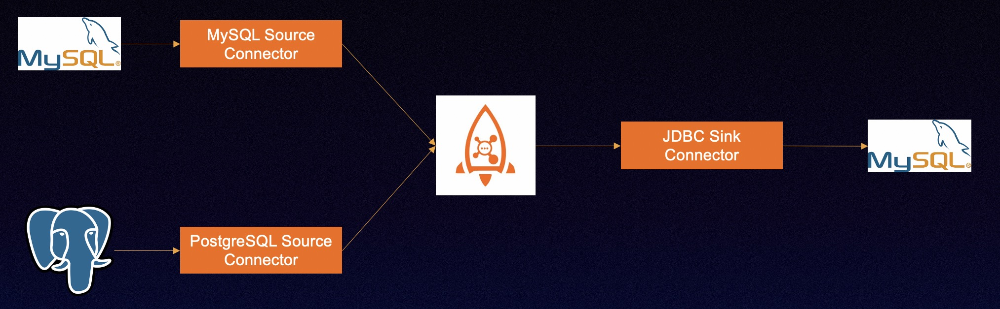

# RocketMQ Connect in Action 3



## Preparation

### Start RocketMQ

1. Linux/Unix/Mac
2. 64bit JDK 1.8+;
3. Maven 3.2.x+;
4. Start [RocketMQ](https://rocketmq.apache.org/docs/quick-start/);


**tips** : ${ROCKETMQ_HOME}  locational instructions

>bin-release.zip version：/rocketmq-all-4.9.4-bin-release
>
>source-release.zip version：/rocketmq-all-4.9.4-source-release/distribution


### Start Connect


#### Compiling Connector Plugin

Debezium RocketMQ Connector

```
$ cd rocketmq-connect/connectors/rocketmq-connect-debezium/
$ mvn clean package -Dmaven.test.skip=true
```

Compile the Debezium MySQL, PostgreSQL, and RocketMQ Connector packages and place them in the Runtime loading directory. The command is as follows：

```
mkdir -p /usr/local/connector-plugins
cp rocketmq-connect-debezium-postgresql/target/rocketmq-connect-debezium-postgresql-0.0.1-SNAPSHOT-jar-with-dependencies.jar /usr/local/connector-plugins

cp rocketmq-connect-debezium-mysql/target/rocketmq-connect-debezium-mysql-0.0.1-SNAPSHOT-jar-with-dependencies.jar /usr/local/connector-plugins

```

JDBC Connector

Move the compiled JDBC Connector package into the Runtime loading directory. The command is as follows：

```
$ cd rocketmq-connect/connectors/rocketmq-connect-jdbc/
$ mvn clean package -Dmaven.test.skip=true
cp rocketmq-connect-jdbc/target/rocketmq-connect-jdbc-0.0.1-SNAPSHOT-jar-with-dependencies.jar /usr/local/connector-plugins

```

#### Start Connect Runtime

```
cd  rocketmq-connect

mvn -Prelease-connect -DskipTests clean install -U

```

Modify the configuration `connect-standalone.conf`, the main configuration is as follows

```
$ cd distribution/target/rocketmq-connect-0.0.1-SNAPSHOT/rocketmq-connect-0.0.1-SNAPSHOT
$ vim conf/connect-standalone.conf
```

```
workerId=standalone-worker
storePathRootDir=/tmp/storeRoot

## Http port for user to access REST API
httpPort=8082

# Rocketmq namesrvAddr
namesrvAddr=localhost:9876

# RocketMQ acl
aclEnable=false
accessKey=rocketmq
secretKey=12345678

autoCreateGroupEnable=false
clusterName="DefaultCluster"

#  Core configuration, configure the plugin directory of the previously compiled debezium package here
# Source or sink connector jar file dir,The default value is rocketmq-connect-sample
pluginPaths=/usr/local/connector-plugins
```


```
cd distribution/target/rocketmq-connect-0.0.1-SNAPSHOT/rocketmq-connect-0.0.1-SNAPSHOT

sh bin/connect-standalone.sh -c conf/connect-standalone.conf &

```

### Postgres image

Use debezium's Postgres docker environment to set up the Postgres database

```
# starting a pg instance
docker run -d --name postgres -p 5432:5432 -e POSTGRES_USER=start_data_engineer -e POSTGRES_PASSWORD=password debezium/postgres:14

# bash into postgres instance
docker exec -ti postgres /bin/bash
```

Postgres information
Port：5432
Account：start_data_engineer/password
Synchronize the source database：bank.user


### MySQL image

Use debezium's MySQL docker environment to set up the MySQL database

```
docker run -it --rm --name mysql -p 3306:3306 -e MYSQL_ROOT_PASSWORD=debezium -e MYSQL_USER=mysqluser -e MYSQL_PASSWORD=mysqlpw quay.io/debezium/example-mysql:1.9
```

```
docker run -it --rm --name mysql -p 3306:3306 -e MYSQL_ROOT_PASSWORD=debezium -e MYSQL_USER=mysqluser -e MYSQL_PASSWORD=mysqlpw quay.io/debezium/example-mysql:1.9
```

MySQL information

Port：3306

Account：root/debezium
Synchronize the source database：bank.user

Target database：bank1.user


### Test data

Login to the database using the root/debezium account

 Source database table：bank.user

```
create database bank;
use bank;

create table bank.user
(
    id       bigint NOT NULL AUTO_INCREMENT,
    user_id          integer,
    name    varchar(8),
    age integer,
    birthday date,
    datetime_created timestamp(3),
    datetime_updated timestamp(3),
    height           decimal(11, 2) null,
    PRIMARY KEY (`id`)
);

insert into bank.user values (1003, 1, 'lilei2', 10, now(), now(), now(), 1.72);
update bank.user set user_id = 1003 where id = 1003;

```


Login to the PostgreSQL database using the start_data_engineer/password account.

Source database table: bank.user

```
CREATE SCHEMA bank;
SET search_path TO bank,public;
create table bank.user
(
    id       integer not null
        constraint user_pkey
            primary key,
    user_id          integer,
    name    varchar(8),
    age integer,
    birthday date,
    datetime_created timestamp(3),
    datetime_updated timestamp(3),
    height           numeric(11, 2)
);

insert into bank.user values (1001, 1, 'lilei1', 10, now(), now(), now(), 1.72);
update bank.user set user_id = 1001 where id = 1001;

```

Target database table: bank1.user

```
create database bank1;
create table bank1.user
(
    id               bigint auto_increment
        primary key,
    user_id          int            null,
    name             varchar(8)     null,
    age              int            null,
    birthday         date           null,
    datetime_created timestamp(3)   null,
    datetime_updated timestamp(3)   null,
    height           decimal(11, 2) null
);

```

## Start Connector

### Start Debezium source connector

Synchronize the original table：bank.user
Purpose：Parse the MySQL binlog and encapsulate it into a common ConnectRecord object, sent to the RocketMQ Topic.

```
curl -X POST -H "Content-Type: application/json" http://127.0.0.1:8082/connectors/MySQLCDCSource1000 -d '{
"connector.class": "org.apache.rocketmq.connect.debezium.mysql.DebeziumMysqlConnector",
"max.task": "1",
"connect.topicname": "debezium-source-topic1000",
"kafka.transforms": "Unwrap",
"kafka.transforms.Unwrap.delete.handling.mode": "none",
"kafka.transforms.Unwrap.type": "io.debezium.transforms.ExtractNewRecordState",
"kafka.transforms.Unwrap.add.headers": "op,source.db,source.table",
"database.history.skip.unparseable.ddl": true,
"database.history.name.srv.addr": "localhost:9876",
"database.history.rocketmq.topic": "db-history-debezium-topic1000",
"database.history.store.only.monitored.tables.ddl": true,
"include.schema.changes": false,
"database.server.name": "dbserver1",
"database.port": 3306,
"database.hostname": "database ip",
"database.connectionTimeZone": "UTC",
"database.user": "debezium",
"database.password": "dbz",
"table.include.list": "bank.user",
"max.batch.size": 50,
"database.include.list": "bank",
"snapshot.mode": "when_needed",
"database.server.id": "184054",
"key.converter": "org.apache.rocketmq.connect.runtime.converter.record.json.JsonConverter",
"value.converter": "org.apache.rocketmq.connect.runtime.converter.record.json.JsonConverter"
}'
```

Synchronize the original table：bank.user
Purpose: Parse the Postgres binlog and encapsulate it into a common ConnectRecord object, sent to the RocketMQ Topic.

```
curl -X POST -H "Content-Type: application/json" http://127.0.0.1:8082/connectors/postgres-connector1000 -d  '{
  "connector.class": "org.apache.rocketmq.connect.debezium.postgres.DebeziumPostgresConnector",
  "max.task": "1",
  "connect.topicname": "debezium-source-topic1000",
  "kafka.transforms": "Unwrap",
  "kafka.transforms.Unwrap.delete.handling.mode": "none",
  "kafka.transforms.Unwrap.type": "io.debezium.transforms.ExtractNewRecordState",
  "kafka.transforms.Unwrap.add.headers": "op,source.db,source.table",
  "database.history.skip.unparseable.ddl": true,
  "database.server.name": "bankserver1",
  "database.port": 5432,
  "database.hostname": "database ip",
  "database.connectionTimeZone": "UTC",
  "database.user": "start_data_engineer",
  "database.dbname": "start_data_engineer",
  "database.password": "password",
  "table.whitelist": "bank.user",
  "key.converter": "org.apache.rocketmq.connect.runtime.converter.record.json.JsonConverter",
  "value.converter": "org.apache.rocketmq.connect.runtime.converter.record.json.JsonConverter"
}'
```

### Start JDBC sink connector

Purpose: Consume the data in the Topic and write it to the target table through JDBC protocol.

```
curl -X POST -H "Content-Type: application/json" http://127.0.0.1:8082/connectors/jdbcmysqlsinktest1000 -d '{
  "connector.class": "org.apache.rocketmq.connect.jdbc.connector.JdbcSinkConnector",
  "max.task": "2",
  "connect.topicnames": "debezium-source-topic1000",
  "connection.url": "jdbc:mysql://database ip:3306/bank1",
  "connection.user": "root",
  "connection.password": "debezium",
  "pk.fields": "id",
  "table.name.from.header": "true",
  "pk.mode": "record_key",
  "insert.mode": "UPSERT",
  "db.timezone": "UTC",
  "table.types": "TABLE",
  "errors.deadletterqueue.topic.name": "dlq-topic",
  "errors.log.enable": "true",
  "errors.tolerance": "ALL",
  "delete.enabled": "true",
  "key.converter": "org.apache.rocketmq.connect.runtime.converter.record.json.JsonConverter",
  "value.converter": "org.apache.rocketmq.connect.runtime.converter.record.json.JsonConverter"
}'

```

After the above three Connector tasks are created successfully, login to the PostgreSQL database using the start_data_engineer/password account or login to the MySQL database using the root/debezium account.

Modifying, deleting, or adding to the source database table bank.user will synchronize to the target MySQL table bank1.user.

