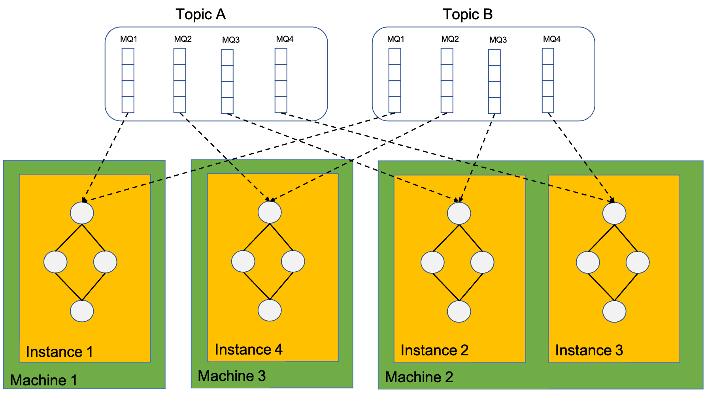
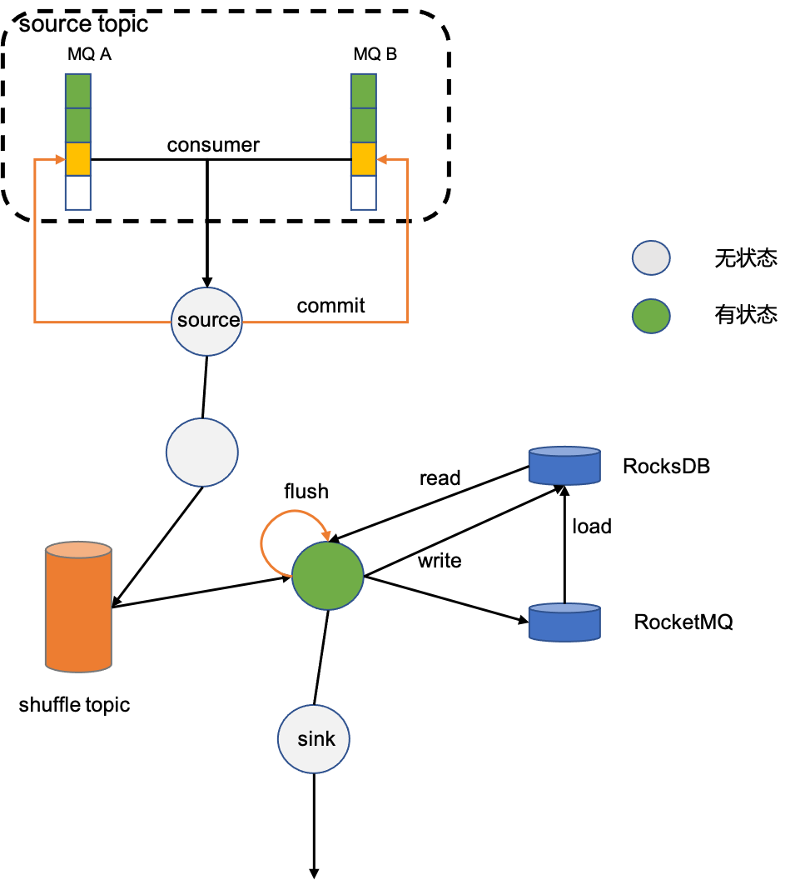
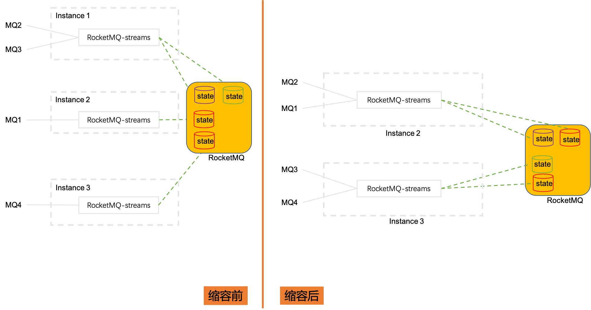

# RocketMQ Streams 概览
RocketMQ Streams是基于RocketMQ的轻量级流计算引擎。能以SDK方式被应用依赖，无须部署复杂的流计算服务端即可获得流计算能力。
因此具有资源消耗少、扩展性好、支持流计算算子丰富的特点。

## 整体架构

数据从RocketMQ中被RocketMQ-streams消费，经过处理最终被写回到RocketMQ。
如果流处理任务中含有算子groupBy，则需要将数据按照Key进行分组，将分组数据写入shuffle topic。后续算子从
shuffle topic消费。如果还涉及count之类有状态算子，那么计算时需要读写状态，在窗口触发之后将计算结果写出。

## 消费模型

计算实例实质上是依赖了Rocket-streams SDK的client，因此，计算实例消费的MQ依赖RocketMQ rebalance分配，
计算实例总个数也不能大于消费总MQ个数，否则将有部分计算实例处于等待状态，消费不到数据。

一个计算实例可以消费多个MQ，一个实例内也只有一张计算拓扑图。

## 状态

对于有状态算子，比如count，需要先对count算子进行分组，然后才能求和。分组算子groupBy会将数据按照分组的key重新写回RocketMQ，并且使相同key写入同一分区（这一过程称作shuffle），
保证这个含有相同key的数据被同一个消费者消费。 状态本地依赖RocksDB加速读取，远程依赖RocketMQ做持久化，在做checkpoint时将本地RocksDB中状态写入到RocketMQ中。
允许流计算任务运行时，可以只依赖本地存储RocksDB, 只需要将setLocalStorageOnly设置成true即可。这种情况下可能存在状态丢失，不建议在生产环境使用。

## 扩缩容

当计算实例从3个缩容到2个，借助于RocketMQ集群消费模式下的rebalance功能，被消费的分片MQ会在计算实例之间重新分配。Instance1上消费的MQ2和MQ3被分配到Instance2和Instance3上，
这两个MQ的状态数据也需要迁移到Instance2和Instance3上，这也暗示，状态数据是根据源数据分片MQ保存的；扩容则是刚好相反的过程。

