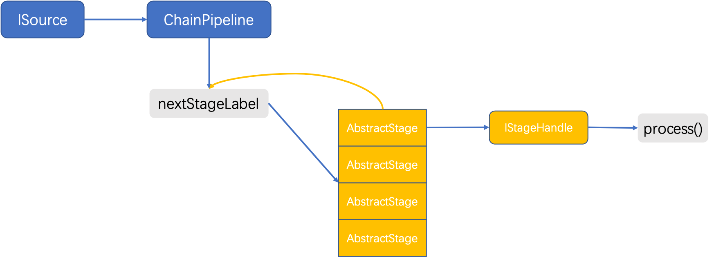

# RocketMQ Streams 核心概念

## DataStream
### DataStreamSource
DataStreamSource 是分段式编程的源头类，用于对接数据源RocketMQ；
+ ```dataStream(nameSpaceName,pipelineName)``` 返回DataStreamSource实例，用于分段编程实现流计算任务；
+ ```fromRocketmq``` 从rocketmq中获取数据，包含四个参数
    + ```topic``` rocketmq消息队列的topic名称，必填参数
    + ```groupName``` 消费者组的名称，必填参数
    + ```namesrvAddress``` RocketMQ集群的namesrv地址
    + ```isJson``` 是否json格式，非必填参数
    + ```tags``` rocketmq消费的tags值，用于过滤消息，非必填参数

### DataStream

+ ```map``` 通过将源的每个记录传递给函数func来返回一个新的DataStream
+ ```flatmap``` 与map类似，一个输入项对应0个或者多个输出项
+ ```filter``` 只选择func返回true的源DStream的记录来返回一个新的DStream
+ ```forEach``` 对每个记录执行一次函数func， 返回一个新的DataStream
+ ```script```  针对每个记录的字段执行一段脚本，返回新的字段，生成一个新的DataStream
+ ```selectFields``` 对每个记录返回对应的字段值，返回一个新的DataStream
+ ```toPrint``` 将结果在控制台打印，生成新的DataStream实例
+ ```toFile``` 将结果保存为文件，生成一个新的DataStream实例
+ ```toRocketmq``` 将结果输出到rocketmq
+ ```window``` 在窗口内进行相关的统计分析，一般会与```groupBy```连用， ```window()```用来定义窗口的大小， ```groupBy()```用来定义统计分析的主key，可以指定多个
    + ```count``` 在窗口内计数
    + ```min``` 获取窗口内统计值的最小值
    + ```max``` 获取窗口内统计值得最大值
    + ```avg``` 获取窗口内统计值的平均值
    + ```sum``` 获取窗口内统计值的加和值
    + ```reduce``` 在窗口内进行自定义的汇总运算
+ ```join``` 根据条件将俩个流进行内关联
+ ```leftJoin``` 根据条件将俩个流的数据进行左关联
+ ```union``` 将俩个流进行合并
+ ```split``` 将一个数据流按照标签进行拆分，分为不同的数据流供下游进行分析计算
+ ```setLocalStorageOnly``` 状态是否使用本地存储
+ ```with``` with算子用来指定计算过程中的相关策略

## ChainPipeline
数据流转管道，ChainPipeline从一个目标源读取数据，数据一次流过多个stage，组成一个数据处理链条。ChainPipeline间可相互组合成处理拓扑，多个ChainPipeline组成一个流处理任务，
例如一个流处理任务中，从两个topic中读出数据经过处理后写入到第三个topic，虽然只有一个流处理任务，但是却由两个ChainPipeline组成，一个ChainPipeline包含一个source实例和若干处理数据的stage组成。

## stage
数据具体运算节点，所有的其他运算，包括map,filter,script，window都会先构建出stage，然后以stage的身份进入ChainPipeline。流计算时，深度优先遍历ChainPipeline中的
stage，stage中属性nextStageLabel指向下游计算节点。

## shuffle
当需要对数据进行分组统计时，需要针对某个key将数据分开，然后对相同的key进行统计。流计算中，往往将含有相同key的数据发送到同一节点处理。在RocketMQ Streams中，借助RocketMQ来实现这一过程能降低复杂度，
不需要动态发现某个key应该被发送到下有哪个实例节点上。
将需要分组的数据，使用key作路由分组，发送回RocketMQ的topic中，含有相同key的数据都在一个分区（messageQueue）中，这个过程成为shuffle。
下游消费者节点，按照集群消费模式消费数据，一个消费者能消费到含有相同key的所有数据，因此才能做出正确的计算。

## 领域模型
领域模型为数据在流处理算子之间传递的数据模型。RocketMQ Streams使用自定义的Message对象作为算子间信息的承载，它具有以下属性：
```java
public class Message {
	private JSONObject message;

    private boolean isJsonMessage = true;

    protected ISystemMessage systemMessage;

    protected MessageHeader header = new MessageHeader();
    
}
```

- message：数据内容，如果原始数据是json形式，则解析成JSONObject，如果原始对象不是，则解析成自定义的对象UserDefinedMessage，他继承自JSONObject；
- systemMessage：表征数据是数据消息还是系统消息，系统消息是指在特定事件发生时，将产生特定类型的系统消息，下游组件接收到将做出特定处理。目前有下列几种系统消息：发现数据来自新分区产生的新增分区系统消息、不再消费某个分区数据的分区异常系统消息、数据消费位点提交时产生的checkpoint系统消息。
- header：数据在处理过程中保留的额外信息，用于辅助后续计算。他有以下属性：

|  字段类型   | 字段名称  |   含义   |
|  ----  | ----  |-----|
| String  | JOIN_LEFT | join时标记左右窗口|
| String  | JOIN_RIGHT | join时标记左右窗口|
|ISource |source | 数据来自的source实例|
| String| routeLabels| 路由标签，标记会被哪些下游节点处理|
| String| filterLabels|路由标记，标记不会被哪些下游节点处理|
|MessageOffset | messageOffset|消息offset|
|boolean |needFlush |是否需要立即将消息传递到下游|
| boolean| isSystemMessage|是否是系统消息|
|String | msgRouteFromLable|消息来自哪个lable|
|String |originTable |消息来自那张sql源表|
