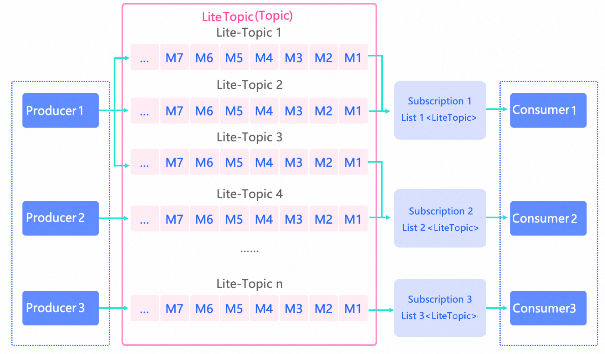

# LiteTopic

LiteTopics are lightweight, ephemeral sub-channels within a single Apache RocketMQ topic. You can create millions of fine-grained message channels -- one per session, task, or user -- without the resource overhead of separate topics. Each LiteTopic is an auto-managed secondary container inside a single parent topic, with its own ordered queue, lifecycle, and subscription scope.

## Key concepts

### What is a LiteTopic

A LiteTopic is a secondary container for message transmission and storage within a parent topic. It groups messages of different child classes -- such as individual sessions, tasks, or users -- under the same business logic.

LiteTopics serve two purposes:

* **Exclusive consumption and data fencing**: Isolate data from different child classes into separate LiteTopics for finer-grained storage and subscription boundaries.

* **Identity and permissions**: Control access at a granularity finer than the topic level by assigning identities and permissions to individual LiteTopics.

### How LiteTopics fit into the domain model

A topic is the top-level container for message transmission and storage in Apache RocketMQ. If a topic is of the Lite type, LiteTopics can be created within it. The combination of a topic and a LiteTopic uniquely identifies a message storage container.

Each LiteTopic contains one queue by default, and messages within that queue are stored and consumed in order.

### LiteTopic properties

**Name**

* Must be globally unique within the parent topic.

* Auto-created on first use: if `setLiteTopic` is called on a message and the specified LiteTopic does not exist, the system creates it automatically.

* For naming constraints, see [Parameter limits](../01-introduction/03limits.md).

**Time-to-live (TTL)**

* If a LiteTopic receives no messages for longer than its TTL, the system deletes it automatically. Deletion releases the quota count.

* Set the TTL through the `expiration` value when you create the Lite-type topic.

* For TTL constraints, see [Parameter limits](../01-introduction/03limits.md).

## Version compatibility

| **Component** | **Minimum version**          |
|-------------------|------------------------------|
| Server | 5.5.0 or later               |
| Client (gRPC SDK) | RocketMQ gRPC 5.1.0 or later |

## LiteTopics vs. normal topics

:::info
Switching a topic to Lite type changes its behavior. Each LiteTopic has only one queue by default, which limits per-channel TPS but enables ordered consumption and fine-grained subscription control. Evaluate this tradeoff before adopting Lite-type topics.
:::

| **Dimension** | **Lite topic** | **Normal topic** |
|-------------------------------------|-----------------------------------------------------------------------------------------------------|---------------------------------------------------------------------------|
| **Primary topic** | Both require you to create topic resources in advance. | Same as Lite. |
| **Secondary channels** | Supports millions of LiteTopics under a single parent topic, each with auto-managed lifecycle. | No secondary channel support. |
| **Lifecycle management** | Automatic creation on first send or subscribe. Automatic deletion after the configured TTL expires. | Manual creation and deletion only. |
| **Ordering** | Each LiteTopic has one queue by default. Messages are stored in order. | Multiple queues. Only partitioned ordered topics guarantee order. |
| **Per-channel TPS** | Limited per LiteTopic (single queue). Total TPS scales with the number of LiteTopics. | TPS scales horizontally by queue count and cluster nodes. |
| **Subscription consistency** | Flexible: each consumer in the same group can subscribe to a different set of LiteTopics. | Strict: all consumers in the same group must share the same subscription. |
| **Consumption mode** | Ordered only. Each LiteTopic is processed by one consumer thread. | Ordered or concurrent. |
| **Dynamic subscription** | Consumers can add or remove LiteTopic subscriptions at runtime. | Not supported. |
| **Per-consumer subscription scale** | Up to thousands of LiteTopics per consumer. | Not applicable. |
| **Observability** | Message accumulation metrics available. Message processing latency metrics not available. | Both accumulation and latency metrics available. |
| **Message trace** | Supported. | Supported. |

