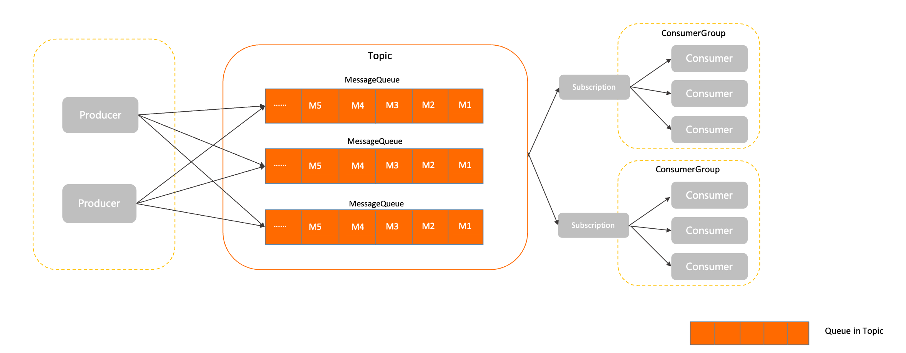

# Message

This section describes the definition, model relationship, internal attributes, and behavior constraints of messages in Apache RocketMQ. This topic also provides usage notes for messages.
## Definition 


A message is the smallest unit of data transmission in Apache RocketMQ. A producer encapsulates the load and extended attributes of business data into messages and sends the messages to a Apache RocketMQ broker. Then, the broker delivers the messages to the consumer based on the relevant semantics.

The characteristics of the message model in Apache RocketMQ are:

* **Immutability**: A message is an event that is generated. After the message is generated, the content of the message does not change. Even if the message passes through a transmission channel, the content of the message remains the same. The messages that consumers obtain are read-only messages.


* **Persistence**: By default, Apache RocketMQ persists messages. The received messages are stored in the storage file of the Apache RocketMQ broker to ensure that the messages can be traced and restored if system failures occur.

  

## Model relationship

The following figure shows the position of messages in the domain model of Apache RocketMQ.

1. Messages are initialized by producers and are sent to the Apache RocketMQ broker.

2. Messages are stored in queues in the order in which the messages are received on the Apache RocketMQ broker.

3. Consumers obtain and consume messages from the Apache RocketMQ broker based on the specified subscriptions.


## Internal attributes 

**System retention attributes**

**Topic name**

* Definition: the name of the topic to which a message belongs. The topic name is globally unique in a cluster. For more information, see [Topic](./02topic.md).

* Values: obtained from the SDK of the client.


**Message type**

* Definition: the type of a message.

* Values: obtained from the SDK of the client. Apache RocketMQ supports the following message types:
  * Normal: [Normal messages](../04-featureBehavior/01normalmessage.md). A normal message does not require special semantics and is not correlated with other normal messages.

  * FIFO: [Fifo messages](../04-featureBehavior/03fifomessage.md). Apache RocketMQ uses a message group to determine the order of a specified set of messages. The messages are delivered in the order in which they are sent.

  * Delay: [Delayed messages](../04-featureBehavior/02delaymessage.md). You can specify a delay to make messages available to consumers only after the delay has elapsed, instead of delivering messages immediately when they are produced.

  * Transaction: [Transaction messages](../04-featureBehavior/04transactionmessage.md). Apache RocketMQ supports distributed transaction messages and ensures transaction consistency of database updates and message calls.


**Message queue**

* Definition: the queue to which a message belongs. For more information, see [Message queues](./03messagequeue.md).

* Values: specified and populated by the broker.


**Message offset**

* Definition: the location where the current message is stored in the queue. For more information, see [Working mechanism](../04-featureBehavior/09consumerprogress.md).

* Values: specified and populated by the broker. Valid values: 0 to Long.Max.


**Message ID**

* Definition: the unique identifier of a message. The ID of each message is globally unique in the cluster.

* Values: automatically generated by the producer client. A message ID is a string of 32 characters that consists of digits and uppercase letters.


**(Optional) Message keys**

* Definition: the list of index keys for messages. You can configure different keys to distinguish between messages and quickly find messages.

* Values: defined by the producer client.


**(Optional) Message tag**

* Definition: the tag that is used to filter messages. Consumers can filter messages by tags and receive only messages that contain specified tags.

* Values: defined by the producer client.

* Constraint: Only one tag can be specified for each message.


**(Optional) Scheduled time**

* Definition: the millisecond-level timestamp that is used when a message triggers delayed delivery in a scheduled time scenario. For more information, see [Delayed messages](../04-featureBehavior/02delaymessage.md).

* Values: defined by the message producer.

* Constraint: The maximum duration is 40 days.


**Message sending time**

* Definition: the local millisecond-level timestamp of the producer client when the message is sent.

* Values: populated by the producer client.

* Note: The client time may be different from the broker time. In this case, the message sending time is based on the client time.


**Message store timestamp**

* Definition: the local millisecond-level timestamp of the Apache RocketMQ broker when the message is stored.

  For delay messages and transaction messages, the message retention time is the broker time that is displayed for the consumer when the message takes effect.

* Values: populated by the broker.

* Note: The client time may be different from the broker time. In this case, the message retention time is based on the broker time.


**Retry times**

* Definition: the number of times that the Apache RocketMQ broker redelivers a message after the message fails to be consumed. After each retry, the maximum number of retries is increased by one. For more information, see [Consumption retry](../04-featureBehavior/10consumerretrypolicy.md).

* Values: labeled by the broker. The first time that a message is consumed, the number of retries is zero. The first time that a message fails to be consumed, the number of retries is one.


**Custom attributes for messages**

**Custom attributes**

* Definition: the extended information that can be specified by the producer.

* Values: specified by the producer based on key-value pairs from a string.

**Message load**

**Message load**

* Definition: the actual message data of the service message.

* Values: serialized by the producer and transmitted in binary bytes.

* Constraints: see [Parameter limits](../01-introduction/03limits.md).


## Behavior constraints 


The size of a message cannot exceed the upper limit. If the size of a message exceeds the corresponding upper limit, the message fails to be sent.

The following describes the default limits for messages:

* max size of message: 4 MB


## Usage notes 


**Overloaded transmission is not recommended for a single message.**

Apache RocketMQ is a messaging middleware that transmits data for business events. If the size of a message is large, the network transmission layer may be overloaded. This affects retries upon errors and throttling. We recommend that you limit the data size of a single message event.

If an overloaded transmission is required in the production environment, we recommend that you split the message based on a fixed size or use the file storage method.

**Immutability of messages**

Messages cannot be modified in Apache RocketMQ broker versions 5.x and the messages that consumers obtain are read-only messages. No strong constraints related to immutability are imposed on versions 3.x and 4.x. We recommend that you re-initialize messages if you want to transmit messages.

* Correct example:

  ```java
  Message m = Consumer.receive();
  Message m2= MessageBuilder.buildFrom(m);
  Producer.send(m2);
  ```

  

* Incorrect example：

  ```java
  Message m = Consumer.receive();
  m.update()；
  Producer.send(m);
  ```

  


