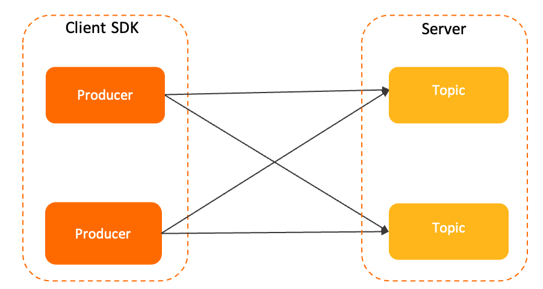

# Producer

This section describes the concept of producers in Apache RocketMQ. It also describes the role of producers in the messaging model, producer attributes and compatibility, and some usage notes of working with producers.

## Definition


A producer in Apache RocketMQ is a functional messaging entity that creates messages and sends them to the server.

A producer is typically integrated on the business system and serves to encapsulate data as messages in Apache RocketMQ and send the messages to the server. For more information about messages, see [Messages](./04message.md).

The following message delivery elements are defined on the producer side:

* Transmission mode: A producer can specify the message transmission mode in an API operation. Apache RocketMQ supports synchronous transmission and asynchronous transmission.

* Batch transmission: A producer can specify batch transmission in an API operation. For example, the number or size of messages sent at a time can be specified.

* Transactional behavior: Apache RocketMQ supports transaction messages. Producers are involved in transaction checks to ensure eventual consistency of transactions. For more information, see [Transactional messages](../04-featureBehavior/04transactionmessage.md).


Producers and topics have an n-to-n relationship. A producer can send messages to multiple topics, and a topic can receive messages from multiple producers. This many-to-many relationship facilitates performance scaling and disaster recovery.


## Model relationship

The following figure shows the role of producers in the messaging model of Apache RocketMQ.

1. The message is initialized by the producer and sent to the Apache RocketMQ server.

2. Messages are stored in the specified queue of the topic in the order in which they arrive at the Apache RocketMQ server.

3. The consumer obtains and consumes messages from the Apache RocketMQ server based on the specified subscription relationship.


## Internal attributes 


**Client ID**

* Definition: the identity of a producer client. This attribute is used to distinguish between different producers. A client ID is globally unique within a cluster.

* Value: The client ID is automatically generated by Apache RocketMQ SDKs. It is mainly used for O\&M purposes such as log viewing and problem locating. The client ID cannot be modified.


**Communication parameters**

* **(Required)** : the endpoint used to connect to the server. This endpoint is used to identify the cluster.

  The access point must be configured in the format. We recommend that you use domain names to avoid using IP addresses to prevent node changes from failing to perform hotspot migration.


* **(Optional)** : the credential used by the client for authentication.

  Transmission is required only when identity recognition and authentication are enabled on the server.


* Request Timeout **(Optional)** : the timeout period of the network request. For more information about the value range and default value, see [Parameter limits](../01-introduction/03limits.md).


**Prebound topic list**

* Definition: the list of topics to which a producer of Apache RocketMQ sends messages. Prebound topics provide the following benefits:
  * Transaction messages **(Required)**: The prebound topic list attribute must be specified for transaction messages. In transaction messaging scenarios, when a producer recovers from a fault or is restarted, the producer checks whether a transaction message topic contains uncommitted transaction messages. This prevents latency caused by uncommitted transaction messages in the topic after the producer sends new messages to the topic.

  * Non-transaction messages **(Optional)**: The server checks the access permissions and validity of the destination topics based on the list of prebound topics during producer initialization, instead of performing the check after the application is started. We recommend that you specify the prebound topic list attribute for non-transaction messages.

    If the prebound topic list attribute is not specified for non-transaction messages or destination topics are changed, Apache RocketMQ dynamically checks and identifies destination topics.

* Limit: For transaction messages, prebound topics must be specified and used together with a transaction checker.


**Transaction checker**

* Apache RocketMQ uses a transaction messaging mechanism that requires a producer to implement a transaction checker to ensure eventual consistency of transactions. For more information, see [Transaction messages](../04-featureBehavior/04transactionmessage.md).

* When a producer sends transaction messages, a transaction checker must be configured and used together with prebound topics.


**Send retry policy**

Send retry policy specifies how a producer retries the delivery of messages upon a failed message delivery attempt. For more information, see [Message sending retry](../04-featureBehavior/05sendretrypolicy.md).

## Version compatibility 

Starting from Apache RocketMQ version 5.x, producers are anonymous, and producer groups are discontinued. For Apache RocketMQ version 3.x and version 4.x, existing producer groups can be discontinued, without affecting your business.

## Usage notes

**We recommend that you limit the number of producers on individual processes.**

In Apache RocketMQ, producers and topics provide a many-to-many form of communication. A single producer can send messages to multiple topics. We recommend that you create and initialize the minimum number of producers that your business scenarios require, and reuse as many producers as you can. For example, in a scenario that requires message delivery to multiple topics, you do not need to create a producer for each topic.

**We recommend that you do not create and destroy producers on a regular basis.**

The producers of Apache RocketMQ are underlying resources that can be reused, like the connection pool of a database. You do not need to create producers each time you send messages or destroy the producers after you send messages. If you regularly create and destroy producers, a large number of short connection requests are generated on the broker. This imposes a high level of load on your system.

* Example of correct usage

  ```java
    Producer p = ProducerBuilder.build();
    for (int i =0;i<n;i++)
    {
      Message m= MessageBuilder.build();
      p.send(m);
    }
    p.shutdown();
  ```

  

* Example of incorrect usage

  ```java
    for (int i =0;i<n;i++)
    {
      Producer p = ProducerBuilder.build();
      Message m= MessageBuilder.build();
      p.send(m);
      p.shutdown();
    }
  ```

  


