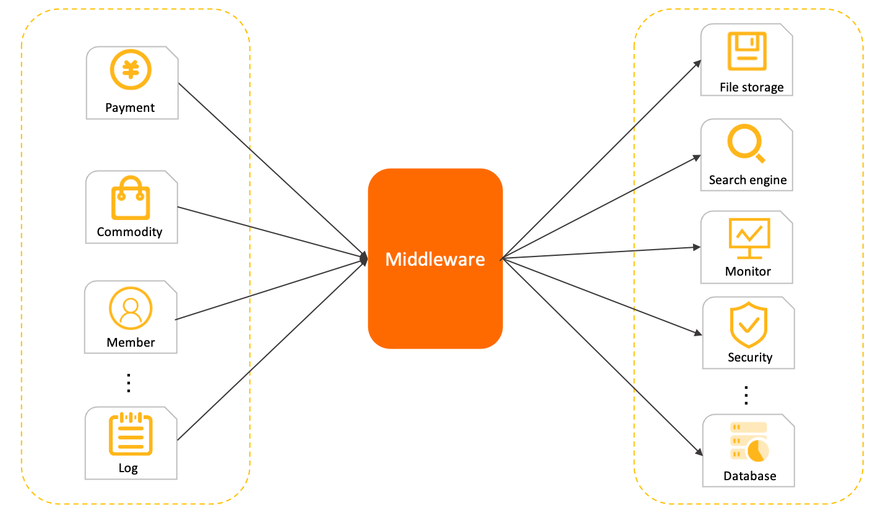
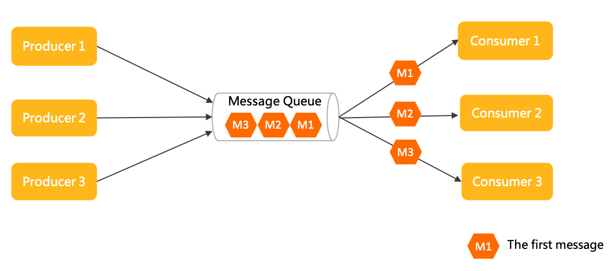

# Domain model

This section describes the domain model of Apache RocketMQ.

Apache RocketMQ is a distributed middleware service that adopts an asynchronous communication model and a publish/subscribe message transmission model.

For more information about the communication model and transmission model, see **Communication model** and **Message transmission model**.

The asynchronous communication model of Apache RocketMQ features simple system topology and weak upstream-downstream coupling. Apache RocketMQ is used in asynchronous decoupling and load shifting scenarios.

## Domain model of Apache RocketMQ

As shown in the preceding figure, the lifecycle of a Apache RocketMQ message consists of three stages: production, storage, and consumption.

A producer generates a message and sends it to a Apache RocketMQ broker. The message is stored in a topic on the broker. A consumer subscribes to the topic to consume the message.

**Message production**

[Producer](../03-领域模型/04producer.md)：

The running entity that is used to generate messages in Apache RocketMQ. Producers are the upstream parts of business call links. Producers are lightweight, anonymous, and do not have identities.

**Message storage**

* [Topic](../03-领域模型/02topic.md)：

  The grouping container that is used for message transmission and storage in Apache RocketMQ. A topic consists of multiple message queues, which are used to store messages and scale out the topic.

* [MessageQueue](../03-领域模型/03messagequeue.md)：

  The unit container that is used for message transmission and storage in Apache RocketMQ. Message queues are similar to partitions in Kafka. Apache RocketMQ stores messages in a streaming manner based on an infinite queue structure. Messages are stored in order in a queue.

* [Message](../03-领域模型/04message.md)：

  The minimum unit of data transmission in Apache RocketMQ. Messages are immutable after they are initialized and stored.

**Message consumption**

* [ConsumerGroup](../03-领域模型/07consumergroup.md)：

  An independent group of consumption identities defined in the publish/subscribe model of Apache RocketMQ. A consumer group is used to centrally manage consumers that run at the bottom layer. Consumers in the same group must maintain the same consumption logic and configurations with each other, and consume the messages subscribed by the group together to scale out the consumption capacity of the group.

* [Consumer](../03-领域模型/08consumer.md)：

  The running entity that is used to consume messages in Apache RocketMQ. Consumers are the downstream parts of business call links, A consumer must belong to a specific consumer group.

* [Subscription](../03-领域模型/09subscription.md)：

  The collection of configurations in the publish/subscribe model of Apache RocketMQ. The configurations include message filtering, retry, and consumer progress Subscriptions are managed at the consumer group level. You use consumer groups to specify subscriptions to manage how consumers in the group filter messages, retry consumption, and restore a consumer offset.

  The configurations in a Apache RocketMQ subscription are all persistent, except for filter expressions. Subscriptions are unchanged regardless of whether the broker restarts or the connection is closed.

## Communication model

According to the concept of distributed system architecture, a complex system can be split into multiple independent modules, such as microservice modules. Remote communication between the modules must be ensured in the system. There are two typical communication models for this purpose: RPC-based synchronous communication model and middleware-based asynchronous communication model.

RPC-based synchronous model

In this model, remote systems communicate with each other directly. Each request is sent directly from the caller to the callee, and the callee returns the call result immediately to the caller.
**Notice** The word "synchronous" does not refer to the mode of the programming interface. RPC also supports the programming mode of asynchronous non-blocking calls, in which case the caller still expects a direct response from the callee within a specified period.

Asynchronous communication model

In this model, subsystems are not connected in a tightly coupled manner. The caller needs only to convert a request into an asynchronous event, or message, and send it to the agent. As long as the message is sent, the call is considered complete. The agent delivers the message to the called downstream subsystem and ensures that the task is accomplished. The role of agent is typically assumed by a message middleware.

Asynchronous communication provides the following benefits:

* Simple system topologyBecause the caller and callee both communicate only with the agent, the system works in a star structure that is easy to maintain and manage.

* Weak upstream and downstream couplingWeak coupling enables the system structure to be more flexible. The agent performs buffering and asynchronous recovery. Systems deployed at the upstream and downstream can be upgraded and changed independently without affecting each other.

* Load shiftingMessage-oriented agents typically provide a large traffic buffer and powerful traffic shaping capability. This prevents traffic peaks from drowning downstream systems.

## Message transmission model

Message middleware services have two common transmission models: the point-to-point model and the publish/subscribe model.

Point-to-point model

The point-to-point model, also known as the queue model, has the following characteristics:

* Consumer anonymity: The queue is the only identity used during upstream-downstream communication. Downstream consumers cannot declare an identity when they obtain messages from the queue.

* One-to-one communication: Consumers do not have identities. All consumers in a consumer group consume the subscribed messages together. Each message can be consumed only by one specific consumer. For this reason, this model supports only one-to-one communication.

Publish/subscribe model

This model has the following characteristics:

* Independent consumption: In this model, consumers use the identity of a consumer group, or a subscription, to receive and consume messages. Consumer groups are independent of each other.

* One-to-many communication: Based on the design of independent identity, this model allows a topic to be subscribed to by multiple consumer groups, each having full access to all the messages. Therefore, the publish/subscribe model supports one-to-many communication.

Comparison between transmission models

The point-to-point model is simpler in structure, while the publish/subscribe model offers better scalability. Apache RocketMQ uses and has the same high scalability as the publish/subscribe model.
