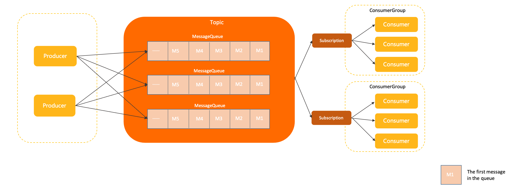

# Topic

This section describes the definition, model relationship, internal attributes, and behavior constraints of topics in Apache RocketMQ. This topic also provides version compatibility information and usage notes for topics.

## Definition

A topic is logically a collection of queues; we may publish messages to or receive from it.

Topics provide the following benefits:

* **Message categorization and message isolation**: When you create a messaging service based on Apache RocketMQ, we recommend that you use different topics to manage messages of different business types for isolated storage and subscription.

* **Identity and permission management**: Messages in Apache RocketMQ are anonymous. You can use a topic to perform identity and permission management for messages of a specific category.

## Model relationship

The following figure shows the position of a topic in the domain model of Apache RocketMQ.

In Apache RocketMQ, a topic is a top-level storage container in which all message resources are defined. A topic is a logical concept and not the actual unit that stores messages.

A topic contains one or more queues. Message storage and scalability are implemented based on queues. All constraints and attribute settings for a topic are implemented based on the queues in the topic.

## Internal attributes

**Topic name**

* Definition: the name of a topic. A topic name identifies the topic and is globally unique in a cluster.

* Value: A topic name is specified by the user when a topic is created.

* Constraint: See [Parameter limits](../01-基础介绍/03limits.md).

**Queues**

* Definition: the actual storage unit that stores messages. A topic contains one or more queues. For more information, see [Message queues](../03-领域模型/03messagequeue.md).

* Value: You can specify the number of queues when you create a topic. Apache RocketMQ allocates the specified number of queues to the topic.

* Constraint: A topic must contain at least one queue.

**Message type**

* Definition: the message type that is specified for a topic.

* Value: When you create a topic in Apache RocketMQ, select one of the following message types for the topic:
  * Normal: [Normal messages](../04-功能行为/01normalmessage.md). A normal message does not require special semantics and is not correlated with other normal messages.

  * FIFO: [Fifo messages](../04-功能行为/03fifomessage.md). Apache RocketMQ uses a message group to determine the order of a specified set of messages. The messages are delivered in the order in which they are sent.

  * Delay: [Delayed messages](../04-功能行为/02delaymessage.md). You can specify a delay to make messages available to consumers only after the delay has elapsed, instead of delivering messages immediately when they are produced.

  * Transaction: [Transaction messages](../04-功能行为/04transactionmessage.md). Apache RocketMQ supports distributed transaction messages and ensures transaction consistency of database updates and message calls.

* Constraint: A topic supports only one message type.

## Behavior constraints

**Forced message type verification**

Apache RocketMQ version 5.x allows you to specify a message type for a topic. This way, you can manage and process messages of the specified type in a separate topic. Apache RocketMQ forcibly verifies the type of messages that are sent and the message type of the topic to which the messages are sent. If message type verification fails, message delivery requests are rejected, and a type mismatch error is returned. The following verification rules apply:

* Consistent message typesThe messages that you want to send must use the same message type as the message type that is specified for the topic to which you want to send the messages.

* Only one type of messages sent to a topicThe messages that you want to send to a topic must use the same message type. Only one message type can be specified for a topic.

**Examples of common usage errors**

* Send messages that do not match the message type of a topicFor example, a request that is initiated to send Transaction messages to a topic that uses the FIFO message type is rejected, and a type mismatch error is returned.

* Send messages of different types to a topicFor example, a request that is initiated to send normal messages and fifo messages to a topic that uses the Normal message type is rejected, and a type mismatch error is returned.

## Version compatibility

Forced message type verification is available only in Apache RocketMQ version 5.x. The SDKs of Apache RocketMQ versions 4.x and 3.x do not support forced message type verification. If you use version 4.x or 3.x, make sure that message types are consistent.

We recommend that you use Apache RocketMQ version 5.x.

## Usage notes

**Plan topics based on your business requirements**

We recommend that you use a topic to process messages that are produced for the same business module of a business aspect when you plan topics in Apache RocketMQ. Take note of the following factors when you plan topics:

* Message types: Use different topics to store messages of different types. For example, you can create two topics to separately store fifo messages and normal messages.

* Message correlation: Use separate topics to store messages that are not directly correlated. For example, create two topics for Taobao transaction messages and Freshippo logistics messages, which are not correlated. If the messages are directly correlated, you can use the same topic. For example, you can create one topic for order messages that are produced for the men's clothing category and women's clothing category on Taobao. If the business volume or submodules require more fine-grained topics, you can also use different topics for messages that can be classified into one topic.

* Message volume and timeliness: Use different topics to process messages that have differences in volume or timeliness. For example, do not use the same topic for one business that generates a small number of time-sensitive messages and another business that generates trillions of messages. This prevents time-sensitive messages from waiting too long for consumption.

**Example of correct topic planning:** In e-commerce scenarios, you can use a topic for order-related messages, such as order creation, payment, and canceling, a topic for logistics messages, and another topic for reward point-related messages.

**Examples of incorrect topic planning:**

* Excessively coarse granularity: causes poor isolation. This does not facilitate independent O\&M and fault handling. An example of this incorrect topic planning practice is to use the same topic for all transaction messages and logistics messages.

* Excessively fine granularity: consumes a large number of topic resources and increases the system load. An example of this incorrect topic planning practice is to use a separate topic for messages that are produced for each user.

**Use a topic to send and receive messages of the same type**

Topic-based business isolation is a design principle of Apache RocketMQ. We recommend that you use different topics for messages that use different business logic. A specific topic must send or receive the same type of messages.

**Avoid automated management of topics**

Topics in Apache RocketMQ are top-level resources and containers that provide separate permission management, observability metrics collection, and monitoring capabilities. System resources are required to create and manage topics. We recommend that you add, delete, modify, or query topics in a production environment only when the operation is required.

Although Apache RocketMQ provides automatic topic creation, we recommend that you use the feature only in a test environment. If you use the feature in a production environment, a large number of unnecessary topics may be generated. This hinders topic management and consumes additional system resources.
