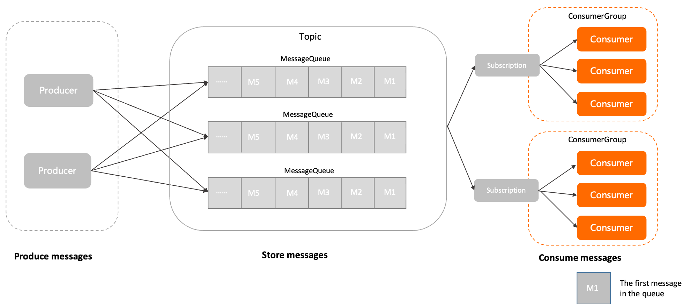

# Consumer

This section describes the definition, model relationship, internal attributes, and behavior constraints for consumers in Apache RocketMQ. This topic also provides version compatibility information and usage notes for consumers.

## Definition

A consumer is an entity that receives and processes messages in Apache RocketMQ.

Consumers are usually integrated in business systems. They obtain messages from Apache RocketMQ brokers and convert the messages into information that can be perceived and processed by business logic.

The following items determine consumer behavior:

* Consumer identity: A consumer must be associated with a consumer group to obtain behavior settings and consumption status.

* Consumer type: Apache RocketMQ provides a variety of consumer types for different development scenarios, including push consumers, simple consumers and pull consumers. For more information, see [Consumer types](../04-功能行为/06consumertype.md).

* Local settings for consumers: These settings specify how consumer clients run based on the consumer type. For example, you can configure the number of threads and concurrency settings on consumers to achieve different transmission effects.

## Model relationship

The following figure shows how consumers are positioned in the domain model of Apache RocketMQ.

1. The message is initialized by the producer and sent to the Apache RocketMQ server.

2. Messages are stored in the specified queue of the topic in the order in which they arrive at the Apache RocketMQ server.

3. The consumer obtains and consumes messages from the Apache RocketMQ server based on the specified subscription relationship.


## Internal attributes

**Consumer group name**

* Definition: the name of the consumer group associated with the current consumer. Consumers inherit their behavior from the consumer groups. For more information, see [Consumer groups](./07consumergroup.md).

* Values: Consumer groups are the logical resources of Apache RocketMQ{#product-name}

  . You must create consumer groups by using the console or calling API operations in advance. For more information about the limits on this operation, see[Parameter limits](../01-基础介绍/03limits.md).

**Client ID**

* Definition: the identity of a consumer client. This attribute is used to distinguish between different consumers. The value must be unique within a cluster.

* Values: The client ID is automatically generated by the Apache RocketMQ SDK. It is mainly used for O\&M purposes such as log viewing and problem locating. The client ID cannot be modified.


**Communication parameters**

* Endpoints **(Required)** : the endpoint used to connect to the server. This endpoint is used to identify the cluster.

  The access point must be configured in the format. We recommend that you use domain names to avoid using IP addresses to prevent node changes from failing to perform hotspot migration.


* Credential **(Optional)** : the credential used by the client for authentication.

  Transmission is required only when identity recognition and authentication are enabled on the server.


* Request Timeout **(Optional)** : the timeout period of the network request. For more information about the value range and default value, see [Parameter limits](../01-基础介绍/03limits.md).


**Pre-bound subscription list**

* Definition: the subscription list of the specified consumer. The Apache RocketMQ broker can use the pre-bound subscription list to verify the permissions and validity of the subscribed topic during consumer initialization instead of after the application is started.

* Values: We recommend that you specify the subscription or the list of subscribed topics during consumer initialization. If the subscription is not specified or the subscribed topics are changed, Apache RocketMQ dynamically verifies the topics.

**Message listener**

* Definition: the listener that a consumer uses to invoke the message consumption logic after Apache RocketMQ broker pushes a message to the consumer.

* Values: The value of a message listener is configured on the consumer client.

* Constraints: When you consume messages as a push consumer, you must configure the message listener on the consumer client. For more information about consumer types, see [Consumer types](../04-功能行为/06consumertype.md).


## Behavior constraints 


In the Apache RocketMQ domain model, consumer management is implemented through consumer grouping, and consumers in the same group share messages for consumption. Therefore, to ensure the normal load and consumption of messages in a group, Apache RocketMQ require all consumers in the same group to keep the following consumption behaviors consistent:

* **Delivery Order**

* **Consumption retry policy**


## Version compatibility 

As described in Behavior Constraints, the delivery order and consumption retry policy of all consumers in the same group need to be consistent.

* Apache RocketMQ server version 5.x: The consumption behavior of the preceding consumers is obtained from the associated consumer groups. Therefore, the consumption behavior of all consumers in the same group must be consistent, and the client does not need to pay attention to it.

* Apache RocketMQ server version 3.x/ 4.x history: The preceding consumption logic is defined by the consumer client interface. Therefore, you must ensure that the consumption behavior of consumers in the same group is consistent when you set the consumer client.


If you use the Apache RocketMQ server version 5.x and the client uses the previous version SDK, the consumer's consumption logic is subject to the settings of the consumer client interface.


## Usage notes 


**We recommend that you limit the number of consumers on individual processes.**

The consumers of Apache RocketMQ support the non-blocking transmission mode at the communication protocol level. The non-blocking transmission mode has higher communication efficiency and supports concurrent access by multiple threads. Therefore, in most scenarios, only one consumer needs to be initialized for a consumer group in a single process. Avoid initializing multiple consumers with the same configurations during the development phase.

**We recommend that you do not create and destroy consumers on a regular basis.**

The consumers of Apache RocketMQ are underlying resources that can be reused, like the connection pool of a database. You do not need to create consumers each time you receive messages or destroy the consumers after you consume messages. If you regularly create and destroy consumers, a large number of short connection requests are generated on the broker. This imposes a high level of load on your system.

* Correct example

  ```java
  Consumer c = ConsumerBuilder.build();
  for (int i =0;i<n;i++)
  {
    Message m= c.receive();
    //process message
  }
  c.shutdown();
  ```

  

* Incorrect example

  ```java
  for (int i =0;i<n;i++)
  {
    Consumer c = ConsumerBuilder.build();
    Message m= c.receive();
    //process message
    c.shutdown();
  }
  ```

  


