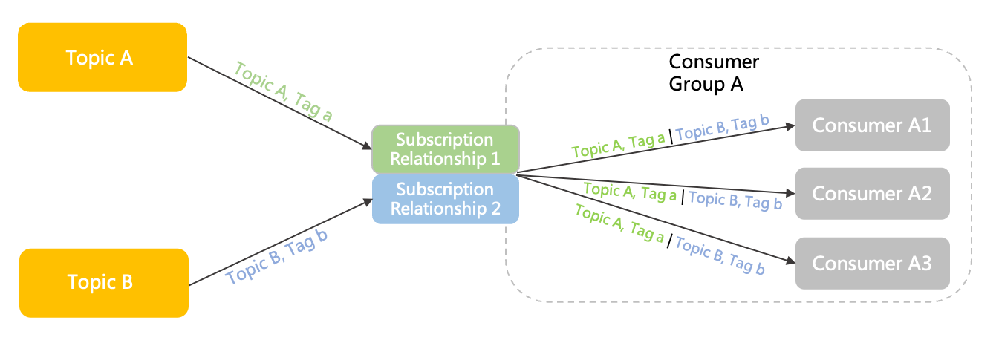

# Subscription

This section describes the definition, model relationship, internal attributes, and usage notes for subscriptions in Apache RocketMQ.

## Definition

A subscription is the rule and status settings for consumers to obtain and process messages in Apache RocketMQ.

Subscriptions are dynamically registered by consumer groups with brokers. Messages are then matched and consumed based on the filter rules defined by subscriptions.

By configuring subscriptions, you can control the following messaging behaviors:

* Message filter rules: These rules are used to define which messages in a topic are consumed by a consumer. By configuring message filter rules, consumers can effectively obtain messages that they want and specify message receiving ranges based on different business scenarios. For more information, see [Message filtering](../04-功能行为/07messagefilter.md).

* Consumption status: By default, the Apache RocketMQ broker provides persistent subscriptions. In other words, after a consumer group subscribes to a broker, consumers in the group can continue consuming messages from where the consumers left off after they reconnect.

## Rules for determining a subscription

The subscriptions of Apache RocketMQ are designed based on consumer groups and topics. Therefore, a subscription refers to the subscription of a specified consumer group to a topic. The following describes the rules for determining a subscription:

* One topic to many subscribersThe following figure shows two consumer groups (Group A and Group B) subscribed to Topic A. These two subscriptions are independent of each other and can be defined separately.
  

* One subscriber to multiple topicsThe following figure shows a consumer group (Group A) subscribed to two topics: Topic A and Topic B. Consumers in Group A have two separate subscriptions to Topic A and Topic B. The two subscriptions are independent of each other and can be defined separately.
  


## Model relationship

The following figure shows the position of subscriptions in the domain model of Apache RocketMQ.

1. The message is initialized by the producer and sent to the Apache RocketMQ server.

2. Messages are stored in the specified queue of the topic in the order in which they arrive at the Apache RocketMQ server.

3. The consumer obtains and consumes messages from the Apache RocketMQ server based on the specified subscription relationship.


## Internal attributes

**Filter types**

* Definition: the type of a message filter rule. After a message filter rule is set for a subscription, the system matches the messages in a topic based on the filter rule. Only the messages that meet the conditions are delivered to consumers. This feature helps you classify messages sent to consumers based on your requirements.

* Values:
  * Tag filter: filters and matches the full text based on tag strings.

  * SQL92 filter: filters and matches message attributes based on SQL syntax.

  

**Filter expressions**

* Definition: the expression of a custom filter rule.

* Values: For more information, see [Syntax for filter expressions](../04-功能行为/07messagefilter.md).


## Behavior constraints

**Subscription consistency**

Apache RocketMQ manages subscriptions based on consumer groups. Therefore, consumers in the same consumer group must maintain the same consumption logic. Otherwise, consumption conflicts occur, which in turn causes some messages to be incorrectly consumed.
* Correct example

  ```java
  //Consumer c1
  Consumer c1 = ConsumerBuilder.build(groupA);
  c1.subscribe(topicA,"TagA");
  //Consumer c2
  Consumer c2 = ConsumerBuilder.build(groupA);
  c1.subscribe(topicA,"TagA");
  ```

  

* Incorrect example

  ```java
  //Consumer c1
  Consumer c1 = ConsumerBuilder.build(groupA);
  c1.subscribe(topicA,"TagA");
  //Consumer c2Consumer 
  c2 = ConsumerBuilder.build(groupA);
  c1.subscribe(topicA,"TagB");
  ```

## Usage notes 

**Do not frequently modify subscriptions.**

In Apache RocketMQ, subscriptions are associated with metadata and configurations such as filter rules and consumption progress. The system must also ensure that the consumption behavior, consumption logic, and load policy of all consumers in the consumer group are consistent. These factors result in a complex web of relationships that need to be managed. Therefore, we recommend that you do not regularly modify subscriptions to change the business logic in the production environment. Otherwise, the client constantly needs to adjust its load distribution, which causes message reception problems.
