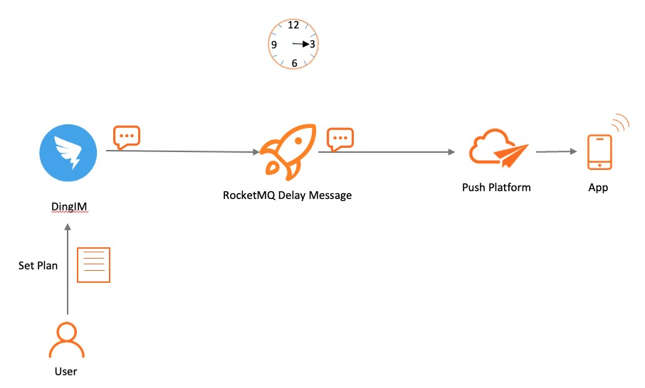
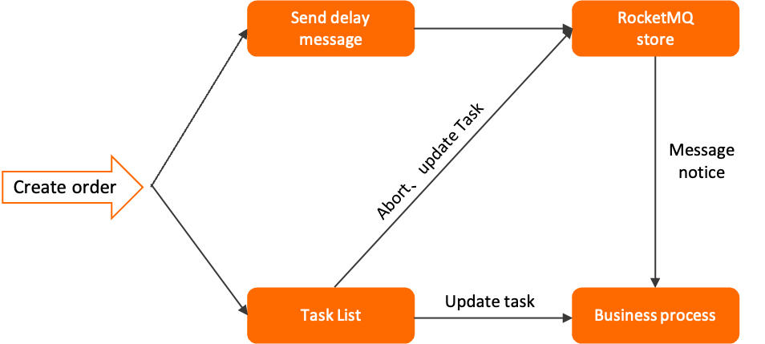

# Delay Message

Delay messages are messages with advanced features in Apache RocketMQ. This topic describes the scenarios, working mechanism, limits, usage examples, and usage notes of delay messages and delayed messages.

:::note

Scheduled message and delay message are essentially the same. Both of them deliver messages to consumers at a fixed time according to the timing time set by the message. Therefore, delay messages are used in the following sections.

:::

## Scenarios

Accurate and reliable time-based event triggers are required in scenarios such as distributed timed scheduling and task timeout processing. Apache RocketMQ provides delay messages to help you simplify the development of timed scheduling tasks and implement high-performance, scalable, and reliable timed triggering.

**Scenario 1: Distributed timed scheduling**


A distributed timed scheduling scenario involves tasks that require various time granularity levels, for example, a task to execute file cleanup at 5 o'clock every day or a task to trigger push messages every 2 minutes. Traditional dataset-based timed scheduling solutions are complex and inefficient in distributed scenarios. In comparison, delay messages in Apache RocketMQ allow you to encapsulate multiple types of time triggers.

**Scenario 2: Task timeout processing**


A typical scenario that involves task timeout processing is e-commerce payment, where an unpaid order is canceled after it remains unpaid for a specific time period instead of being canceled immediately. In this case, you can use delay messages in Apache RocketMQ to check and trigger timeout tasks.

Task timeout processing based on delay messages provides the following benefits:

* Various time granularity levels and simplified development: Scheduled messaging in Apache RocketMQ does not have the limit of fixed time increments. You can trigger tasks at any time granularity level and without deduplication.

* High performance and scalability: delay messages in Apache RocketMQ offer high concurrency and scalability. This outperforms traditional database scanning methods, which are complex to implement and can cause performance bottlenecks due to frequent API calls for scanning.

## Working mechanism

**Definition of delay messages**

delay messages are messages with advanced features in Apache RocketMQ. delay messages allow consumers to consume messages that are sent to the server only after a specified period of time or at a specified time. You can use delay messages to implement delayed scheduling and triggering in distributed scenarios.

**Time setting rules**

* The scheduled or delayed time for delay messages in Apache RocketMQ is represented as a timestamp, not a time period.

* The scheduled time is in the format of a millisecond-level Unix timestamp. You must convert the scheduled time of message delivery to a millisecond-level Unix timestamp. You can use the [Unix timestamp converter](https://www.unixtimestamp.com/) to convert a time to a millisecond-level Unix timestamp.

* The scheduled time must be within the allowed time range. If the scheduled time exceeds the range, the scheduled time does not take effect and the messages are immediately delivered from the server side.

* By default, the maximum time range for delay messages is 24 hours. You cannot change the default value. For more information, see[Parameter limits](../01-introduction/03limits.md).

* The scheduled time must be later than the current time. If the scheduled time is set to a time earlier than the current time, the scheduled time does not take effect and the messages are immediately delivered from the server side.


**The following section provides two time setting examples:**

* delay messages: If the current time is 2022-06-09 17:30:00 and you want to deliver messages at 2022-06-09 19:20:00, the millisecond-level Unix timestamp of the scheduled time is 1654773600000.

* Delayed messages: If the current time is 2022-06-09 17:30:00 and you want to deliver messages after 1 hour, the message delivery time is 2022-06-09 18:30:00 and the millisecond-level Unix timestamp is 1654770600000.

**Lifecycle of a scheduled message**


* Initialized: The message is built and initialized by the producer and is ready to be sent to the server.

* Timing: The message is sent to the server side, where the message is stored in a time-based storage system until the specified delivery time. An index is not immediately created for the message.

* Ready: At the specified time, the message is written into a regular storage engine, where the message is visible for consumers and waits for consumption by consumers.


* Inflight: The message is obtained by the consumer and processed based on the local business logic of the consumer.

  In this process, the broker waits for the consumer to complete the consumption and submit the consumption result. If no response is received from the consumer in a certain period of time, Apache RocketMQ retries the message. For more information, see [Consumption retry](../04-featureBehavior/10consumerretrypolicy.md).


* Acked: The consumer completes consumption and submits the consumption result to the broker. The broker marks whether the current message is successfully consumed.

  By default, Apache RocketMQ retains all messages. When the consumption result is submitted, the message data is logically marked as consumed instead of being deleted immediately. Therefore, the consumer can backtrack the message for re-consumption before it is deleted due to the expiration of the retention period or insufficient storage space.


* Deleted: When the retention period of the message expires or the storage space is insufficient, Apache RocketMQ deletes the earliest saved message from the physical file in a rolling manner. For more information, see [Message storage and cleanup](../04-featureBehavior/11messagestorepolicy.md).

## Usage limits

**Message type consistency**

delay messages can be sent only to topics whose MessageType is Delay.

**Time granularity**

The time granularity for delay messages in Apache RocketMQ is down to milliseconds. The default granularity value is 1000 ms.

The status of delay messages in Apache RocketMQ can be persistently stored. If the messaging system experiences a failure and is restarted, messages are still delivered based on the specified delivery time. However, if the storage system experiences an exception or is restarted, latency may occur in delivering delay messages.


## Example

Unlike normal messages, delay messages must have a delivery timestamp specified for them.

The following code provides Java examples of delivery and consumption of delay messages:

```java
        // Send delay messages.
        MessageBuilder messageBuilder = null;
        // Specify a millisecond-level Unix timestamp. In this example, the specified timestamp indicates that the message will be delivered in 10 minutes from the current time. 
        Long deliverTimeStamp = System.currentTimeMillis() + 10L * 60 * 1000;
        Message message = messageBuilder.setTopic("topic")
                // Specify the message index key. The system uses the key to locate the message. 
                .setKeys("messageKey")
                // Specify the message tag. The consumer can use the tag to filter messages. 
                .setTag("messageTag")
                .setDeliveryTimestamp(deliverTimeStamp)
                // Configure the message body.
                .setBody("messageBody".getBytes())
                .build();
        try {
            // Send the messages. Focus on the result of message sending and exceptions such as failures. 
            SendReceipt sendReceipt = producer.send(message);
            System.out.println(sendReceipt.getMessageId());
        } catch (ClientException e) {
            e.printStackTrace();
        }
        // Consumption example 1: If a scheduled message is consumed by a push consumer, the consumer needs to process the message only in the message listener. 
        MessageListener messageListener = new MessageListener() {
            @Override
            public ConsumeResult consume(MessageView messageView) {
                System.out.println(messageView.getDeliveryTimestamp());
                // Return the status based on the consumption result. 
                return ConsumeResult.SUCCESS;
            }
        };
        // Consumption example 2: If a scheduled message is consumed by a simple consumer, the consumer must obtain the message for consumption and submit the consumption result. 
        List<MessageView> messageViewList = null;
        try {
            messageViewList = simpleConsumer.receive(10, Duration.ofSeconds(30));
            messageViewList.forEach(messageView -> {
                System.out.println(messageView);
                // After consumption is complete, the consumer must invoke ACK to submit the consumption result. 
                try {
                    simpleConsumer.ack(messageView);
                } catch (ClientException e) {
                    e.printStackTrace();
                }
            });
        } catch (ClientException e) {
            // If the pull fails due to system traffic throttling or other reasons, you must re-initiate the request to obtain the message. 
            e.printStackTrace();
        }
    }
```


## Usage notes

**We recommend that you do not schedule the same delivery time for a large number of messages.**

delay messages are stored in a time-based storage system before they are delivered to consumers at the specified delivery time. If you specify the same delivery time for a large number of delay messages, the system has to simultaneously process the messages at the delivery time. This puts the system under heavy load and results in delays in message delivery.
