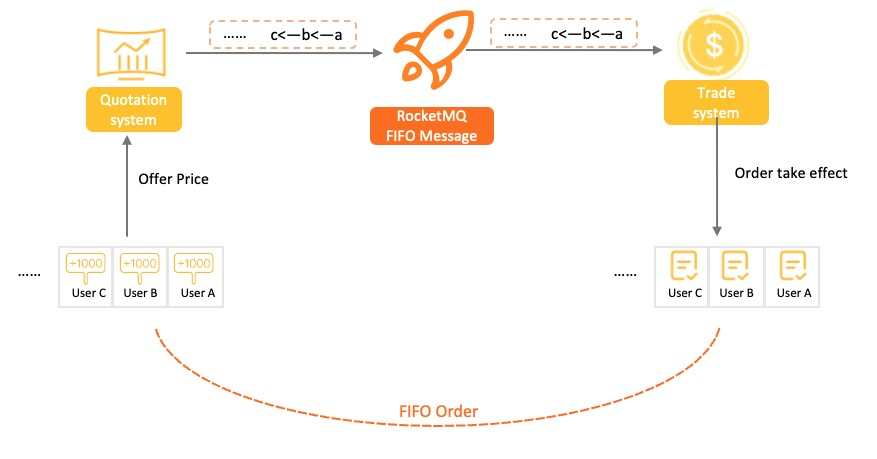
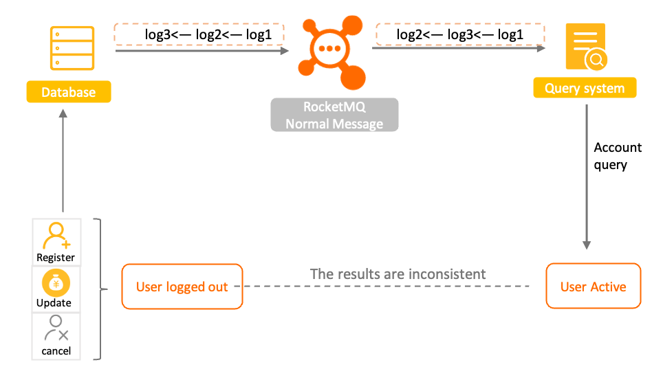
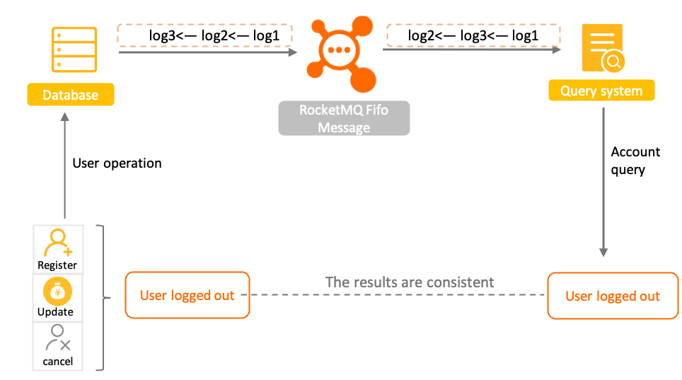
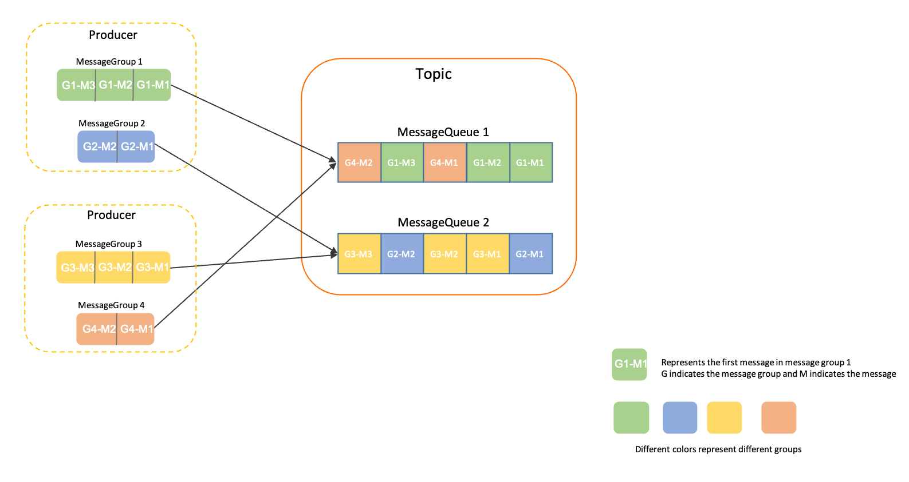

# Ordered Message

Ordered messages are a type of message with advanced features in Apache RocketMQ. This topic describes the scenarios, working mechanism, limits, usage examples, and usage notes of ordered messages.

## Scenarios

Heterogeneous systems use state synchronization to maintain strong consistency in scenarios such as ordered event processing, transaction matchmaking, and real-time incremental data synchronization. The preceding scenarios require ordered delivery of messages from upstream applications to downstream applications when an event change occurs. Apache RocketMQ provides ordered messages to help you implement ordered message transmission.


**Scenario 1: Transaction matchmaking**


For example, in securities and stock trading scenarios, if multiple bidders offer the same bid price for a bid order, the bidder who first offers the bid price wins the bid. Therefore, the downstream order processing system must be designed to process orders in the order in which prices were offered.

**Scenario 2: Real-time incremental data synchronization**

Normal message
Fifo message

For example, you want to perform incremental synchronization of data that is related to database modifications. You can use ordered messages provided in Apache RocketMQ to transmit messages from the upstream source database to the downstream query system. The messages can be binary logs of addition, deletion, and modification operations. The downstream system retrieves the messages in the order in which the messages are sent to make the database status updated in the same order. Ordered messages help you ensure consistency between the operations in the upstream system and the status data in the downstream system. If you use normal messages in this scenario, state inconsistency may occur.

## Working mechanism

**Definition of ordered messages**

Ordered messages are an advanced type of message in Apache RocketMQ. Ordered messages are delivered to consumers in the order in which the messages are sent. This message type allows you to implement ordered processing in business scenarios.

The defining characteristics of ordered messages are the order of message sending, storage, and delivery.

Apache RocketMQ uses message groups to determine the order of ordered messages. You must configure message groups for ordered messages. The messages in a message group are processed in the first-in, first-out (FIFO) order. Message ordering does not apply to different message groups or messages that are not in a message group.

Message group-based message ordering allows you to specify fine-grained message ordering based on your business logic. This helps you implement partial message ordering in your business system and improve the degree of concurrency and throughput of the business system.


**Message ordering**

Two types of message order apply in Apache RocketMQ: the production order and the consumption order.

* **Production order** ： Apache RocketMQ uses the protocol that is established between the producer and the server to ensure that messages are serially sent from the producer to the server and that the messages are stored and persisted in the order in which the messages are sent.

  To ensure the production order of messages, make sure that the following conditions are met:
  * Single producer: The production order of messages applies to individual producers. Apache RocketMQ cannot determine the order of messages from different producers in different systems, even if you configure the same message group for the messages.
  
  * Serial transmission: A producer in Apache RocketMQ supports secure access by using multiple threads. If a producer uses multiple threads to concurrently send messages, Apache RocketMQ cannot determine the order of messages from different threads.

If producers that meet the preceding conditions send messages to Apache RocketMQ, the messages that belong to the same message group are stored in the same queue in the order in which the messages are sent. The following figure describes the sequential storage logic of Apache RocketMQ.



In the preceding figure, messages from MessageGroup 1 and MessageGroup 4 are stored in the same queue (MessageQueue 1). Apache RocketMQ ensures that messages G1-M1, G1-M2, and G1-M3 from MessageGroup 1 are stored in the queue in the order in which the messages are sent. Messages G4-M1 and G4-M2 from MessageGroup 4 are also stored in the order in which the messages are sent. However, messages from MessageGroup 1 and MessageGroup 4 are stored in no particular order.

  

* **Consumption order** ：

  Apache RocketMQ uses the protocol that is established between the consumers and the server to ensure that messages are consumed in the order in which the messages are stored.
  
  To ensure the consumption order of messages, make sure that the following conditions are met:
  * Delivery order: Apache RocketMQ ensures that message are delivered in the message storage order on the server by using the client SDK and the communications protocol on the server side. When consumer applications consume messages, the applications must follow the receive-process-reply path to prevent out-of-order messages caused by asynchronous processing.
  
    :::note
    * When a PushConsumer consumer consumes messages, Apache RocketMQ ensures that messages are delivered to the consumer one by one in the order in which the messages are stored. 
    * When a SimpleConsumer consumer consumes messages, the consumer may pull multiple messages at a time, and the business application must have a solution to implement the message consumption order. For more information about consumer types, see [Consumer types](./06consumertype.md).
    :::

  * Limited retries:Apache RocketMQ limits the number of delivery retries for ordered messages. If a message reaches the maximum number of delivery retries, Apache RocketMQ stops retrying the delivery of the message for consumption. This prevents other messages in the queue from constantly waiting for delivery.

  In scenarios in which the consumption order is critical, we recommend that you specify an appropriate number of retries to prevent out-of-order message processing.

  
**Combination of production order and consumption order**

If you want messages to be processed based on the FIFO principle, the production order and the consumption order are required. In most business scenarios, a producer may map to multiple consumers, and not all consumers require ordered consumption of messages. You can combine the settings of production order and consumption order to meet your requirements in different business scenarios. For example, you can send ordered messages and use non-sequential concurrent consumption to improve throughput. The following table describes different combinations of production order and consumption order settings.

|                             Production order                             |        Consumption order        |                                                                                                                                                Effect                                                                                                                                                |
|--------------------------------------------------------------------------|---------------------------------|------------------------------------------------------------------------------------------------------------------------------------------------------------------------------------------------------------------------------------------------------------------------------------------------------|
| Configure message groups to implement ordered delivery of messages.      | Ordered consumption of messages | The order of messages is ensured at the message group level. Messages in the same message group are sent and consumed in the same order.                                                                                                                                                             |
| Configure message groups to implement ordered delivery of messages.      | Concurrent consumption          | Messages are concurrently and chronologically consumed.                                                                                                                                                                                                                                              |
| Configure no message groups to implement unordered delivery of messages. | Ordered consumption of messages | The order of messages is ensured at the queue level. The message consumption is based on the attributes of the queue. Apache RocketMQ ensures that the consumption order is the same as the storage order in the queue, but not necessarily the same as the message sending order. |
| Configure no message groups to implement unordered delivery of messages. | Concurrent consumption          | Messages are concurrently and chronologically consumed.                                                                                                                                                                                                                                              |


**Lifecycle of an ordered message**


* Initialized: The message is built and initialized by the producer and is ready to be sent to a broker.

* Ready: The message is sent to the broker, and is visible to the consumer and available for consumption.

* Inflight: The message is obtained by the consumer and processed based on the local business logic of the consumer.

  In this process, the broker waits for the consumer to complete the consumption and submit the consumption result. If no response is received from the consumer in a certain period of time, Apache RocketMQ retries the message. For more information, see [Consumption retry](./10consumerretrypolicy.md).

* Acked: The consumer completes consumption and submits the consumption result to the broker. The broker marks whether the current message is successfully consumed.

  By default, Apache RocketMQ retains all messages. When the consumption result is submitted, the message data is logically marked as consumed instead of being deleted immediately. Therefore, the consumer can backtrack the message for re-consumption before it is deleted due to the expiration of the retention period or insufficient storage space.

* Deleted: When the retention period of the message expires or the storage space is insufficient, Apache RocketMQ deletes the earliest saved message from the physical file in a rolling manner. For more information, see [Message storage and cleanup](./11messagestorepolicy.md).

:::note

* Message consumption failures or timeouts trigger the retry logic of the server. If a consumption retry is triggered for a message, the message reaches the end of its lifecycle. The original message is considered a new message with a new message ID.

* If a consumption retry is triggered for an ordered message, the messages that follow the ordered message can be processed only after the ordered message is consumed.

:::


## Usage limits

Ordered messages support only topics whose MessageType is FIFO.

## Example

Compared with normal messages, ordered messages must have message groups configured for them. We recommend that you configure message groups at a fine-grained level based on your business requirements to allow for workload decoupling and concurrency scaling.

The following sample code provides an example on how to send and receive ordered messages in Java:

```java
        // Send ordered messages. 
        MessageBuilder messageBuilder = null;
        Message message = messageBuilder.setTopic("topic")
                // Specify the message index key. The system uses the key to locate the message. 
                .setKeys("messageKey")
                // Specify the message tag. The consumer can use the tag to filter the message. 
                .setTag("messageTag")
                // Configure a message group for the ordered messages. We recommend that you do not include a large number of messages in the group. 
                .setMessageGroup("fifoGroup001")
                // Configure the message body. 
                .setBody("messageBody".getBytes())
                .build();
        try {
            // Send the messages. Focus on the result of message sending and exceptions such as failures.
            SendReceipt sendReceipt = producer.send(message);
            System.out.println(sendReceipt.getMessageId());
        } catch (ClientException e) {
            e.printStackTrace();
        }
        // Make sure that ordered delivery is applied to the consumer group. Otherwise, the messages are delivered concurrently and in no particular order. 
        // Consumption example 1: If the consumer type is PushConsumer, the consumer needs to only process the message in the message listener. 
        MessageListener messageListener = new MessageListener() {
            @Override
            public ConsumeResult consume(MessageView messageView) {
                System.out.println(messageView);
                // Return the status based on the consumption result. 
                return ConsumeResult.SUCCESS;
            }
        };
        // Consumption example 2: If the consumer type is SimpleConsumer, the consumer must actively obtain the message for consumption and submit the consumption result. 
        // If the consumption of a message in the message group has not finished, the next message in the message group cannot be retrieved if you call the Receive function. 
        List<MessageView> messageViewList = null;
        try {
            messageViewList = simpleConsumer.receive(10, Duration.ofSeconds(30));
            messageViewList.forEach(messageView -> {
                System.out.println(messageView);
                // After consumption is complete, the consumer must invoke ACK to submit the consumption result. 
                try {
                    simpleConsumer.ack(messageView);
                } catch (ClientException e) {
                    e.printStackTrace();
                }
            });
        } catch (ClientException e) {
            // If the pull fails due to system traffic throttling or other reasons, the consumer must re-initiate the request to obtain the message. 
            e.printStackTrace();
        }
```


## Usage notes

**Use serial consumption to prevent out-of-order message processing.**

We recommend that you use serial message consumption instead of batch consumption. Consumption of multiple messages at the same time may cause out-of-order message processing.

For example, messages 1, 2, 3, and 4 are sent in the 1-2-3-4 order and the order of batch consumption is 1-\[2, 3\](processed in batches but failed)-\[2, 3\](retry)-4. The system may repeatedly process Message 2 if Message 3 fails to be processed. As a result, out-of-order message consumption occurs.

**Avoid including a large number of messages in a message group.**

Apache RocketMQ ensures that the messages in the same message group are stored in the same queue. A message group that contains a large number of messages causes the corresponding queue to be overloaded. This affects messaging performance and hinders scalability. When you configure message groups, you can use order IDs and user IDs as the message sequencing conditions. This ensures the order of messages of the same user.

We recommend that you split messages in your business applications by message group. For example, you can use order IDs and user IDs as message group keywords to implement ordered processing of messages of the same user. You do not need to ensure the order of messages of different users.
