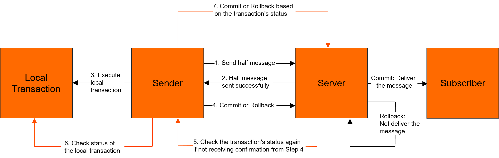

# Transaction Message

Transactional messages are an advanced message type in Apache RocketMQ. This topic describes the application scenarios, working mechanism, limits, usage, and usage notes of transactional messages.
## Scenarios

**Distributed transactions**

When a core business logic is executed in a distributed system, multiple downstream businesses are invoked to process the logic simultaneously. Therefore, ensuring the consistency of the execution results between the core business and the downstream businesses is the biggest challenge that needs to be solved for distributed transactions.


In an e-commerce scenario, when a user places an order, downstream systems are triggered to make changes accordingly. For example, the logistics system must initiate shipment, the credit system must update the user's credit points, and the shopping cart system must clear the user's shopping cart. The processing branches include:

* The order system changes the order status from unpaid to paid.

* The logistics system adds a to-be-shipped record and creates an order logistics record.

* The credit system updates the credit points of the user.

* The shopping cart system clears the shopping cart and updates the user's shopping cart records.


**Traditional XA-based solution: poor performance**

The typical method used to ensure result consistency among the branches is by using a distributed transaction system based on the eXtended Architecture (XA) protocol. The system encapsulates the four call branches into a large transaction that contains four independent transaction branches. While this solution can ensure result consistency, a large number of resources need to be locked to achieve this. This number increases with the number of branches, which results in low system concurrency. As more downstream branches are added, the system performance deteriorates.

**Normal message-based solution: poor result consistency**

A simpler solution based on the XA solution treats the change of the order system as a local transaction and the changes of downstream systems as downstream tasks. Transaction branches are treated as normal messages with added order table transactions. This solution processes messages asynchronously to shorten the processing lifecycle and improves system concurrency. 

However, this solution is prone to deliver inconsistent results between the core transaction and transaction branches, for example:

* The message is sent, but the order is not executed. As a result, the whole transaction needs to be rolled back.

* The order is executed, but the message is not sent. In this case, the message has to be resent for consumption.

* Timeout errors cannot be reliably detected, which makes it difficult to determine whether the order needs to be rolled back or an order change needs to be committed.


**Distributed transaction message-based solution of Apache RocketMQ: thorough consistency**

The reason why consistency cannot be guaranteed in the preceding solution is that normal messages do not have the commit, rollback, and unified coordination capabilities of standalone database transactions.

The transactional message feature of Apache RocketMQ supports two-phase commit on the basis of the normal message-based solution. The feature combines two-phase commit and local transaction to achieve global consistency of commit results.


The transactional message solution of Apache RocketMQ is powerful, scalable, and easy to develop. For more information about the working mechanism and process of transactional message, see Working mechanism。

## Working mechanism

**Definition**

Transactional messages are an advanced message type provided by Apache RocketMQ to ensure the ultimate consistency between message production and local transaction.
**Processing workflow**

The following figure shows the interaction process of transactional messages.

1. The producer sends a message to a Apache RocketMQ broker.

2. The Apache RocketMQ broker saves the message and marks it as not ready for delivery. A message in this state is called a half message. After that, the broker sends an acknowledgment message (ACK) back to the producer.

3. The producer executes the local transaction.

4. The producer sends a second ACK to the broker to submit the execution result of the local transaction. The execution result may be Commit or Rollback.
   * If the status of the message received by the broker is Commit, the broker marks the half message as deliverable and delivers the message to the consumer.

   * If the status of the message received by the broker is Rollback, the broker rolls back the transaction and does not deliver the half message to the consumer.
   

5. If the network is disconnected or the producer application is restarted and the broker does not receive a second ACK or the status of the half message is Unknown, the broker waits a period of time and sends a request to a producer in the producer cluster to query the status of the half message.
   **Note** For more information about the length of the period and the maximum number of queries, see[Parameter limits](../01-introduction/03limits.md).


6. After the producer receives the request, the producer checks the execution result of the local transaction that corresponds to the half message.

7. The producer sends another ACK to the Apache RocketMQ broker based on the execution result of the local transaction. Then, the broker processes the half message by following Step 4.


**Lifecycle of a transactional message**


* Initialized: The message is built and initialized by the producer and is ready to be sent to a broker.

* Transaction pending: The half message is sent to the broker. However, it is not immediately written to a disk for permanent storage. Instead, it is stored in a transaction storage system. The message is not committed until the system verifies that the second phase of the local transaction is successful. During this period, the message is invisible to downstream consumers.

* Rollback: In the second phase, if the execution result of the transaction is rollback, the broker rolls back the half message and terminates the workflow.

* Ready: The message is sent to the broker, and is visible to the consumer and available for consumption.

* Inflight: The message is obtained by the consumer and processed based on the local business logic of the consumer.

  In this process, the broker waits for the consumer to complete the consumption and submit the consumption result. If no response is received from the consumer in a certain period of time, Apache RocketMQ retries the message. For more information, see [Consumption retry](./10consumerretrypolicy.md).

* Acked: The consumer completes consumption and submits the consumption result to the broker. The broker marks whether the current message is successfully consumed.

  By default, Apache RocketMQ retains all messages. When the consumption result is submitted, the message data is logically marked as consumed instead of being deleted immediately. Therefore, the consumer can backtrack the message for re-consumption before it is deleted due to the expiration of the retention period or insufficient storage space.

* Deleted: When the retention period of the message expires or the storage space is insufficient, Apache RocketMQ deletes the earliest saved message from the physical file in a rolling manner. For more information, see [Message storage and cleanup](./11messagestorepolicy.md).


## Usage limits

**Message type consistency**

Transactional messages can only be used in topics whose MessageType is Transaction.

**Transaction-centered consumption**

The transactional message feature of Apache RocketMQ guarantees that the same transaction can be processed between the local core transaction and downstream branches. However, it does not guarantee the consistency between the message consumption result and the upstream execution result. Therefore, downstream businesses must ensure that messages are processed correctly. We recommend that consumers [Consumption retry](./10consumerretrypolicy.md) properly to ensure that the message is processed correctly in the event of failure.

**Intermediate state visibility**

The transactional message feature of Apache RocketMQ ensures only final consistency, which means that status consistency is not guaranteed between an upstream transaction and a downstream branch before a message is delivered to a consumer. Therefore, transactional messages are only suitable for transaction scenarios that accept asynchronous execution.

**Transaction timeout mechanism**

Apache RocketMQ implements a timeout mechanism for transactional messages. Upon receiving a half message, if the broker cannot determine whether to commit or roll back the transaction after a certain period of time, the broker rolls back the message by default. For more information about the timeout period, see[Parameter limits](../01-introduction/03limits.md).

## Example

Sending transactional messages is different from sending normal messages in the following aspects:

* Before sending transactional messages, you must enable the transaction checker and associate it with local transaction execution.

* When creating a producer, you must set the transaction checker and bind the list of topics of messages to be sent. These actions enable the built-in transaction checker of the client to restore topics in the event of exceptions.

The following example uses Java as an example to show you how to send transactional messages:

```java
    // The demo is used to simulate the order table query service to check whether the order transaction is submitted. 
    private static boolean checkOrderById(String orderId) {
        return true;
    }
    // The demo is used to simulate the execution result of a local transaction. 
    private static boolean doLocalTransaction() {
        return true;
    }
    public static void main(String[] args) throws ClientException {
        ClientServiceProvider provider = new ClientServiceProvider();
        MessageBuilder messageBuilder = new MessageBuilder();
        // Build a transaction producer: The transactional message requires the producer to build a transaction checker to check the intermediate status of an exceptional half message. 
        Producer producer = provider.newProducerBuilder()
                .setTransactionChecker(messageView -> {
                    /**
                     * The transaction checker checks whether the local transaction is correctly committed or rolled back based on the business ID, for example, an order ID. 
                     * If this order is found in the order table, the order insertion action is committed correctly by the local transaction. If no order is found in the order table, the local transaction has been rolled back. 
                     */
                    final String orderId = messageView.getProperties().get("OrderId");
                    if (Strings.isNullOrEmpty(orderId)) {
                        // Message error. Rollback is returned. 
                        return TransactionResolution.ROLLBACK;
                    }
                    return checkOrderById(orderId) ? TransactionResolution.COMMIT : TransactionResolution.ROLLBACK;
                })
                .build();
        // Create a transaction branch. 
        final Transaction transaction;
        try {
            transaction = producer.beginTransaction();
        } catch (ClientException e) {
            e.printStackTrace();
            // If the transaction branch fails to be created, the transaction is terminated. 
            return;
        }
        Message message = messageBuilder.setTopic("topic")
                // Specify the message index key so that the system can use a keyword to accurately locate the message. 
                .setKeys("messageKey")
                // Specify the message tag so that consumers can use the tag to filter the message. 
                .setTag("messageTag")
                // For transactional messages, a unique ID associated with the local transaction is created to verify the query of the local transaction status. 
                .addProperty("OrderId", "xxx")
                // Message body. 
                .setBody("messageBody".getBytes())
                .build();
        // Send a half message.
        final SendReceipt sendReceipt;
        try {
            sendReceipt = producer.send(message, transaction);
        } catch (ClientException e) {
            // If the half message fails to be sent, the transaction can be terminated and the message is rolled back. 
            return;
        }
        /**
         * Execute the local transaction and check the execution result. 
         * 1. If the result is Commit, deliver the message. 
         * 2. If the result is Rollback, roll back the message. 
         * 3. If an unknown exception occurs, no action is performed until a response is obtained from a half message status query. 
         *
         */
        boolean localTransactionOk = doLocalTransaction();
        if (localTransactionOk) {
            try {
                transaction.commit();
            } catch (ClientException e) {
                // You can determine whether to retry the message based on your business requirements. If you do not want to retry the message, you can use the half message status query to submit the transaction status. 
                e.printStackTrace();
            }
        } else {
            try {
                transaction.rollback();
            } catch (ClientException e) {
                // We recommend that you record the exception information. This enables you to submit the transaction status based on the half message status query in the event of a rollback exception. Otherwise, you have to retry the message. 
                e.printStackTrace();
            }
        }
    }
```


## Usage notes

**Avoid timeout of a large number of half messages.**

Apache RocketMQ allows you to check the transaction in the event of an exception during a transaction commit to ensure transaction consistency. However, producers should try to avoid local transactions returning unknown results. A large number of transaction checks can cause system performance to deteriorate and delay transaction processing.

**Properly handle transactions in progress.**

During a half message status query, do not return Rollback or Commit for a transaction in progress. Instead, keep the Unknown status for the transaction.

Generally, the reason why the transaction is in progress is that the transaction execution is slow and the query is frequent. Two solutions are recommended:

* Set the interval for the first query to a larger value. However, this may cause a large delay for messages that depend on the query result.

* Make the program correctly identify ongoing transactions. 


