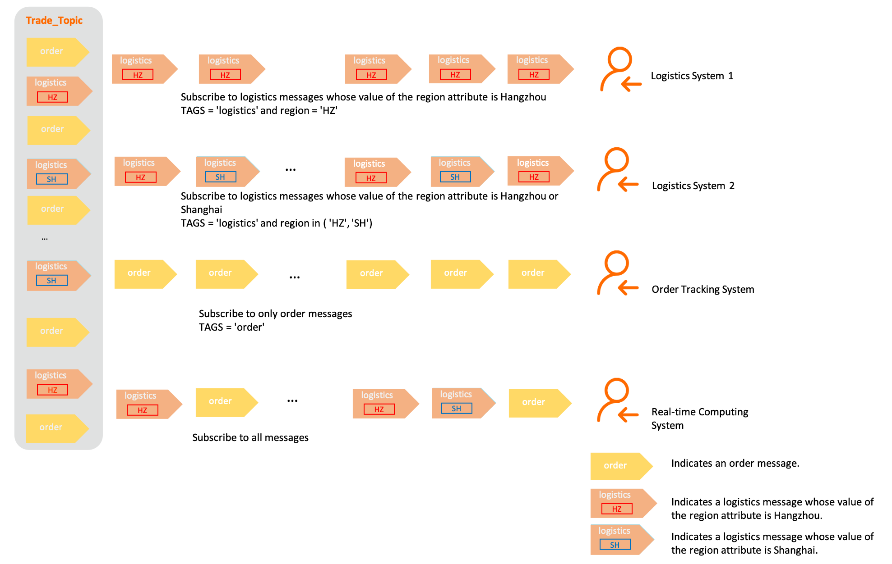

# Message filtering

After a consumer is subscribed to a topic, Apache RocketMQ delivers all messages in the topic to the consumer. However, if you want the consumer to receive only messages that are relevant to your business, you can set filters on the Apache RocketMQ broker. This topic describes the message filtering feature and how it works. This topic also describes how messages are classified and provides examples on how different filtering methods can be used.
## Scenarios

Apache RocketMQ follows the publish-subscribe pattern. Apache RocketMQ is a message-oriented-middleware, and is widely used to facilitate communication between distributed upstream and downstream applications. In a real-world scenario, applications may use different methods to consume messages. These applications can all subscribe to the same Apache RocketMQ topic, and filters can be set to allow these applications to receive only the messages relevant to them.

By using the message filtering feature of Apache RocketMQ, you can effectively manage the messages sent to different consumers. This prevents your system from being overburdened by a huge number of messages that are not mission-critical.

The message filtering feature of Apache RocketMQ takes effect at the topic level, allowing you to manage messages of one business that are distributed across multiple services. If you want to manage messages for different businesses, you can subscribe to different topics.

## Feature overview

**Definition**

The message filtering feature filters messages based on consumer-configured conditions and sends messages that meet the conditions to the consumers.

First, message attributes and tags are defined on Apache RocketMQ producers and consumers. Then filter conditions are set on the consumers, and Apache RocketMQ brokers filter messages based on the conditions and send the filtered messages to the consumers.

**Working mechanism**


Message filtering involves the following steps:

* Producer: The producer attaches attributes and tags to messages before initializing the messages. These attributes and tags are used to match the filter conditions set by the consumers.

* Consumer: The consumer calls the subscription registration operation to inform the broker of the subscribed topic and messages, or filter conditions, during message initialization and consumption.

* Broker: Upon receiving a consumer's request for messages, a Apache RocketMQ broker dynamically filters messages based on the expression of filter conditions that is submitted by the consumer, and sends messages that match the filter conditions to the consumer.

**Classification**

Apache RocketMQ supports tag-based filtering and attribute-based SQL filtering. The following table compares the two methods.


|        Item        |       Tag-based filtering       |                                             Attribute-based SQL filtering                                              |
|--------------------|---------------------------------|------------------------------------------------------------------------------------------------------------------------|
| Filter target      | Message tags.                   | Message attributes, which include custom attributes and system attributes. Message tags are a system attribute (TAGS). |
| Filtering capacity | Precise match.                  | SQL syntax-based match.                                                                                                |
| Scenarios          | Simple filtering based on tags. | Complex filtering involving relationships between tags and attributes.                                                 |

For more information about how to use the filtering methods, see [Tag-based filtering](#section-4vy-ole-5nw) and [Attribute-based SQL filtering](#section-ge0-q7e-lsb).

## Subscription consistency

Filter expressions are part of a subscription. According to the publish-subscribe pattern of Apache RocketMQ, the subscription of one consumer must be consistent with that of another within a consumer group, including their filter expressions, to avoid situations where some messages cannot be consumed. For more information, see [Subscriptions](../03-domainModel/09subscription.md).

## Tag-based filtering

Tag-based filtering is the basic message filtering capability provided by Apache RocketMQ. This feature filters messages based on the tags set on producers. Consumers use the tags to specify which messages to consume.

**Scenarios**

The following figure shows an example in the e-commerce transaction scenario. A series of messages are generated in the process, from placing an order to receiving the product, such as:

* Order messages

* Payment messages

* Logistics messages


These messages are sent to the topic named Trade_Topic, which have multiple systems as its subscribers, including:

* Payment system: subscribes only to payment messages.

* Logistics system: subscribes only to logistics messages.

* Transaction success rate analysis system: subscribes to order and payment messages.

* Real-time computing system: subscribes to all messages.


**Tag setting**

* The producer attaches only one tag to each message before sending the messages.

* The tag is a string of characters. The recommended maximum length of the string is 128 characters.


**Filtering rules**

Tag-based filtering implements precise filtering based on character strings. You can set the following filtering rules:

* Single-tag match: You can set the filter expression to a single tag to receive only messages that carry that tag.

* Multi-tag match: You can set multiple tags in your filter expression to receive messages that carry any one of the tags. Separate the tags with two vertical bars (\|\|). For example, Tag1\|\|Tag2\|\|Tag3 indicates that messages that are attached with Tag1, Tag2, or Tag3 are all sent to the consumer.

* All match: You can use an asterisk (\*) to match all tags, which means that all messages in the topic will be sent to the consumer.


**Example**

* Set a tag and send a message

  ```java
  Message message = messageBuilder.setTopic("topic")
  // Specify the message index key so that the system can use a keyword to accurately locate the message. 
  .setKeys("messageKey")
  // Specify the message tag so that consumers can use the tag to filter the message. 
  // This example indicates that the tag of the message is set to "TagA". 
  .setTag("TagA")
  // Message body. 
  .setBody("messageBody".getBytes())
  .build();
  ```


* Specify a tag and subscribe to messages

  ```java
  String topic = "Your Topic";
  // Subscribe to messages that carry tag "TagA". 
  FilterExpression filterExpression = new FilterExpression("TagA", FilterExpressionType.TAG);
  pushConsumer.subscribe(topic, filterExpression);
  ```


* Specify multiple tags and subscribe to messages

  ```java
  String topic = "Your Topic";
  // Subscribe to messages that carry tag TagA, TagB, or TagC. 
  FilterExpression filterExpression = new FilterExpression("TagA||TagB||TagC", FilterExpressionType.TAG);
  pushConsumer.subscribe(topic, filterExpression);
  ```


* Subscribe to all the messages in a topic

  ```java
  String topic = "Your Topic";
  // Subscribe to all messages. 
  FilterExpression filterExpression = new FilterExpression("*", FilterExpressionType.TAG);
  pushConsumer.subscribe(topic, filterExpression);
  ```
  


## Attribute-based SQL filtering

Attribute-based SQL filtering is an advanced message filtering method provided byApache RocketMQ. It filters messages based on the attributes and attribute values, which are also called keys and values, that producers configure for messages. Producers can set multiple attributes for a message. Consumers can then specify attributes in SQL expressions to receive certain messages.

:::info
Because tags are a system attribute, tag-based filtering is a type of attribute-based SQL filtering. In SQL syntaxes, the tag attribute is represented by TAGS.
:::

**Scenarios**

The following figure shows an example in the e-commerce transaction scenario. A series of messages are generated in the process, from placing an order to receiving the product. The messages are classified into order messages and logistics messages. A region attribute is configured for the logistics messages, and the values of the region attribute are Hangzhou and Shanghai.

* Order messages

* Logistics messages
  * Logistics messages whose value of the region attribute is Hangzhou

  * Logistics messages whose value of the region attribute is Shanghai

  

These messages are sent to the topic named Trade_Topic, which has the following systems as its subscribers:

* Logistics system 1: subscribes to only logistics messages whose value of the region attribute is Hangzhou.

* Logistics system 2: subscribes to all logistics messages.

* Order tracking system: subscribes to only order messages.

* Real-time computing system: subscribes to all messages.



**Message attribute setting**

Producers can set custom attributes for messages before sending the messages. Each attribute is a custom key-value pair.

More than one attribute can be set for a message.

**Filtering rules**

You must follow the SQL92 syntax when you write filter expressions. Specifically:


|                                                                                       Syntax                                                                                        |                                                                                                                                                                Description                                                                                                                                                                |                                                                                                                                                                        Example                                                                                                                                                                        |
|-------------------------------------------------------------------------------------------------------------------------------------------------------------------------------------|-------------------------------------------------------------------------------------------------------------------------------------------------------------------------------------------------------------------------------------------------------------------------------------------------------------------------------------------|-------------------------------------------------------------------------------------------------------------------------------------------------------------------------------------------------------------------------------------------------------------------------------------------------------------------------------------------------------|
| IS NULL                                                                                                                                                                             | Specifies that an attribute does not exist.                                                                                                                                                                                                                                                                                               | `a IS NULL`: Attribute a does not exist.                                                                                                                                                                                                                                                                                         |
| IS NOT NULL                                                                                                                                                                         | Specifies that an attribute exists.                                                                                                                                                                                                                                                                                                       | `a IS NOT NULL`: Attribute a exists.                                                                                                                                                                                                                                                                                             |
| * \>  * \>=  * \<  * \<=   | Compares numeric values. The syntax cannot be used to compare strings. If it is used to compare strings, an error is reported when the consumer is started. **Note** Strings that can be converted into numeric values are also considered as numeric values.                                                                             | * `a IS NOT NULL AND a > 100`: Attribute a exists and the value of Attribute a is greater than 100.   * `a IS NOT NULL AND a > 'abc'`: An error example. abc is a string. Therefore, you cannot compare a with abc.    |
| BETWEEN xxx AND xxx                                                                                                                                                                 | Compares numeric values. The syntax cannot be used to compare strings. If it is used to compare strings, an error is reported when the consumer is started. The syntax is equivalent to \>= xxx AND \<= xxx. It means that the value of the attribute is between two numeric values or equal to either of the two numeric values.         | `a IS NOT NULL AND (a BETWEEN 10 AND 100)`: Attribute a exists and the value of Attribute a is greater than or equal to 10 and less than or equal to 100.                                                                                                                                                                        |
| NOT BETWEEN xxx AND xxx                                                                                                                                                             | Compares numeric values. The syntax cannot be used to compare strings. If it is used to compare strings, an error is reported when the consumer is started. The syntax is equivalent to \< xxx OR \> xxx. It means that the value of the attribute is less than the left-side numeric value or greater than the right-side numeric value. | `a IS NOT NULL AND (a NOT BETWEEN 10 AND 100)`: Attribute a exists and the value of Attribute a is less than 10 or greater than 100.                                                                                                                                                                                             |
| IN (xxx, xxx)                                                                                                                                                                       | Indicates that the value of the attribute is included in a set. The elements in the set can only be strings.                                                                                                                                                                                                                              | `a IS NOT NULL AND (a IN ('abc', 'def'))`: Attribute a exists and the value of Attribute a is abc or def.                                                                                                                                                                                                                        |
| * =  *  \<\>                                                                                   | The equal to operator and the not equal to operator. They can be used to compare numeric values and strings.                                                                                                                                                                                                                              | `a IS NOT NULL AND (a = 'abc' OR a<>'def')`: Attribute a exists and the value of Attribute a is abc or the value of Attribute a is not def.                                                                                                                                                                                      |
| * AND  * OR                                                                                    | The logical AND operator and the logical OR operator. They can be used to combine simple logical functions, and each logical function must be put in parentheses.                                                                                                                                                                         | `a IS NOT NULL AND (a > 100) OR (b IS NULL)`: Attribute a exists and the value of Attribute a is greater than 100 or Attribute b does not exist.                                                                                                                                                                                 |


SQL attribute-based filtering is implemented by configuring custom message attributes and defining an SQL filter expression. The filter expression may not generate valid results. The Apache RocketMQ broker processes messages based on the following logic:

* Exception handling: If an exception is reported when a filter expression is being evaluated, the broker filters out received messages by default and does not deliver the messages to the consumer. For example, an exception occurs when numeric values and non-numeric values are compared.

* Handling of null values: If the calculated result of the filter expression is NULL or the value is not a Boolean value, the broker filters out received messages by default and does not deliver the messages to the consumer. A Boolean value represents a truth value, which can be true or false. Assume that you did not configure a custom attribute for a message that the producer sends, but this custom attribute is used as a filter condition in the SQL expression. In this case, the evaluation result of the filter expression is NULL.

* Handling of inconsistent numeric values: If the values of the custom message attribute are floating-point numbers but the attribute values used in the filter expression are integers, the broker filters out received messages by default and does not deliver the messages to the consumer.


**Example**

* Set a tag and an attribute for messages and send a message

  ```java
  Message message = messageBuilder.setTopic("topic")
  // Specify the message index key so that the system can use a keyword to accurately locate the message. 
  .setKeys("messageKey")
  // Specify the message tag so that consumers can use the tag to filter the message. 
  // This example indicates that the message tag is set to "messageTag". 
  .setTag("messageTag")
  // You can also set custom attributes for the messages, such as environment, region, and logical branch. 
  // In this example, the custom attribute is region and the attribute value is Hangzhou. 
  .addProperty("Region", "Hangzhou")
  // Message body. 
  .setBody("messageBody".getBytes())
  .build();
  ```


* Subscribe to and filter messages based on a custom attribute

  ```java
  String topic = "topic";
  // Subscribe only to messages whose value of the region attribute is Hangzhou. 
  FilterExpression filterExpression = new FilterExpression("Region IS NOT NULL AND Region='Hangzhou'", FilterExpressionType.SQL92);
  simpleConsumer.subscribe(topic, filterExpression);
  ```


* Subscribe to and filter messages based on multiple custom attributes

  ```java
  String topic = "topic";
  // Subscribe to messages whose value of the region attribute is Hangzhou and value of the price attribute is greater than 30. 
  FilterExpression filterExpression = new FilterExpression("Region IS NOT NULL AND price IS NOT NULL AND Region = 'Hangzhou' AND price > 30", FilterExpressionType.SQL92);
  simpleConsumer.subscribe(topic, filterExpression);
  ```


* Subscribe to all the messages in the topic

  ```java
  String topic = "topic";
  // Subscribe to all the messages. 
  FilterExpression filterExpression = new FilterExpression("True", FilterExpressionType.SQL92);
  simpleConsumer.subscribe(topic, filterExpression);
  ```


## Usage notes

**Set topics and tags for messages properly.**

You can use topics, tags, and attributes to split messages. Pay attention to the following items when you split messages:

* Message type: Messages of different types, such as ordered messages and normal messages, must be split by using different topics. Do not use tags to split message types.

* Business domain: Different business domains and departments must use different topics. For example, the topics must be different for logistics messages and payment messages. Logistics messages can be further divided into ordinary messages and urgent messages by using tags.

* Quantity and importance of messages: Messages that differ in quantity or link importance must be split into different topics. 


