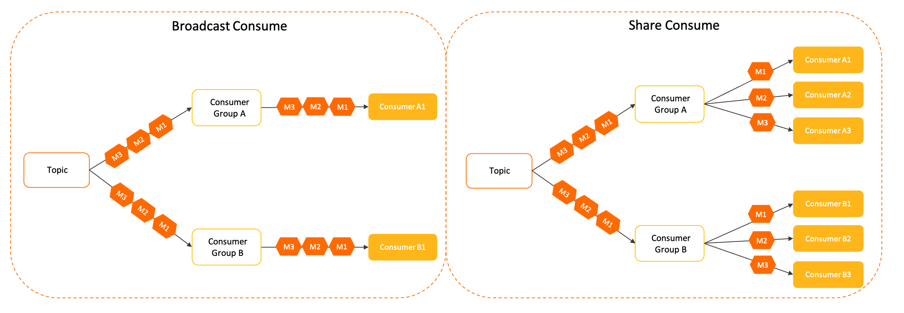
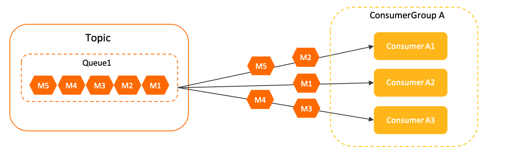
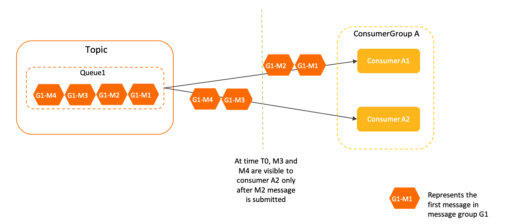
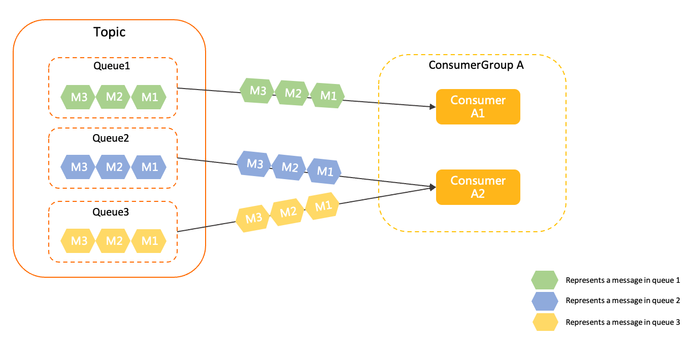

# Load balancing policies for consumers

When consumers in a consumer group pull messages from a Apache RocketMQ topic, a load balancing policy is used to determine how the messages are allocated to the consumers. Load balancing policies improve service concurrency and application scalability. This topic describes the load balancing policies that Apache RocketMQ provides for consumers.

## Background information

Familiarizing yourself with the load balancing policies provided by Apache RocketMQ can help you determine the appropriate measures to take when confronted with the following scenarios:

* Disaster recovery: You can determine how messages are retried and switched over when local nodes fail.

* Message ordering: You can better understand how Apache RocketMQ ensures strict first-in-first-out message ordering.

* Horizontal partitioning: You can plan for traffic migration and horizontal scaling operations based on how messages are allocated.


## Broadcast consumption and cluster consumption

Apache RocketMQ allows multiple consumer groups to subscribe to the same message and each consumer group to initialize multiple consumers. Consumer groups and consumers can be configured to consume messages in the following scenarios:

* **Broadcast consumption across consumer groups** : This scenario is illustrated on the left side of the preceding figure. Each consumer group initializes its own consumer who consumes all messages. Messages are delivered to multiple subscribers from topics in a one-to-many relationship.

  This mode is typically used in scenarios such as gateway push and configuration push.


* **Cluster consumption within a consumer group** : This scenario is illustrated on the right side of the preceding figure. Each consumer group initializes multiple consumers, and the messages are sent to all consumers in the group. This is useful when you want to implement horizontal traffic partitioning and load balancing within the group.

  This mode is suitable for microservice decoupling.


## Introduction to the load balancing policy for consumers

In scenarios that use broadcast consumption, load balancing is not required because each consumer group contains only one consumer.

However, in scenarios that use cluster consumption, each consumer group contains multiple consumers. Load balancing policies can help determine how messages are allocated.

Based on consumer types, load balancing policies can be divided into the following two types:

* [Message-based load balancing](#section-x2b-2cu-gpf): the default policy for push consumers and simple consumers.

* [Queue-based load balancing](#section-n9m-6xy-y77): the default policy for pull consumers.


## Message-based load balancing

**Usage scope**

Message-based load balancing is the only and default policy for push consumers and simple consumers.

**Working mechanism**

Message-based load balancing evenly allocates messages in a topic to multiple consumers in a consumer group.


As shown in the preceding figure, Consumer Group A consists of three consumers: A1, A2, and A3. These three consumers consume the messages of Queue1 in the topic.

:::note
Message-based load balancing ensures that messages in a queue can be concurrently processed by multiple consumers. However, messages are randomly sent to consumers, which means that you cannot specify how messages are allocated to consumers.
:::

Message-based load balancing is based on the acknowledgment semantics of a single message in a topic. After a consumer receives a message, the broker locks the message to ensure that it is invisible to other consumers until it is consumed or times out. This prevents messages of the same queue to be consumed multiple times by different consumers.

**Load policy for ordered messages**

In ordered messages, the order of messages refers to the sequence of multiple messages in a message group. These messages must be processed in the exactly same order as they are stored on the broker. Therefore, message-based load balancing needs to ensure that messages in a message group are consumed in the same order as they are stored on the server. When different consumers process messages in the same group, the system locks the messages in strict accordance with the message order to ensure messages are consumed sequentially.


In the preceding figure, there are four ordered messages in message group G1 of Queue1. Their saving orders are represented by M1 to M4. During consumption, when the messages M1 and M2 are processed by consumer A1, consumer A2 cannot consume messages M3 and M4 in parallel if the consumption status for M1 and M2 is not submitted. Consumers can only consume messages when the consumption status for preceding messages is submitted.

**Features**

Compared with queue-based load balancing, message-based load balancing has the following features:

* More balanced consumption allocationIn conventional queue-based load balancing, the number of queues and the number of consumers may not be properly balanced. This results in a system where some consumers may be idle while some consumers are overburdened. In comparison, message-based load balancing ensures even load balancing among consumers without requiring you to manage the number of queues and consumers.


* More forgiving to differences in networking capacitiesIn an online production environment, the processing capabilities of consumers may be different due to actual network conditions or inconsistent networking hardware specifications. If messages are allocated based on queues, there might be cases where some consumers have accumulated messages while some other consumers are idle. In contrast, message-based load balancing allocates messages on demand to achieve a more balanced load distribution among consumers.


* Easier O\&M for queue allocationIn scenarios where conventional queue-based load balancing is used, you must make sure that the number of queues is greater or equal to the number of consumers to ensure that no consumers are idle. This issue is not present with message-based load balancing.


**Scenarios**

Since messages in a queue are discretely allocated to consumers, message-based load balancing is suitable for most online event handling scenarios. In these scenarios, consumers require only basic processing capabilities instead of batch aggregation of messages. As for scenarios such as stream processing and aggregation computing where aggregation and batch processing of messages is required, queue-based load balancing is a better choice.
**Example**

Consumers do not need to perform extra configurations for message-based load balancing. By default, this policy is enabled for push consumers and simple consumers.

```java
        SimpleConsumer simpleConsumer = null;
        // Consumption example 1: When push consumers consume normal messages, they need only to process messages on a message listener and do not need to consider load balancing. 
        MessageListener messageListener = new MessageListener() {
            @Override
            public ConsumeResult consume(MessageView messageView) {
                System.out.println(messageView);
                // Return the status based on the consumption result. 
                return ConsumeResult.SUCCESS;
            }
        };
        // Consumption example 2: When simple consumers consume normal messages, they obtain and submit messages. The consumers obtain messages based on the subscribed topic and do not need to consider load balancing. 
        List<MessageView> messageViewList = null;
        try {
            messageViewList = simpleConsumer.receive(10, Duration.ofSeconds(30));
            messageViewList.forEach(messageView -> {
                System.out.println(messageView);
                // After consumption is complete, consumers must invoke ACK to submit the consumption result. 
                try {
                    simpleConsumer.ack(messageView);
                } catch (ClientException e) {
                    e.printStackTrace();
                }
            });
        } catch (ClientException e) {
            // If the pull fails due to system traffic throttling or other reasons, consumers must re-initiate the request to obtain the message. 
            e.printStackTrace();
        }
```


## Queue-based load balancing

**Usage scope**

For consumers of broker versions 4.x and 3.x, including PullConsumer, DefaultPushConsumer, DefaultPullConsumer and DefaultLitePullConsumer, only queue-based load balancing can be used.

Working mechanism

In the queue-based load balancing policy, consumers in the same consumer group consume messages in the queue allocated to them. Each queue is consumed by one consumer.


As shown in the preceding figure, the three queues (Queue1, Queue2, and Queue3) in the topic are assigned to two consumers in a consumer group. Since each queue can be assigned to only one consumer, consumer A2 is assigned two queues. If the number of queues is less than the number of consumers, some consumers will not have queues assigned to them.

Queue-based load balancing allocates messages based on operating data such as the number of queues and the number of consumers. Each queue is bound to a specific consumer. Then, each consumer processes messages according to the consumption semantics of obtaining messages \> submitting offsets \> persisting offsets. The consumption status is not returned to the queue when consumers obtain messages. Therefore, to avoid repeated consumption of messages by multiple consumers, each queue can be consumed by only one consumer.

:::note

Queue-based load balancing guarantees that a queue is processed by only one consumer. However, the implementation of this policy depends on the information negotiation mechanism between the consumer and the broker. 

Apache RocketMQ does not guarantee that messages in a queue are processed by only one consumer. Therefore, when the number of consumers and the number of queues change, temporary inconsistency in queue allocation may occur, which causes a small number of messages to be processed more than once.

:::

**Features**

Compared with message-based load balancing, the granularity of queue-based load balancing is larger and less flexible. However, queue-based load balancing is ideal for stream processing scenarios. It ensures that messages in a queue are processed by one consumer. Therefore, queue-based load balancing is more suitable for scenarios where you want to process aggregated messages or messages in batches.

**Scenarios**

Queue-based load balancing is applicable to scenarios where you want to process aggregated messages or messages in batches. These are common scenarios in stream computing and data aggregation applications.

**Example**

Consumers do not need to perform extra configurations for queue-based load balancing. By default, this policy is enabled for pull consumers of broker versions 4.x and 3.x.

For more information about the sample code, visit the [code library of Apache RocketMQ](https://github.com/apache/rocketmq/blob/develop/example/src/main/java/org/apache/rocketmq/example/simple/LitePullConsumerAssign.java).

## Version compatibility

The message-based load balancing policy is available from broker version 5.0 of Apache RocketMQ. For broker versions 4.x and 3.x, only the queue-based load balancing policy is available.

Both the message-based and queue-based load balancing policies are available for broker version 5.x of Apache RocketMQ. Which policy is effective depends on the client version and consumer type.

## Usage notes

**Implement message idempotence for consumption logic.**

Both the message-based and queue-based load balancing policies trigger temporary re-balancing in scenarios such as adding consumers, removing consumers, and broker scaling. This may cause temporary load inconsistency and result in a small number of messages being consumed more than once. Therefore, it is necessary to perform deduplication to ensure idempotence for message consumption.