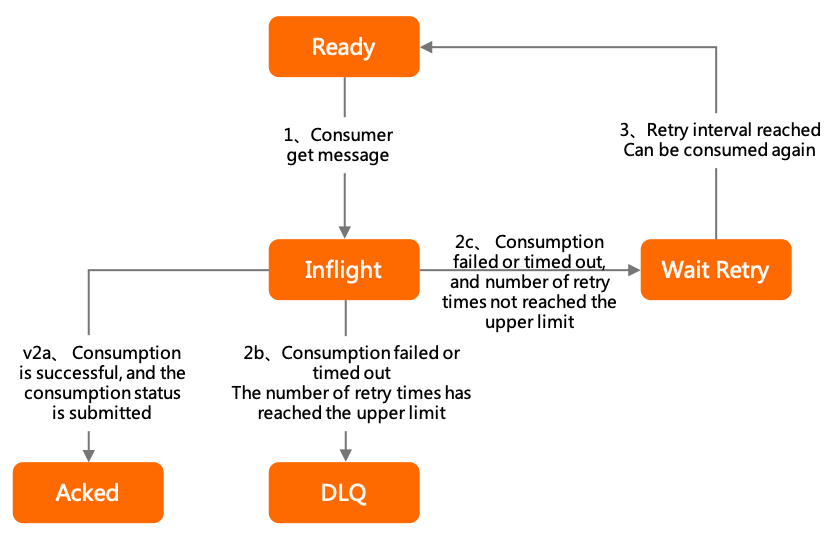
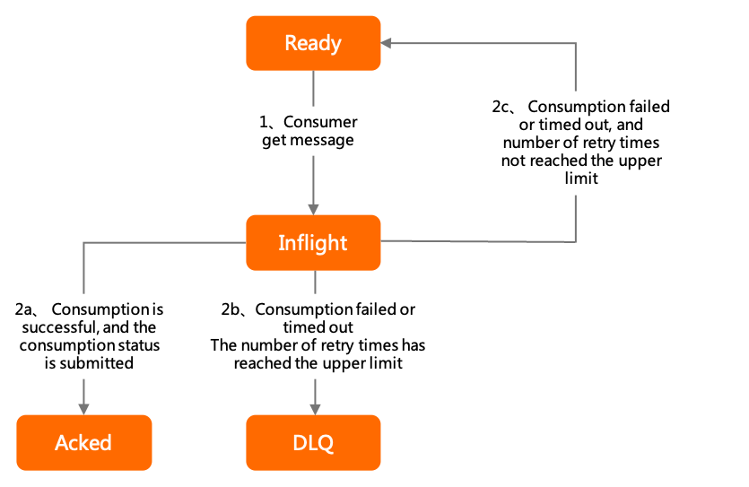
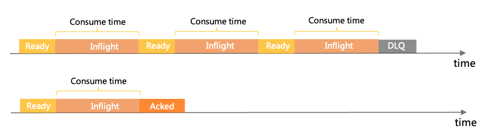
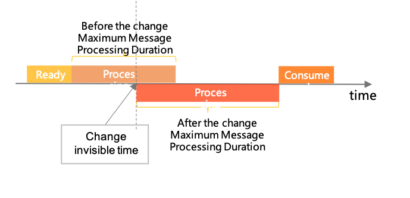

# Consumption Retry

If a message fails to be consumed, Apache RocketMQ redelivers the message based on a consumption retry policy. This helps remove some faults. This topic describes the working mechanism, version compatibility, and usage notes of the consumption retry feature.

## Scenarios

The consumption retry feature of Apache RocketMQ ensures consumption integrity that may be affected by the failure of a business processing logic. This feature is a protective measure against business logic failures. It cannot be used to control the business process.

The feature is suitable for use in the following scenarios:

* The business fails because of the message content. For example, the transaction status is not returned and the business is expected to be restored within a specific period of time.

* The cause of consumption failure does not affect business continuity. The failure has a small possibility of occurring and subsequent messages are very likely to be delivered and consumed as expected. In these cases, you can use the retry mechanism to redeliver the message to avoid blocking the process.


Do not use the feature in the following scenarios:

* Consumption failure is used as a condition to divert message flows in the processing logic. The processing logic assumes that many messages will fail to be consumed.

* Consumption failure is used to limit the rate of message processing. Rate limiting should be used to temporarily stack excessive messages in the queue for later processing instead of making the messages enter the retry link.


## Purpose 


A common issue of message middleware in asynchronous decoupling is how to ensure the integrity of the entire call link if the downstream service fails to process messages. As a financial-grade reliable message middleware service, Apache RocketMQ uses a well-designed message acknowledgement and retry mechanism to ensure that every message is processed according to business expectations.

Understanding the message acknowledgement and retry mechanism of Apache RocketMQ helps solve the following issues:

* How to ensure that every message is processed: You can ensure that every message is processed based on their consumer logic and business statuses are consistent.

* How to ensure that the status of messages that are being processed are correct when an exception occurs: You can ensure the correct message status when an exception, such as power failure, occurs.


## Policy overview

When the consumption retry feature is enabled, the Apache RocketMQ broker resends a message when the message fails to be consumed. If the message fails to be consumed even after a specified number of retries, the broker sends the message to the dead-letter queue.

**Trigger conditions**

* A message fails to be consumed. In this case, the consumer returns a failure status or the system throws an exception.

* A timeout error occurs or a message stays in a push consumer queue for an excessive period of time.


**Behaviors**

* Retry process state machine: controls the state and the change logic of messages in the retry process.

* Retry interval: the time that elapses from when a consumption failure or timeout occurs to when the message is retried.

* Maximum retries: the maximum number of times that a message can be retried for consumption.

**Policy differences**

Message retry policies use different retry mechanisms and configuration methods based on the consumer type. The following table describes the differences between the policies.


| Consumer type  |                                                                                                            Retry process state machine                                                                                                            |                                                                                                 Retry interval                                                                                                  |                  Maximum number of retries                  |
|----------------|---------------------------------------------------------------------------------------------------------------------------------------------------------------------------------------------------------------------------------------------------|-----------------------------------------------------------------------------------------------------------------------------------------------------------------------------------------------------------------|-------------------------------------------------------------|
| PushConsumer   | * Ready  * Inflight  * WaitingRetry  * Commit  * DLQ   | Specified in the metadata when a consumer group is created. * Unordered messages: incremental  * Ordered messages: fixed   | Specified in the metadata when a consumer group is created. |
| SimpleConsumer | * Ready  * Inflight  * Commit  * DLQ                                                     | Specified in the InvisibleDuration parameter in the API.                                                                                                                                                        | Specified in the metadata when a consumer group is created. |

For more information about retry policies, see [Retry policy for push consumers](#section-qqo-bil-rc6) and [Retry policy for simple consumers](#section-my2-2au-7gl).

## Retry policy for PushConsumer


**Retry process state machine**

When a push consumer consumes a message, the message can be in one of the following states:

* Ready The message is waiting to be consumed on the Apache RocketMQ broker.


* Inflight The message has been obtained and is being consumed by the consumer. However, the consumption result has not been returned.


* WaitingRetry This state is exclusive to push consumers. The message fails to be consumed or a timeout error occurs when the broker waits for the consumer to return the consumption status. In these cases, the consumption retry logic is triggered. If the maximum number of retries is not reached, the message goes back to the Ready state after the retry interval elapses. Messages that are in the Ready state can be consumed again. You can increase the interval between retries to prevent frequent retries.


* Commit The message is consumed. After the consumer returns a success response, the state machine can be terminated.


* DLQ A preventive measure for the consumption logic. If the message fails to be consumed even after the maximum number of retries is reached, the message is no longer retried and is sent to the dead-letter queue. You can consume messages in a dead-letter queue to restore your business.

When a message is retried, its state changes from Ready to Inflight and then to WaitingRetry. The interval between two consumptions is the sum of the actual time spent on consumption and the retry interval. The maximum consumption interval is specified by a system parameter on the broker and cannot be exceeded. 

**Maximum number of retries**

The maximum number of retries for a push consumer is specified in the metadata when the consumer group is created. For more information, see [Consumer groups](../03-domainModel/07consumergroup.md).

For example, if the maximum number of retries is three, the message can be delivered four times: one original attempt and three retries.

**Retry interval**

* Unordered messages (messages that are not ordered messages): incremental. The following table describes the details.

  | Retry number |  Interval  | Retry number |  Interval  |
    |--------------|------------|--------------|------------|
  | 1            | 10 seconds | 9            | 7 minutes  |
  | 2            | 30 seconds | 10           | 8 minutes  |
  | 3            | 1 minute   | 11           | 9 minutes  |
  | 4            | 2 minutes  | 12           | 10 minutes |
  | 5            | 3 minutes  | 13           | 20 minutes |
  | 6            | 4 minutes  | 14           | 30 minutes |
  | 7            | 5 minutes  | 15           | 1 hour     |
  | 8            | 6 minutes  | 16           | 2 hours    |


:::info
If the number of retries exceeds 16, the interval of each subsequent retry is 2 hours.
:::

* Ordered messages: fixed. For more information, see[Parameter limits](../01-introduction/03limits.md).


**Example**

For push consumers, a message retry is triggered only by the status code of consumption failure. Unexpected exceptions are also captured by the SDK.

```java
        SimpleConsumer simpleConsumer = null;
        // Consumption example: Consume normal messages as a push consumer and trigger a message retry by using a consumption failure. 
        MessageListener messageListener = new MessageListener() {
            @Override
            public ConsumeResult consume(MessageView messageView) {
                System.out.println(messageView);
                // Retry the message until the maximum number of retries is reached. 
                return ConsumeResult.FAILURE;
            }
        };
            
```

## Retry policy for SimpleConsumer


**Retry process state machine**

When a simple consumer consumes a message, the message can be in one of the following states:

* Ready The message is waiting to be consumed on the Apache RocketMQ broker.

* Inflight The message has been obtained and is being consumed by the consumer. However, the consumption result has not been returned.

* Commit The message is consumed. After the consumer returns a success response, the state machine can be terminated.

* DLQ A preventive measure for the consumption logic. If the message fails to be consumed even after the maximum number of retries is reached, the message is no longer retried and is sent to the dead-letter queue. You can consume messages in a dead-letter queue to restore your business.


The retry interval is fixed and pre-allocated. It is configured in the InvisibleDuration parameter by the consumer when the consumer calls the API. The parameter specifies the maximum processing duration of the message. When a message is retried, the value of the parameter is reused. You do not need to configure the interval for the subsequent retries.


Because the InvisibleDuration value is pre-allocated, it may not meet your business requirements. You can change it in the code that is used to call the API.

For example, if you set the InvisibleDuration value to 20 ms and a message cannot be processed within the duration, you can change the value to a larger value to avoid triggering the retry mechanism.

Before you can change the InvisibleDuration value, the following conditions must be met:

* A timeout error has not occurred on the current message.

* A consumption status of the current message is not returned.

As shown in the following figure, the change takes effect immediately, that is, the InvisibleDuration value is recalculated from the point in time when the API is called.


**Maximum number of retries**

The maximum number of retries for a simple consumer is specified in the metadata when the consumer group is created. For more information, see [Consumer groups](../03-domainModel/07consumergroup.md).

**Message retry interval**

Message retry interval = InvisibleDuration value − Actual duration of message processing

The consumption retry interval is therefore controlled by the InvisibleDuration value. For example, if the InvisibleDuration value is 30 ms and a consumption failure is returned 10 ms after the processing starts, the time to the next retry is 20 ms, which means that the retry interval is 20 ms. If no consumption result is returned within 30 ms, a timeout error occurs and a retry is triggered. Then, the retry interval is 0 ms.

**Examples**

Simple consumers need only to wait for a message to be retried.

```java
 // Consumption example: Consume normal messages as a simple consumer. If you want a message to be retried, do not process the message. Wait for it to time out, and the broker retries it automatically. 
        List<MessageView> messageViewList = null;
        try {
            messageViewList = simpleConsumer.receive(10, Duration.ofSeconds(30));
            messageViewList.forEach(messageView -> {
                System.out.println(messageView);
                // If you want a message to be retried after it fails to be consumed, ignore the failure and wait for the message to be visible. Then try to obtain it again from the broker. 
            });
        } catch (ClientException e) {
            // If the message fails to be pulled due to throttling or other reasons, you must re-initiate the request to obtain the message. 
            e.printStackTrace();
        }
```

## Usage notes

**Do not use consumption retry to deal with consumption throttling**

As mentioned in [Scenarios](#section-d2i-0sk-rtf), message retry is suitable for scenarios where failure of business processing and message consumption is a small-possibility event. Message retry is not suitable for scenarios where the failure continues, such as consumption throttling.

* Incorrect example:Return consumption failures to trigger retries when the current consumption rate is higher than the upper limit.

* Correct example:Obtain and consume messages at a later time if the current consumption rate is higher than limited.


**Set a proper number of retries to avoid infinite retries**

Although Apache RocketMQ supports custom numbers of consumption retries, we recommend that you set a small number of retries and a long retry interval to reduce the burden on the system. Avoid a large number of retries or infinite retries.
