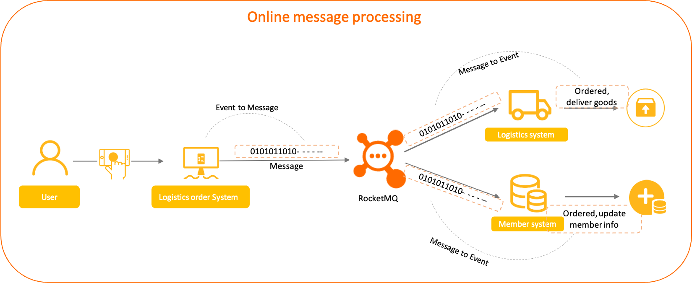
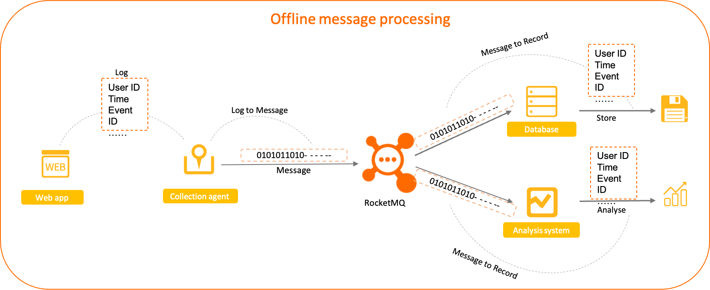

# Normal Message

Normal messages are messages that have no special features in Apache RocketMQ. They are different from featured messages such as fifo messages, delay messages, and transaction messages. This topic describes the scenarios, working mechanism, usage, and usage notes of normal messages.

## Scenarios

Normal messages are generally used in microservice decoupling, data integration, and event-driven scenarios. Most of these scenarios have low or no requirements on timing or the sequence for processing messages other than reliable transmission channels.

**Scenario 1: Asynchronous decoupling of microservices**


The preceding figure shows an online e-commerce transaction scenario. In this scenario, the upstream order system encapsulates order placement and payment as an independent normal message and sends the message to the Apache RocketMQ broker. Downstream systems then subscribe to the message from the broker on demand and process tasks based on the local consumption logic. Messages are independent of each other and do not need to be associated.

**Scenario 2: Data integration transmission**


The preceding figure uses offline log collection as an example. An instrumentation component is used to collect operations logs from frontend applications and forward the logs to Apache RocketMQ. Each message is a piece of log data that requires no processing from Apache RocketMQ. Apache RocketMQ needs only to send the log data to the downstream storage and analysis systems. The backend applications are responsible for subsequent processing tasks.

## Working mechanism

**Definition of normal messages**

Normal messages are messages with basic functions in Apache RocketMQ. Normal messages support asynchronous decoupling and communication between producers and consumers.


**Lifecycle of a normal message**

* Initialized: The message is built and initialized by the producer and is ready to be sent to a broker.

* Ready: The message is sent to the broker, and is visible to the consumer and available for consumption.

* Inflight: The message is obtained by the consumer and processed based on the local business logic of the consumer.

  In this process, the broker waits for the consumer to complete the consumption and submit the consumption result. If no response is received from the consumer in a certain period of time, Apache RocketMQ retries the message. For more information, see [Consumption retry](./10consumerretrypolicy.md).

* Acked: The consumer completes consumption and submits the consumption result to the broker. The broker marks whether the current message is successfully consumed.

  By default, Apache RocketMQ retains all messages. When the consumption result is submitted, the message data is logically marked as consumed instead of being deleted immediately. Therefore, the consumer can backtrack the message for re-consumption before it is deleted due to the expiration of the retention period or insufficient storage space.

* Deleted: When the retention period of the message expires or the storage space is insufficient, Apache RocketMQ deletes the earliest saved message from the physical file in a rolling manner. For more information, see [Message storage and cleanup](./11messagestorepolicy.md).

## Usage limits

Normal messages support only topics whose MessageType is Normal.

## Example

You can set index keys and filter tags to filter or search for normal messages. The following sample code shows how to send and receive normal messages in Java:
```java
// Send a normal message. 
  MessageBuilder messageBuilder = new MessageBuilder();
  Message message = messageBuilder.setTopic("topic")
  // Specify the message index key so that you can accurately search for the message by using a keyword.
  .setKeys("messageKey")
  // Specify the message tag so that the consumer can filter the message based on the specified tag.
  .setTag("messageTag")
  // Message body. 
  .setBody("messageBody".getBytes())
  .build();
  try {
    // Send the message. You need to pay attention to the sending result and capture exceptions such as failures. 
    SendReceipt sendReceipt = producer.send(message);
    System.out.println(sendReceipt.getMessageId());
  } catch (ClientException e) {
      e.printStackTrace();
  }
  // Consumption example 1: When you consume a normal message as a push consumer, you need only to process the message in the message listener. 
  MessageListener messageListener = new MessageListener() {
      @Override
      public ConsumeResult consume(MessageView messageView) {
          System.out.println(messageView);
          // Return the status based on the consumption result. 
          return ConsumeResult.SUCCESS;
      }
  };
  // Consumption example 2: When you consume a normal message as a simple consumer, you must obtain and consume the message, and submit the consumption result. 
  List<MessageView> messageViewList = null;
  try {
      messageViewList = simpleConsumer.receive(10, Duration.ofSeconds(30));
      messageViewList.forEach(messageView -> {
          System.out.println(messageView);
          // After consumption is complete, you must invoke ACK to submit the consumption result. 
          try {
              simpleConsumer.ack(messageView);
          } catch (ClientException e) {
              e.printStackTrace();
          }
      });
      } catch (ClientException e) {
      // If the pull fails due to system traffic throttling or other reasons, you must re-initiate the request to obtain the message. 
      e.printStackTrace();
  }
```


## Usage notes

**Set a globally unique index key to facilitate troubleshooting**

You can set custom index keys, which are message keys, in Apache RocketMQ. When you query and trace messages, the index key can help you find these messages efficiently and accurately.

Therefore, when you send messages, we recommend that you use the unique information of the service, such as order ID and user ID, as an index. This helps you find messages quickly in the future.

