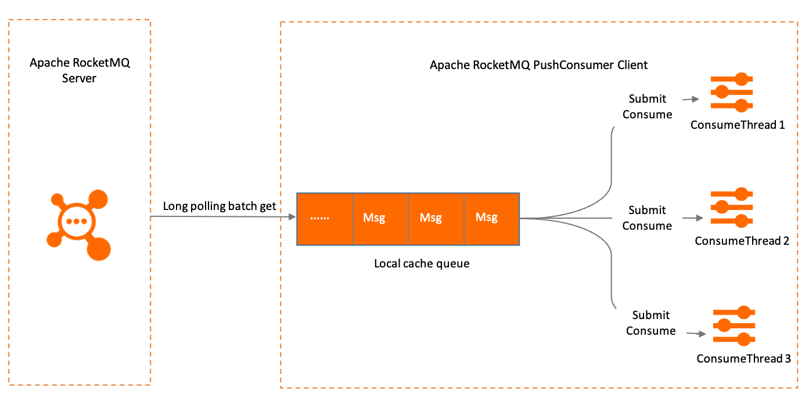

# Consumer types

Apache RocketMQ supports the following types of consumers: PushConsumer, SimpleConsumer and PullConsumer. This topic describes the usage, working and retry mechanisms, and scenarios of the three consumer types.

## Background information

Apache RocketMQ provides the PushConsumer, SimpleConsumer and PullConsumer consumer types. The three consumer types have different integration and control methods that you can use to meet messaging requirements in different business scenarios. The following factors can help you choose a suitable consumer type for your business scenarios:

* Concurrent consumption: How can consumers use the multithreading technique to implement concurrent message consumption for higher message processing efficiency?

* Synchronous or asynchronous message processing: For different integration scenarios, consumers may need to asynchronously distribute messages that they received to the business logic system for processing. How do I implement asynchronous message processing?

* Reliable message processing: How do consumers return response results when they process messages? How do I implement message retries when message errors occur to ensure reliable message processing?

For answers to the preceding problems, see [PushConsumer](#section-r97-urp-who) and [SimpleConsumer](#section-b6m-nr8-8ii).

## Feature overview


The preceding figure shows that message consumption by consumers in Apache RocketMQ involves the following stages: receiving messages, processing messages, and committing the consumption status.

The three types of consumers are suitable for various message consumption scenarios by providing different implementation methods and API operations. The following table describes the differences between the three types of consumers.

:::info

PullConsumer is only recommended for integration in a stream processing framework. PushConsumer and simpleConsumer could satisfy most scenarios.

You can switch between the PushConsumer and SimpleConsumer based on your business scenarios. When you switch to a different consumer type, the usage of existing resources and existing business processing tasks in Apache RocketMQ are not affected.

:::

:::danger
Mixing consumer type between pullConsumer and  other consumer type in same consumerGroup is strictly prohibited.
:::

|                Item                |                                                                                       PushConsumer                                                                                        |                                                                SimpleConsumer                                                                 |  PullConsumer                          |
|------------------------------------|-------------------------------------------------------------------------------------------------------------------------------------------------------------------------------------------|-----------------------------------------------------------------------------------------------------------------------------------------------|----------------------------------------|
| API operation call                 | The callback operation is called to return the consumption result by using a message listener. Consumers can process the consumption logic only within the scope of the message listener. | Business applications implement message processing and call the corresponding operation to return the consumption result.                     |Business applications implement message pulling and processing and call the corresponding operation to return the consumption result.|
| Consumption concurrency management | Apache RocketMQ SDKs are used to manage the number of concurrent threads for message consumption.                                                                       | The number of concurrent threads that are used for message consumption is based on the consumption logic of individual business applications. |The number of concurrent threads that are used for message consumption is based on the consumption logic of individual business applications.|
|LoadBalance mechanism               | Message-based load balancing in 5.0 version, Queue-based load balancing in earlier version.                                                                             |Message-based load balancing.                                                                                                                  |Queue-based load balancing.             |
| API flexibility                    | The API operations are encapsulated and provide poor flexibility.                                                                                                                         | The atomic operations provide great flexibility.                                                                                              |The atomic operations provide great flexibility.|
| Scenarios                          | This consumer type is suitable for development scenarios that do not require a custom process.                                                                                            | This consumer type is suitable for development scenarios that require custom processes.                                                       |It is recommended to be integrated only in the stream processing framework scenario|


## PushConsumer 

PushConsumer is a consumer type that provides a high degree of encapsulation. Message consumption and consumption result submission are processed by using only the message listener. The message acquisition, consumption status submission, and consumption retries are completed by using Apache RocketMQ client SDKs.

**Usage**

PushConsumer is used in a fixed manner. A message listener is registered with a PushConsumer consumer when the consumer is initialized, and message processing logic is implemented in the message listener. Message acquisition, listener call triggering, and message retries are processed by using Apache RocketMQ SDKs.

Sample code:

```java
// Message consumption example: Use a PushConsumer consumer to consume messages. 
ClientServiceProvider provider = ClientServiceProvider.loadService();
        String topic = "Your Topic";
        FilterExpression filterExpression = new FilterExpression("Your Filter Tag", FilterExpressionType.TAG);
        PushConsumer pushConsumer = provider.newPushConsumerBuilder()
                // Configure consumer groups. 
                .setConsumerGroup("Your ConsumerGroup")
                // Specify the access point. 
                .setClientConfiguration(ClientConfiguration.newBuilder().setEndpoints("Your Endpoint").build())
                // Specify the pre-bound subscriptions. 
                .setSubscriptionExpressions(Collections.singletonMap(topic, filterExpression))
                // Set the message listener. 
                .setMessageListener(new MessageListener() {
                    @Override
                    public ConsumeResult consume(MessageView messageView) {
                        // Consume the messages and return the consumption result. 
                        return ConsumeResult.SUCCESS;
                    }
                })
                .build();
                
```

The message listener for a PushConsumer consumer returns one of the following results:

* Consumption success: For example, when you use Apache RocketMQ SDK for Java and a message is consumed, `ConsumeResult.SUCCESS` is returned. The server updates the consumption progress based on the consumption result.

* Consumption failure: For example, when you use Apache RocketMQ SDK for Java and a message fails to be consumed, `ConsumeResult.FAILURE` is returned. Whether Apache RocketMQ retries to consume the message depends on the consumption retry logic.

* Unexpected failure: For example, if an unexpected exception is thrown, the message fails to be consumed. Whether Apache RocketMQ retries to consume the message depends on the consumption retry logic.

If an unexpected error in the message processing logic constantly prevents a message from being consumed by a PushConsumer consumer, the SDK considers that the consumption has timed out and forcibly commits a consumption failure result. Then, the message is processed based on the consumption retry logic. For more information about consumption timeouts, see [Retry policy for push consumers](./10consumerretrypolicy.md).

:::info
When a consumption timeout occurs, the SDK commits the consumption failure result. However, the current consumption thread may fail to respond to the result and continues to process the message.:::

**Working mechanism**

For PushConsumer, real-time message processing is based on the typical Reactor thread model of the SDK. The SDK has a built-in long polling thread, which pulls messages and stores the messages to a queue. Then, the messages are delivered from the queue to individual message consumption threads. The message listener behaves based on the message consumption logic. The following figure shows the message consumption process of PushConsumer consumers. 


**Retry for reliability**

For PushConsumer, the communication between the client SDK and the consumption logic unit is implemented by using only a message listener. The client SDK checks whether the message is consumed based on the result that is returned by the message listener, and performs retries based on the consumption retry logic to ensure message reliability. All messages must be consumed in a synchronous manner. Consumption results are returned when the listener operation call ends. Asynchronous distribution is not allowed. For more information about message retries, see [Retry policy for push consumers](./10consumerretrypolicy.md).

To ensure messaging reliability, Apache RocketMQ prohibits the following behaviors in message consumption by PushConsumer consumers.

* Return the consumption result before the consumption of a message is complete. For example, a consumption success result is returned in advance for a message that fails to be consumed later. In this case, Apache RocketMQ cannot check the actual consumption result and does not retry the consumption of the message.

* Distribute a message to other custom threads from the message listener and return the consumption result in advance. If the message fails to be consumed but a consumption success result is returned in advance, Apache RocketMQ cannot check the actual consumption result and does not retry the consumption of the message.

**Ensured message order**

For [Fifo messages](./03fifomessage.md) in Apache RocketMQ, if ordered message consumption is configured for consumer groups, PushConsumer consumers consume messages in the consumption order. When PushConsumer consumers consume messages, the consumption order is ensured without requiring individual business applications to define the consumption order in the business logic.

:::info
In Apache RocketMQ, synchronous committing is the prerequisite to ordered message processing. If asynchronous distribution is defined in the business logic, Apache RocketMQ cannot ensure the order of messages.
:::


Scenarios

PushConsumer limits message processing to synchronous processing and restricts the timeout for processing each message. PushConsumer is suitable for the following scenarios:

* Predictable message processing duration: If the message processing duration is not limited, message retries are continuously triggered for messages that require a long processing duration to ensure message reliability. This causes a large number of repeated messages.

* No asynchronization and no custom process: PushConsumer limits the thread model of the consumption logic to the Reactor thread model. The client SDK processes messages based on the maximum throughput. This model is easy to develop, but does not allow asynchronous or custom processes.


## SimpleConsumer

SimpleConsumer is a consumer type that supports atomic operations for message processing. Such type of consumers call operations to acquire messages, commit the consumption status, and perform message retries based on the business logic.

**Usage**

SimpleConsumer involves multiple API operations. The corresponding operations are called as needed to obtain and distribute messages to business threads for processing. Then, the commit operation is called to commit message processing results. Sample code:

```java
        // Consumption example: When a SimpleConsumer consumer consumes normal messages, the consumer obtain messages and commit message consumption results. 
        ClientServiceProvider provider1 = ClientServiceProvider.loadService();
        String topic1 = "Your Topic";
        FilterExpression filterExpression1 = new FilterExpression("Your Filter Tag", FilterExpressionType.TAG);
        SimpleConsumer simpleConsumer = provider1.newSimpleConsumerBuilder()
                // Configure consumer groups. 
                .setConsumerGroup("Your ConsumerGroup")
                // Specify the access point. 
                .setClientConfiguration(ClientConfiguration.newBuilder().setEndpoints("Your Endpoint").build())
                // Specify the pre-bound subscriptions. 
                .setSubscriptionExpressions(Collections.singletonMap(topic, filterExpression))
                .build();
        List<MessageView> messageViewList = null;
        try {
            // A SimpleConsumer consumer must obtain and process messages. 
            messageViewList = simpleConsumer.receive(10, Duration.ofSeconds(30));
            messageViewList.forEach(messageView -> {
                System.out.println(messageView);
                // After consumption is complete, the consumer must invoke ACK to submit the consumption result. 
                try {
                    simpleConsumer.ack(messageView);
                } catch (ClientException e) {
                    e.printStackTrace();
                }
            });
        } catch (ClientException e) {
            // If the pull fails due to system traffic throttling or other reasons, the consumer must re-initiate the request to obtain the message. 
            e.printStackTrace();
        }
```


The following table describes the API operations that are provided for SimpleConsumer.


|         Operation         |                                                                                                                                                                             Description                                                                                                                                                                              |                                                                                                                                                                                                                                                                                                           Modifiable parameter                                                                                                                                                                                                                                                                                                            |
|---------------------------|----------------------------------------------------------------------------------------------------------------------------------------------------------------------------------------------------------------------------------------------------------------------------------------------------------------------------------------------------------------------|-------------------------------------------------------------------------------------------------------------------------------------------------------------------------------------------------------------------------------------------------------------------------------------------------------------------------------------------------------------------------------------------------------------------------------------------------------------------------------------------------------------------------------------------------------------------------------------------------------------------------------------------|
| `ReceiveMessage`          | Consumers can call this operation to obtain messages from the server. **Note** Because the server uses distributed storage, the server may return an empty result, although the requested message actually exists on the server.  You can call the ReceiveMessage operation again or increase the concurrency value in the ReceiveMessage operation. | * Batch pull size: the number of messages that are obtained at a time. A SimpleConsumer consumer can obtain multiple messages for batch consumption.   * Message invisibility duration: the maximum processing duration of a message. This parameter controls the message retry interval if consumption fails. For more information, see **Retry policy for SimpleConsumer**. This parameter is required when you call the `ReceiveMessage` operation.    |
| `AckMessage`              | After a message is consumed by a consumer, the consumer calls this operation to return the consumption success result to the server.                                                                                                                                                                                                                                 | None                                                                                                                                                                                                                                                                                                                                                                                                                                                                                                                                                                                                                                      |
| `ChangeInvisibleDuration` | In consumption retry scenarios, consumers can call this operation to change the message processing duration to control the message retry interval.                                                                                                                                                                                                                   | Message invisibility duration: the maximum processing time of a message. You can call this operation to change the message invisibility duration that is specified in the `ReceiveMessage` operation. In most cases, this operation is used in scenarios in which you want to increase the message processing duration.                                                                                                                                                                                                                                                                                              |

**Retry for reliability**

When SimpleConsumer consumers consume messages, the communication between the client SDK and the Apache RocketMQ server is implemented by using the `ReceiveMessage` and `AckMessage` operations. When the client SDK successfully processes a message, the `AckMessage` operation is called. When the message fails to be processed, no ack message is returned to trigger the message retry mechanism after the specified message invisibility duration elapses. For more information, see [Retry policy for simple consumers](./10consumerretrypolicy.md).


**Ensured message order**

In Apache RocketMQ, a SimpleConsumer consumer obtains [Fifo messages](./03fifomessage.md) in the order in which they are stored. If a message in a set of ordered messages is not completely processed, the next message in the set of order messages cannot be obtained.

Scenarios

SimpleConsumer provides atomic API operations to obtain messages and commit consumption results. Compared with PushConsumer, SimpleConsumer provides better flexibility. SimpleConsumer is suitable for the following scenarios:

* Uncontrollable message processing duration: If the message processing duration is inestimable, we recommend that you use SimpleConsumer to prevent messages from being processed for an excessively long period of time. You can specify an estimated message processing duration during message consumption. If an existing processing duration is not suitable for your business scenarios, you can call the corresponding API operation to change the message processing duration.

* Asynchronous processing and batch consumption: SimpleConsumer does not involve complex thread encapsulation in the SDK. Business applications can use custom settings. This way, SimpleConsumer consumers can implement asynchronous distribution, batch consumption, and other custom scenarios.

* Custom message consumption rate: When SimpleConsumer is used, business applications call the ReceiveMessage operation to obtain messages. You can adjust the frequency of obtaining message to control the message consumption rate.

## PullConsumer

To be continued.


## Usage notes

**Specify a proper consumption duration limit for PushConsumer**

We recommend that you limit the message consumption duration for PushConsumer consumers to prevent a message from being processed for a long time. Long-time processing of a message can cause duplicate messages due to message processing timeouts and keep the next message continuously waiting from consumption. If messages are frequently processed for an excessively long period of time, we recommend that you use SimpleConsumer and specify a suitable message invisibility duration based on your business requirements.
