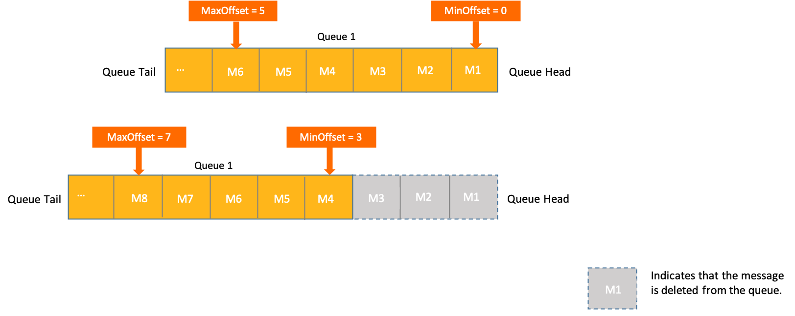

# Consumer progress management
Apache RocketMQ uses consumer offsets to manage the progress of consumers. This topic describes the consumer progress management mechanism of Apache RocketMQ.
## Background

In Apache RocketMQ, messages can be generated before or after they are subscribed to by consumers. So how does a consumer know where to start consuming messages, and how are consumed messages marked? In order to overcome this challenge, Apache RocketMQ has developed the consumer progress management mechanism.

The consumer progress management mechanism of Apache RocketMQ solves the following problems:

* Where does a client start to consume messages after it is launched?

* How is a consumed message marked to ensure that it is not processed multiple times?

* Can a message be consumed again by the same client if a service exception occurs?

## Working mechanism

**Message Offset** 

In Apache RocketMQ, messages are queued in topics in the order that they arrive, and are assigned a unique Long-type coordinate. This is also known as the offset of the message. For more information about the individual definitions of these concepts, see [Topic](../03-领域模型/02topic.md) and [Message queue](../03-领域模型/03messagequeue.md).

Theoretically speaking, a message queue can store an indefinite number of messages. Therefore, the value range of offset is from 0 to Long.MAX_VALUE. You can locate any message based on its topic, queue, and offset. The following figure shows the relationship between these three concepts.

In Apache RocketMQ, the offset of the earliest message in a queue is called the minimum offset (MinOffset), and the offset of the latest message is called the maximum offset (MaxOffset). Although a message queue can theoretically hold an indefinite number of messages, the physical machines on which they are stored have limited space. Therefore, Apache RocketMQ dynamically deletes the earliest message from a queue, and the MinOffset and MaxOffset values of the queue increase constantly. 

**Consumer Offset**

Apache RocketMQ follows the publish-subscribe pattern. Multiple consumer groups can subscribe to the same queue. In scenarios such as this, when a consumer deletes a message after consuming it, the other consumers are unable to consume it.

To prevent this from happening, Apache RocketMQ uses consumer offsets to manage the message consumption progress of different consumers. Apache RocketMQ does not delete a message immediately after it is consumed. Instead, Apache RocketMQ maintains a record of the latest message consumed by a consumer group, which is also called a consumer offset.

In the event that a client is restarted, the consumer is able to continue processing messages based on the consumer offset saved in a server. If the consumer offset expires and gets deleted, the MinOffset value of the queue saved in the server is used as the consumer offset.

:::info
Consumer offsets are saved to and restored from Apache RocketMQ servers, and are not related to any specific consumer. Therefore, Apache RocketMQ can restore consumer progress across different consumers.
:::

The following figure shows the relationships between the minimum offset, maximum offset, and a consumer offset in a message queue.

* The consumer offset is always smaller than or equal to the maximum offset.
  * If messages are produced and consumed at the same rate and there are no unconsumed messages in the queue, the consumer offset is the same as the maximum offset.

  * If messages are consumed slower than they are produced, unconsumed messages exist in the queue. Consequently, the consumer offset is smaller than the maximum offset, and the difference is the number of unconsumed messages.

  
* Typically, the consumer offset is larger than or equal to the minimum offset. If the consumer offset is smaller than the minimum offset, the consumer is unable to consume messages. In this case, the server restores the correct consumer offset to the consumer.

**Initial consumer offset**

An initial consumer offset is the consumer offset saved in a server when a consumer group starts to consume a message queue for the first time.

Apache RocketMQ uses the maximum offset of a message queue when a consumer obtains messages from the queue for the first time as the initial consumer offset. In other words, the consumer starts consuming from the latest message in the queue.

## Reset consumer offset

If the initial or current consumer offset is not aligned with the state of your business, you can reset the consumer offset to adjust your consumer progress.

**Scenarios**

* Improper initial consumer offset: The initial consumer offset is the maximum offset of the queue, that is, the client starts consuming from the latest message. If you need to consume earlier messages, you can reset the consumer offset to that of an earlier message.

* Consumer lag: A large number of messages can accumulate if the consumer is unable to keep up with the speed at which messages are generated. If the accumulated messages are not mission-critical, you can adjust the consumer offset to a larger value to skip these messages and alleviate downstream burden.

* Business backtracking and corrective processing: If you want to re-consume messages that have been incorrectly consumed due to business errors, you can set the consumer offset to a smaller value.

**The consumer offset reset feature**

The consumer offset reset feature of Apache RocketMQ allows you to:

* Reset a consumer offset to any offset in the message queue.

* Reset a consumer offset to a specific point in time. The server adjusts the consumer offset to an offset closest to the time point.

**Limits**

* After you reset a consumer offset, the consumer starts to consume messages from the new offset. In backtracking scenarios, the consumer starts with historical messages that are mostly cold data. Referred to as cold reads, this may cause undue burden to your system. Evaluate the risks and benefits before you proceed with this operation. We recommend that you implement strict control policies for this permission to prevent abuse and frequent resets.

* Apache RocketMQ allows you to reset the consumer offset only for visible messages. You cannot reset the offset for messages that are in the scheduling or retry pending states. For more information, see [Delay messages](./02delaymessage.md) and [Consumption retry](./10consumerretrypolicy.md).

## Version compatibility

Servers have different definitions for the initial consumer offset in different versions of Apache RocketMQ.

* In 4.x and 3.x versions, the initial consumer offset is defined to the message status of a queue.

* In 5.x versions, the initial consumer offset is the maximum offset of the queue at the time when the consumer starts receiving messages.

Therefore, if you upgrade from an earlier version, you must pay attention to the initial consumer offset when you launch your client.

## Usage notes

**Strictly control the reset permissions**

Resetting the consumer offset incurs additional burden on the system and may affect message reads and writes. Therefore, we recommend that you evaluate the risks and benefits before you perform this operation.
