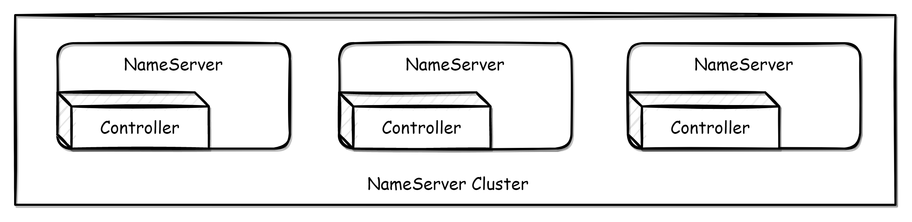
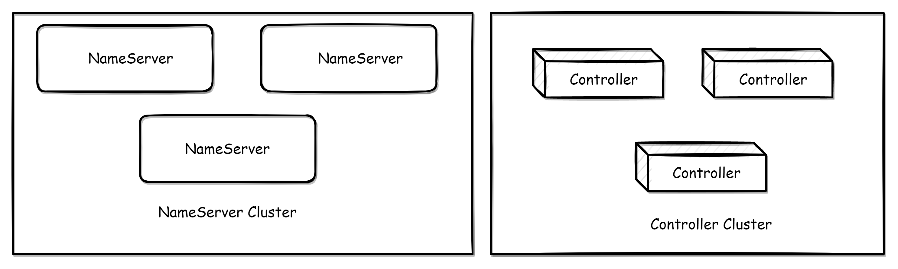

# Master-Slave automatic switchover mode deployment


This document mainly introduces how to deploy a RocketMQ cluster that supports automatic master-slave switchover. Its architecture is shown in the above figure. It mainly adds the controller component that supports automatic master-slave switchover, which can be deployed independently or embedded in the NameServer.

:::tip Refer to
For more details, refer to [Design Ideas](https://github.com/apache/rocketmq/blob/develop/docs/cn/controller/design.md) and [Quick Start](https://github.com/apache/rocketmq/blob/develop/docs/cn/controller/quick_start.md)
:::

## Controller Deployment

The controller component provides selection of the master. If the controller needs to be fault-tolerant, it needs to be deployed in three or more replicas (following the Raft majority protocol).

:::tip Tip
If the controller is only deployed as a single copy, it can still complete broker failover, but if the single-point controller fails, it will affect the switchover ability but not affect the normal send and receive of the existing cluster.
:::

There are two ways to deploy the controller. One is to embed it in the NameServer for deployment. This can be opened by setting enableControllerInNamesrv (it can be selectively opened and is not required to be opened on every NameServer). In this mode, the NameServer itself is still stateless, which means that if the NameServer fails in the embedded mode, it will only affect the switchover ability, not the original routing acquisition and other functions. The other is to deploy the controller component independently.

### Embedding the Controller in the NameServer for deployment



When the Controller is embedded in the NameServer for deployment, you only need to set **`enableControllerInNamesrv=true`** in the NameServer configuration file and fill in the controller configuration.

```properties
enableControllerInNamesrv = true
controllerDLegerGroup = group1
controllerDLegerPeers = n0-127.0.0.1:9877;n1-127.0.0.1:9878;n2-127.0.0.1:9879
controllerDLegerSelfId = n0
controllerStorePath = /home/admin/DledgerController
enableElectUncleanMaster = false
notifyBrokerRoleChanged = true
```

Parameter explain：

- enableControllerInNamesrv: Whether to enable the controller in the Nameserver, the default is false.
- controllerDLegerGroup: The name of the DLedger Raft Group, it must be consistent within the same DLedger Raft Group.
- controllerDLegerPeers: Port information of the nodes within the DLedger Group, the configuration of the nodes within the same Group must be consistent.
- controllerDLegerSelfId: Node id, must be one of the controllerDLegerPeers; each node within the same Group must be unique.
- controllerStorePath: Location of the controller log storage. The controller is stateful, and the controller needs to rely on the log to recover data when restarting or crashing. This directory is very important and cannot be easily deleted.
- enableElectUncleanMaster: Whether it is possible to elect a Master from outside SyncStateSet. If true, it may choose a replica with outdated data as the master and lose messages. The default is false.
- notifyBrokerRoleChanged: Whether to actively notify when the role of the Broker replica group changes, the default is true.

After setting the parameters, you can start the Nameserver by specifying the configuration file.

```shell
$ nohup sh bin/mqnamesrv -c namesrv.conf &
```

### Controller independent deployment



To deploy independently, run the following script:

```shell
$ nohup sh bin/mqcontroller -c controller.conf &
```
The mqcontroller script is located at **`distribution/bin/mqcontroller`** in the source code package, and the configuration parameters are the same as in the embedded mode.

:::caution Caution
After independently deploying the Controller, you still need to deploy the NameServer separately to provide routing discovery capability.
:::

## Broker deployment

The Broker start method is the same as before, with the following additional parameters:

- enableControllerMode: The overall switch for the Broker controller mode. Only when this value is true will the automatic primary-secondary switch mode be enabled. The default is false.
- controllerAddr: The address of the controller, separated by semicolons between multiple controllers. For example, `controllerAddr = 127.0.0.1:9877;127.0.0.1:9878;127.0.0.1:9879`
- syncBrokerMetadataPeriod: The time interval for syncing Broker replica information to the controller. The default is 5000 (5s).
- checkSyncStateSetPeriod: The time interval for checking SyncStateSet, checking SyncStateSet may shrink SyncState. The default is 5000 (5s).
- syncControllerMetadataPeriod: The time interval for syncing controller metadata, mainly to obtain the address of the active controller. The default is 10000 (10s).
- haMaxTimeSlaveNotCatchup: The maximum time interval for Slave not catching up to Master, if a slave in SyncStateSet exceeds this time interval, it will be removed from SyncStateSet. The default is 15000 (15s).
- storePathEpochFile: The location of the epoch file. The epoch file is very important and cannot be deleted casually. The default is in the store directory.
- allAckInSyncStateSet: If this value is true, a message will only be returned to the client as successful when it has been replicated to every replica in SyncStateSet, ensuring that the message is not lost. The default is false.
- syncFromLastFile: If the slave is a blank disk startup, whether to replicate from the last file. The default is false.
- asyncLearner: If this value is true, the replica will not enter SyncStateSet, that is, it will not be elected as Master, but will always act as a learner replica and perform asynchronous replication. The default is false.
- inSyncReplicas: The number of replica groups that need to be kept in sync, the default is 1, and this parameter is invalid when allAckInSyncStateSet=true.
- minInSyncReplicas: The minimum number of replica groups that need to be kept in sync. If the number of replicas in SyncStateSet is less than minInSyncReplicas, putMessage will return PutMessageStatus.IN_SYNC_REPLICAS, the default is 1

In controller mode, the Broker configuration must set enableControllerMode=true and fill in controllerAddr, and start with the following command:

```shell
$ nohup sh bin/mqbroker -c broker.conf &
```

:::caution Caution 
In automatic primary and secondary switching mode, Broker does not need to specify brokerId and brokerRole, which are assigned by the controller component.
:::

## Compatibility

This mode does not make any changes or modifications to any client-level APIs, and there are no compatibility issues with clients.

The Nameserver itself has not been modified and there are no compatibility issues with the Nameserver. If enableControllerInNamesrv is enabled and the controller parameters are configured correctly, the controller function is enabled.

If Broker is set to **`enableControllerMode=false`**, it will still operate as before. If **`enableControllerMode=true`**, the Controller must be deployed and the parameters must be configured correctly in order to operate properly.

The specific behavior is shown in the following table:

|                                    | Old nameserver                  | Old nameserver + Deploy controllers independently | New nameserver enables controller | New nameserver disable controller |
| ---------------------------------- | ------------------------------- | ------------------------------------------------- | --------------------------------- | --------------------------------- |
| Old broker                         | Normal running, cannot failover | Normal running, cannot failover                   | Normal running, cannot failover   | Normal running, cannot failover   |
| New broker enable controller mode  | Unable to go online normally    | Normal running, can failover                      | Normal running, can failover      | Unable to go online normally      |
| New broker disable controller mode | Normal running, cannot failover | Normal running, cannot failover                   | Normal running, cannot failover   | Normal running, cannot failover   |

## Upgrade considerations

From the compatibility statements above, it can be seen that NameServer can be upgraded normally without compatibility issues. In the case where the Nameserver is not to be upgraded, the controller component can be deployed independently to obtain switching capabilities. For broker upgrades, there are two cases:

1. Master-Slave deployment is upgraded to controller switching architecture

   In-place upgrade with data is possible. For each group of Brokers, stop the primary and secondary Brokers and ensure that the CommitLogs of the primary and secondary are aligned (you can either disable writing to this group of Brokers for a certain period of time before the upgrade or ensure consistency by copying). After upgrading the package, restart it.

   :::caution Caution 
   If the primary and secondary CommitLogs are not aligned, it is necessary to ensure that the primary is online before the secondary is online, otherwise messages may be lost due to data truncation.
   :::

2. Upgrade from DLedger mode to Controller switching architecture

   Due to the differences in the format of message data in DLedger mode and Master-Slave mode, there is no in-place upgrade with data. In the case of deploying multiple groups of Brokers, it is possible to disable writing to a group of Brokers for a certain period of time (as long as it is confirmed that all existing messages have been consumed), and then upgrade and deploy the Controller and new Brokers. In this way, the new Brokers will consume messages from the existing Brokers and the existing Brokers will consume messages from the new Brokers until the consumption is balanced, and then the existing Brokers can be decommissioned.
