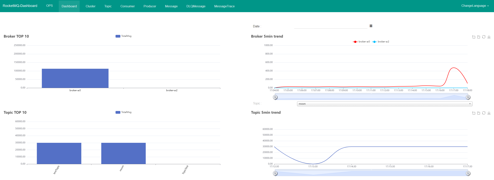
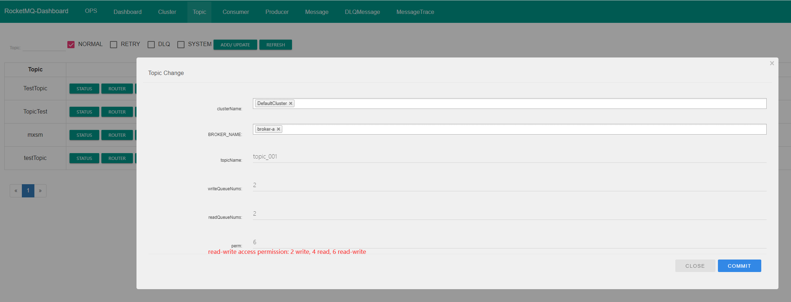
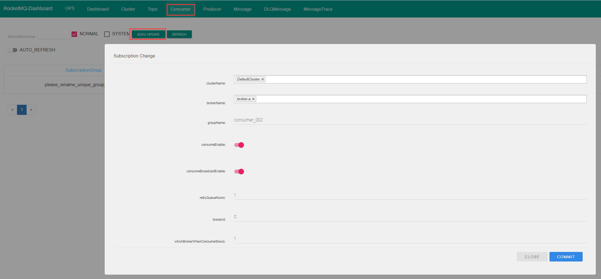
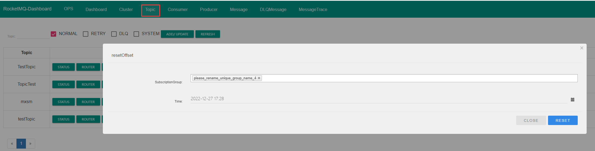
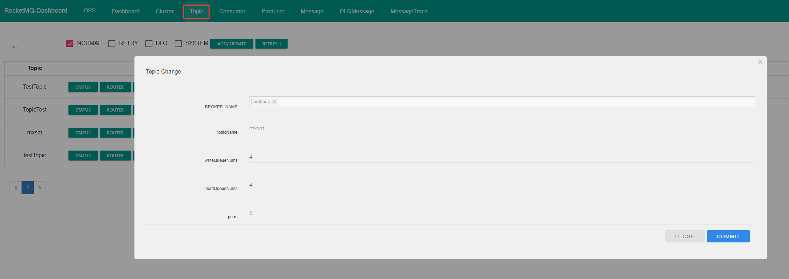
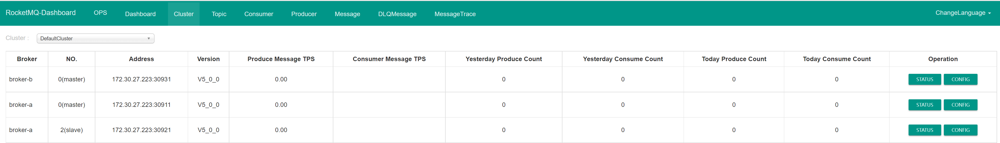
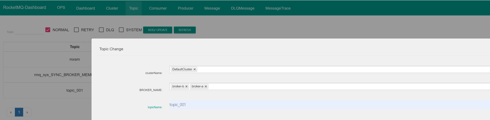
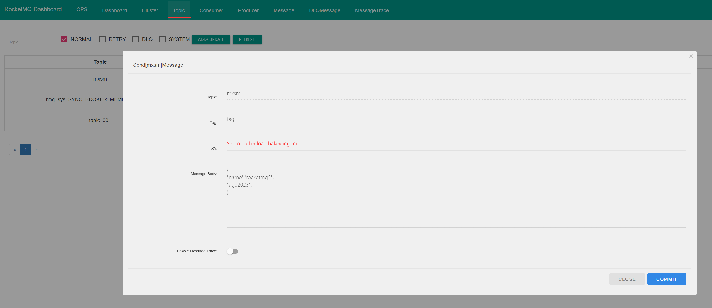
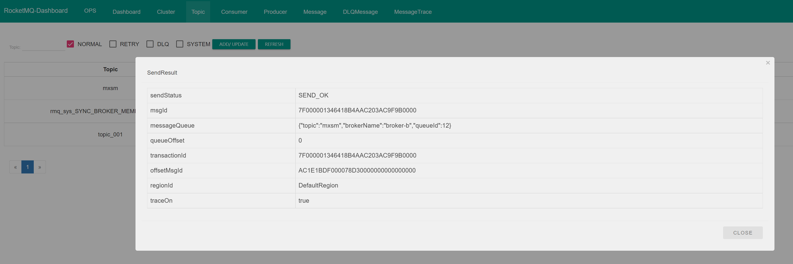

# RocketMQ Dashboard

**`RocketMQ Dashboard`** is a tool for managing RocketMQ, providing various statistical information on events and performance of clients and applications, and supporting visualized tools to replace command line operations such as topic configuration and broker management.

## Introduction

### Feature Overview

| Dashboard | Function                                                     |
| --------- | ------------------------------------------------------------ |
| OPS       | Modify nameserver address; use `VIPChannel`                  |
| Dashboard | Check broker, topic message volume                           |
| Cluster   | Cluster distribution, broker configuration, runtime information |
| Topic     | Search, filter, delete, update/add topics, message routing, send messages, reset consumption points |
| Consumer  | Search, delete, add/update consumer groups, terminals, consumption details, configuration |
| Message   | Message records, private messages, message trace, etc. message details |

Operation panel：



## Quick Start

System requirements：

1. Linux/Unix/Mac
2. 64bit JDK 1.8+
3. Maven 3.2.x
4. Start [RocketMQ](https://rocketmq.apache.org/docs/quick-start/) 

Network configuration：

1. The cloud server can be accessed remotely or the local virtual machine can PING the external network
2. ```rocketmq``` configuration file ```broker.conf / broker-x.properties``` set nameserver's address and port.
3. Start the broker with the configuration file

### 1. Docker image installation

① Install docker and pull the rocketmq-dashboard image

```shell
docker pull apacherocketmq/rocketmq-dashboard:latest
```

② Run in a docker container ```rocketmq-dashboard```

```shell
docker run -d --name rocketmq-dashboard -e "JAVA_OPTS=-Drocketmq.namesrv.addr=127.0.0.1:9876" -p 8080:8080 -t apacherocketmq/rocketmq-dashboard:latest
```

:::tip

Replace namesrv.addr:port with the nameserver address and port configured in rocketmq

1. Open port numbers: 8080, 9876, 10911, 11011

- Cloud server: Set security group access rules
- Local virtual machine: Turn off firewall, or -add-port

:::

### 2. Source installation

Source address：[apache/rocketmq-dashboard](https://github.com/apache/rocketmq-dashboard) 

Download it, unzip it, and navigate to the source directory ```rocketmq-dashboard-master/```

① Compile ```rocketmq-dashboard``` 

```shell
mvn clean package -Dmaven.test.skip=true
```

② Run ```rocketmq-dashboard```

```shell
java -jar target/rocketmq-dashboard-1.0.1-SNAPSHOT.jar
```

:::tip

**Started App in x.xxx seconds (JVM running for x.xxx)** ，Indicates successful startup.

:::

Browser page access：namesrv.addr:8080

Close ```rocketmq-dashboard``` : ctrl + c

Restart：execution ②

**tips**：The downloaded source code needs to be uploaded to the Linux system for compilation, and local compilation may return errors

## Tutorial

### 1.Create topic-Topic 

Topic ```>``` ADD/UPDATE



### 2. Create consumer group-Consumer

Consumer ```>``` ADD/UPDATE



### 3. Reset consumption offset

Topic ```>``` REST CONSUMER OFFSET



:::tip

- Cluster consumption supports resetting consumption offsets, but broadcast mode does not.
- If a consumer is not online, it is not possible to reset the consumption offset.

:::

### 4. Expand topic queues

Topic ```>``` TOPIC CONFIG



### 5. Expand Broker

- To install and deploy a new broker with the same nameserver address as the current cluster

  

- To update the `BROKER_NAME` of topic

  Topic ```>``` ADD/UPDATE ```>``` BROKER_NAME



### 6. Send message

- To send a message to a specific topic

  Topic ```>``` SEND MESSAGE

  

- Send result

  

