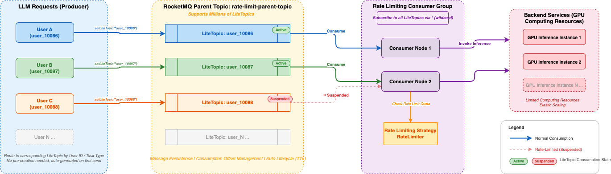

# Fine-Grained Task Isolation and Rate Limiting Based on RocketMQ LiteTopic

This document provides a detailed guide on how to leverage Apache RocketMQ's **LiteTopic** feature to build a general-purpose system supporting fine-grained task isolation and dynamic rate limiting at massive scale.

## Background and Challenges
In AI inference and business processing scenarios (such as image generation, video rendering, large-scale computation, etc.), backend services typically rely on high-cost computing resources like GPUs. As a platform service provider, with limited computing resources, it is essential to prioritize service quality for important users or critical task types.

While ensuring proper allocation of high-priority computing resources, the platform also faces the following typical challenges:

+ **Resource Isolation**: Requests from important customers or critical tasks require dedicated processing resource pools to avoid mixing with other traffic.
+ **Traffic Non-interference**: Customers at the same priority level should be isolated from each other, preventing a single customer's burst traffic from occupying resources and causing long queuing for other customers' requests.
+ **Dynamic Subscription Management**: User ID lists or task type lists change in real-time; downstream consumers need to dynamically adjust subscription relationships, adding or removing subscription targets.
+ **Fine-grained Rate Limiting**: When request volume for a specific type or user exceeds the maximum processing capacity, consumption must be paused individually for that dimension with backoff handling, without affecting other dimensions.
+ **Cluster-level Traffic Governance**: When the overall cluster processing capacity reaches its limit, the system needs to identify and pause consumption of top-traffic queues, gradually resuming after the cluster completes scaling.
+ **Peak Shaving and Valley Filling**: Smooth out highly fluctuating request traffic to ensure backend service stability and availability.

### Limitations of Traditional Approaches
#### Approach 1: Isolation Based on RocketMQ Standard Topics
Creating independent Topics and ConsumerGroups for each user ID or task type, and launching corresponding consumer instances for each ConsumerGroup. This approach has the following issues:

+ Topics and ConsumerGroups are heavyweight resources. After creation, producers and consumers need to complete connection initialization and other resource preparation, affecting the smoothness of message sending and consumption.
+ Downstream consumers need to actively detect changes in the upstream producer's user or task type lists, dynamically adding or removing subscription relationships, making true decoupling between producers and consumers impossible.

#### Approach 2: Isolation Based on Kafka
Kafka faces the same heavyweight resource issues as the RocketMQ standard Topic approach. If attempting to map different users or task types through Kafka Topic partitions, having too many partitions in a single Topic leads to dramatic increases in Broker resource consumption and performance overhead, introducing stability risks.

## Solution
### Core Architecture: Fine-Grained Isolation and Rate Limiting Based on LiteTopic



This document adopts Apache RocketMQ's **LiteTopic (Lightweight Topic)** feature to build a novel fine-grained isolation and dynamic rate limiting architecture:

+ **Message Sending Side**: Routes messages to the corresponding LiteTopic based on business dimensions (such as user ID, model ID, task type).
+ **Message Consuming Side**: Consumers bind to the parent Topic and subscribe to the LiteTopics that need to be processed based on business dimensions. When LiteTopics are dynamically added or removed, the LiteTopic subscriptions should be updated accordingly, and the consumer cluster can scale based on capacity.

### Core Advantages of LiteTopic
+ **Lightweight with Massive Scale Support**: A single instance can support millions of LiteTopics, allowing creation of dedicated lightweight queues for each user or task type to meet large-scale fine-grained isolation requirements.
+ **Resource Decoupling and Efficient Reuse**: LiteTopics do not need to be pre-created — they are automatically generated on demand when messages are written, without affecting send latency. After becoming idle, they are automatically cleaned up according to built-in TTL policies, enabling fully automated lifecycle management.
+ **Precise Flow Control**: The consuming side supports returning a Suspend status, enabling precise suspension of specific LiteTopics to pause consumption and achieve millisecond-level fine-grained rate limiting. This only affects the target LiteTopic without interfering with normal consumption of other queues.
+ **Physical Isolation with Logical Unity**: Each user or business dimension has an independent LiteTopic, achieving data-level isolation. Meanwhile, all consumer instances belong to the same ConsumerGroup, sharing thread pools and other resources, balancing isolation with resource utilization.

## Steps
### Step 1: Create the Parent Topic
Create a parent Topic through the Apache RocketMQ console or API to host all LiteTopics. All rate-limited objects share the same parent Topic — no need to create separate ones for each user.

Example configuration:

+ Topic name: `rate-limit-parent-topic`
+ Message type: Lite
+ LiteTopic idle expiration: set based on your business requirements, for example, `1440` minutes (one day)

> **Note**: The parent Topic is the carrier of LiteTopics. A single parent Topic can host millions of LiteTopics. When creating it through an API, `message.type=LITE` enables LiteTopic, and `lite.topic.expiration` sets the LiteTopic idle cleanup time in minutes. The default value is `-1`, which disables idle cleanup. For positive values, the maximum is `43200` minutes, or 30 days.

### Step 2: Create a Consumer Group
Create a unified Consumer Group shared by all consumer machines.

Example configuration:

+ Group name: `GID_rate_limit_consumer`
+ Bound parent Topic: `rate-limit-parent-topic`
+ LiteTopic subscription mode: `Shared` by default, or `Exclusive` when required by the business

> **Note**: When creating it through an API, `lite.bind.topic` binds the LiteTopic consumer group to the parent Topic, and `lite.sub.model` selects the LiteTopic subscription mode. `Shared` allows multiple Consumers in the same Group to hold the same LiteTopic subscription and share consumption; `Exclusive` makes a LiteTopic belong to only one Consumer at a time within the same Group.

### Step 3: Send Messages to LiteTopic
On the message sending side, write messages to the corresponding LiteTopic based on user identifiers. LiteTopics do not need to be pre-created — they are automatically generated on first send.

```java
// Parent Topic name
String topic = "rate-limit-parent-topic";

// Get Producer instance
final Producer producer = ProducerSingleton.getInstance(topic);

// Build message body
byte[] body = "your message content".getBytes(StandardCharsets.UTF_8);

// Use user identifier as LiteTopic name to achieve per-user isolation
String userId = "user_10086";

final Message message = provider.newMessageBuilder()
    // Set parent Topic
    .setTopic(topic)
    // Set LiteTopic for per-user isolation
    .setLiteTopic(userId)
    .setBody(body)
    .build();

try {
    final SendReceipt sendReceipt = producer.send(message);
    log.info("Message sent successfully, messageId={}", sendReceipt.getMessageId());
} catch (LiteTopicQuotaExceededException e) {
    // LiteTopic count exceeds instance quota limit
    log.error("LiteTopic quota exceeded, please upgrade instance", e);
} catch (Throwable t) {
    log.error("Failed to send message", t);
}
```

**Key Notes**:

+ The parameter of `setLiteTopic()` is the LiteTopic name. It is recommended to use business identifiers such as user ID or task type ID for easy matching with rate limiting strategies.
+ When a LiteTopic receives its first message, the system automatically creates the queue — no additional operations required.
+ If the LiteTopic count exceeds the instance quota, a `LiteTopicQuotaExceededException` will be thrown, requiring an instance specification upgrade.

### Step 4: Consume Messages and Implement Rate Limiting
The consuming side uses `LitePushConsumer` to bind the parent Topic and subscribe to the LiteTopics that need to be processed, and applies rate limiting based on business strategies within the message processing logic.

```java
String consumerGroup = "GID_rate_limit_consumer";
String topic = "rate-limit-parent-topic";

// Build LitePushConsumer instance
LitePushConsumer litePushConsumer = provider.newLitePushConsumerBuilder()
    .setClientConfiguration(clientConfiguration)
    // Set consumer group
    .setConsumerGroup(consumerGroup)
    // Bind parent Topic
    .bindTopic(topic)
    // Set message listener
    .setMessageListener(messageView -> {
        // Get the LiteTopic the message belongs to (i.e., user identifier)
        String liteTopic = messageView.getLiteTopic()
            .orElseThrow(() -> new IllegalStateException("LiteTopic is missing"));

        // Execute business logic (e.g., call downstream service)
        boolean success = processMessage(messageView);

        if (success) {
            // Business processing successful
            // Check if this user needs rate limiting
            if (rateLimiter.shouldLimit(liteTopic)) {
                // Return Suspend to pause pulling from this LiteTopic
                // Parameter is the suspension duration; no new messages
                // from this LiteTopic will be pulled during this period
                return ConsumeResultSuspend.of(Duration.ofMillis(500));
            }
            return ConsumeResult.SUCCESS;
        } else {
            // Business processing failed, message will be retried
            return ConsumeResult.FAILURE;
        }
    })
    .build();

// Dynamically subscribe to the LiteTopics that need to be processed.
litePushConsumer.subscribeLite("user_10086");
```

**Key Notes**:

+ `ConsumeResultSuspend.of(Duration)` is the core rate limiting mechanism provided by LiteTopic: after returning this result, the Broker will pause message pulling for that LiteTopic for the specified duration, without affecting normal consumption of other LiteTopics.
+ The rate limiting strategy (`rateLimiter.shouldLimit()`) is implemented by the business side and can be based on algorithms such as sliding window or token bucket, controlling consumption rate on a per-user dimension.

### Step 5: Implement Rate Limiting Strategy (Reference Example)
Below is a simplified example of a fixed-window rate limiter that controls consumption rate on a per-LiteTopic (i.e., per-user) dimension:

```java
import java.util.Map;
import java.util.concurrent.ConcurrentHashMap;
import java.util.concurrent.atomic.AtomicInteger;

public class LiteTopicRateLimiter {

    // Rate limit configuration per LiteTopic: key = liteTopic, value = max consumption per second
    private final Map<String, Integer> rateLimitConfig;

    // Fixed window counters
    private final Map<String, AtomicInteger> windowCounters = new ConcurrentHashMap<>();

    /**
     * Determine whether the specified LiteTopic needs rate limiting
     * @param liteTopic LiteTopic name (user identifier)
     * @return true if rate limiting is needed
     */
    public boolean shouldLimit(String liteTopic) {
        Integer maxQps = rateLimitConfig.get(liteTopic);
        if (maxQps == null) {
            // No rate limiting strategy configured, no limiting applied
            return false;
        }

        AtomicInteger counter = windowCounters.computeIfAbsent(
            liteTopic, k -> new AtomicInteger(0));

        return counter.incrementAndGet() > maxQps;
    }

    /**
     * Periodically reset window counters (executed once per second)
     */
    @Scheduled(fixedRate = 1000)
    public void resetWindow() {
        windowCounters.values().forEach(c -> c.set(0));
    }
}
```

## Best Practices
### LiteTopic Naming Conventions
It is recommended to use naming rules with clear business semantics for easy operations troubleshooting and rate limiting strategy matching.

+ Rate limiting by user: `{userId}`, e.g., `user_10086`
+ Rate limiting by user + business type: `{userId}_{bizType}`, e.g., `user_10086_premium`
+ Rate limiting by task type: `{taskType}_{taskId}`, e.g., `sms_task_001`

### Choosing Suspend Duration
Suspend duration directly affects rate limiting effectiveness and message processing latency. It is recommended to set it appropriately based on business scenarios:

+ **Light rate limiting** (reduce speed without blocking): 50-200 milliseconds
+ **Moderate rate limiting** (noticeably reduce consumption rate): 200-1000 milliseconds
+ **Heavy rate limiting** (near consumption pause): 1000-5000 milliseconds

### Integration with Backend Elastic Scaling
In backend service elastic scaling scenarios, it is recommended to combine the Suspend mechanism for smooth traffic growth control:

1. During the initial traffic burst, return a larger Suspend value (e.g., 2000 milliseconds) for users exceeding the threshold, significantly reducing consumption rate.
2. As backend scaling gradually completes, dynamically reduce the Suspend value (e.g., from 2000 milliseconds down to 100 milliseconds), allowing traffic to grow smoothly.
3. After scaling is complete, remove the rate limiting strategy and restore normal consumption rate.

This strategy ensures the consumption traffic growth curve matches the backend computing capacity scaling curve as closely as possible, minimizing service unavailability caused by the scaling time window.

## Related Documentation
+ [Apache RocketMQ Official Documentation](https://rocketmq.apache.org/docs/)
+ [RocketMQ 5.x Client SDK Guide](https://rocketmq.apache.org/docs/sdk/java/)
