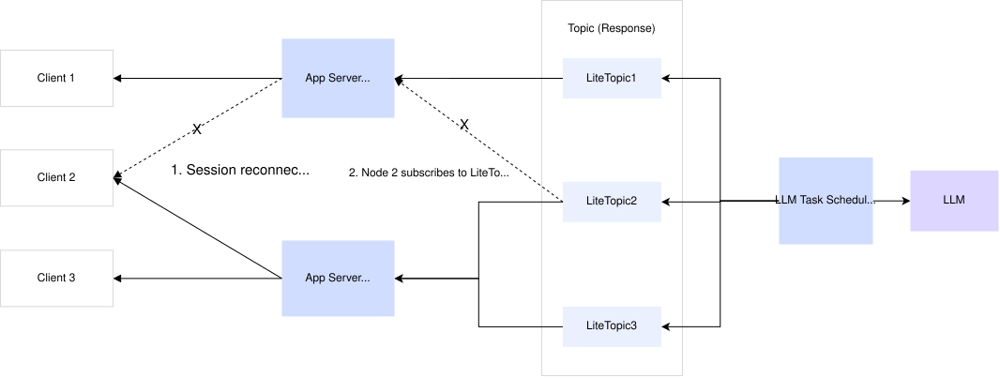

# Manage distributed session state with RocketMQ LiteTopic

This document describes how to use the LiteTopic feature of Apache RocketMQ to build a distributed, highly available session state management system.

## Background and challenges

When building modern AI applications, developers often face a difficult challenge: how to maintain session continuity over unstable networks that rely on long-lived connections, such as WebSocket or Server-Sent Events (SSE). Traditional session management methods can easily lose context during node failures or network reconnections, leading to wasted computing resources. The primary challenges include:

* **Long-running and multi-turn interactions**: The inference process for a large language model (LLM) can take several seconds or longer. User-AI interactions are often multi-turn conversations that are highly dependent on context.

* **High computing costs**: Each AI task consumes expensive GPU resources. If a network disruption interrupts the connection and terminates the task, it results in a significant waste of resources.

* **Unstable long-lived connections**: AI applications typically use technologies like SSE or WebSocket to push streaming results in real time. However, in a production environment, disruptions such as gateway or service node restarts, connection timeouts, and mobile network switching are unavoidable.

**Pain points of traditional architectures:** In a traditional monolithic or simple distributed architecture, session state is often tied to a specific application server node. If a user's long-lived connection drops and reconnects to a different node, the new node cannot retrieve the previous session state. This interrupts the conversation and results in a poor user experience.

## Solution

To address these challenges, we propose a distributed session state management solution based on Apache RocketMQ. This solution uses the lightweight topic (LiteTopic) feature as a transport channel for session messages and employs stateless application server nodes to ensure high availability and session continuity.

### System architecture

* **Application server (stateless)**: The application service can be horizontally scaled across multiple nodes (Node 1, Node 2, and so on). These nodes do not store session state and are only responsible for handling connections and forwarding messages.

* **RocketMQ LiteTopic**: A LiteTopic is used as a "channel" for each session. Each session corresponds to a unique LiteTopic. We recommend the naming convention `chat/{sessionID}`.

* **Large model task scheduling component**: This component is responsible for interacting with the LLM and sending the generated streaming data to the corresponding LiteTopic.

### Communication flow

1. **Session establishment and initial connection**

   1. **User access**: Web client 2 sends a request to establish a long-lived connection (for example, a WebSocket) with application server Node 1.

   2. **Session creation**: The system generates a unique sessionID, such as Session2.

   3. **Channel subscription**: Application server Node 1 subscribes to the corresponding LiteTopic in RocketMQ based on the sessionID (that is, `LiteTopic2`, named `chat/Session2`).

   4. **Task scheduling**: After receiving the request, the large model task scheduling component calls the LLM. It then sends the streaming data (tokens) from the LLM as a series of messages to `LiteTopic2`.

   5. **Message push**: Node 1 receives the messages and pushes them in real time to Web client 2 through the long-lived connection.

2. **Failure handling and reconnection**

   When a network fluctuation or node failure occurs, the system recovers as follows:

   1. **Connection interruption**: Assume the connection between Web client 2 and Node 1 unexpectedly drops. Node 1 detects the closed connection and unsubscribes from `LiteTopic2`.

   2. **Automatic reconnection**: The client logic for web client 2 triggers an automatic reconnection. Because of load balancing, the reconnection request is routed to application server node 2.

   3. **State takeover**:

      1. Node 2 receives the reconnection request and parses the sessionID (Session2).

      2. Node 2 immediately subscribes to `LiteTopic2` in RocketMQ.

   4. **Message resumption**:

      1. RocketMQ provides message persistence and offset management. When Node 2 subscribes to `LiteTopic2`, it pulls unconsumed messages starting from the previous offset.

      2. The large model task scheduling component continues sending data to `LiteTopic2`. Node 2 now receives the data and pushes it to Web client 2.

### Benefits

* **Session continuity**: Regardless of which node the client reconnects to, it can seamlessly receive subsequent messages by subscribing to the same LiteTopic. The process is transparent to the user.

* **Resource protection**: Because the session state is managed in RocketMQ, a connection interruption does not stop the background LLM task, which prevents wasting expensive computing resources.

* **Auto scaling**: The application servers are completely stateless, allowing them to be scaled in or out based on traffic load. This eliminates concerns about sticky sessions.

### Summary

The LiteTopic feature of Apache RocketMQ offers an effective solution to the complex challenge of managing distributed sessions in AI applications. This architecture makes application nodes stateless, improves the system's auto scaling capabilities, and, most importantly, ensures a seamless user experience and the efficient use of AI computing resources in complex network environments. It is a proven best practice for building enterprise-grade, highly available AI agent applications.
