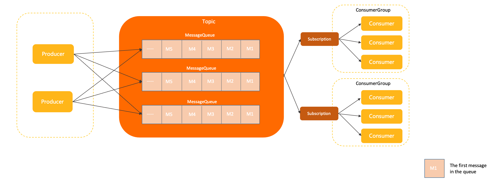

# Asynchronous multi-agent communication with RocketMQ LiteTopic

This article explains how to use Apache RocketMQ to build a highly concurrent and scalable multi-agent system.

## Background and challenges

As AI applications become increasingly complex, single-agent architectures are often insufficient, making multi-agent systems a growing trend. However, the long-running nature of AI tasks poses challenges for traditional synchronous calls, leading to thread blocking and scalability bottlenecks. This hands-on tutorial demonstrates how to use the message queue and LiteTopic features of RocketMQ to build a multi-agent system with asynchronous communication. This approach resolves the blocking issues associated with long-running calls and enhances system performance and scalability.

## Solution

### System architecture

* **Web client**: The user interface for sending requests and receiving final results.

* **Supervisor Agent**: The core orchestrator of the system. It receives requests from the web client, decomposes complex tasks into sub-tasks, and dispatches them to appropriate worker agents. It also aggregates results from the worker agents and returns the final output to the web client.

* **Worker Agent**: Responsible for executing specific, specialized sub-tasks. Each worker agent focuses on its area of expertise.

### Communication workflow

RocketMQ decouples the communication workflow, which consists of two phases: request and response.

1. **Request phase**:

   1. The Supervisor Agent receives a request from the web client and decomposes the task.

   2. For each sub-task, it creates a request message and sends it to the corresponding **request topic**. For example, it might send a message to "Topic 1 (Request)" for "Worker Agent 1" and to "Topic 2 (Request)" for "Worker Agent 2".

   3. Each worker agent subscribes to its designated request topic. When a new message arrives, the agent immediately begins processing it.

2. **Response phase**:

   1. While processing the request, the Supervisor Agent creates and subscribes to a **response topic**. This is a special **lightweight topic**.

   2. After completing its sub-task, each worker agent sends its result to a **LiteTopic** within the response topic. This LiteTopic can be named using a unique Task ID or Session ID to ensure responses are routed correctly.

   3. By subscribing to the response topic, the Supervisor Agent receives the results from all worker agents in real time.

   4. Finally, the Supervisor Agent aggregates the results from all sub-tasks and pushes them to the web client via HTTP, enabling streaming responses.

## Key technology: RocketMQ LiteTopic

The **LiteTopic** feature of RocketMQ plays a crucial role in this solution.

Traditional topics can be resource-intensive to create and manage. In contrast, a LiteTopic is a lightweight topic that offers the following advantages, making it ideal for the response phase in a multi-agent system:

* **Dynamic creation and deletion**: You can dynamically create a dedicated LiteTopic for each task, for example, by using the task ID as its name. The LiteTopic is automatically deleted after its TTL expires. This approach avoids pre-provisioning numerous static topics and significantly improves system flexibility and resource utilization.

* **Isolation**: A LiteTopic has lower creation and maintenance overhead than standard topics, making it suitable for large-scale, high-concurrency scenarios with short-lived messages.

* **Precise subscription**: Within the same ConsumerGroup, each consumer can subscribe to a different set of LiteTopics.

* **Ordered messages**: Messages within a single LiteTopic are ordered. This ensures that streaming responses are delivered in the correct sequence.

## Summary

This tutorial demonstrates how to use the LiteTopic feature of Apache RocketMQ to build an efficient, decoupled multi-agent system with asynchronous communication. This solution transitions long-running AI tasks from a synchronous, blocking model to an asynchronous, non-blocking model. It resolves the issue of thread blocking and enhances system stability and scalability by using the buffering and peak-shaving capabilities of the message queue. This architecture provides a robust model for developing sophisticated, enterprise-grade AI applications.
