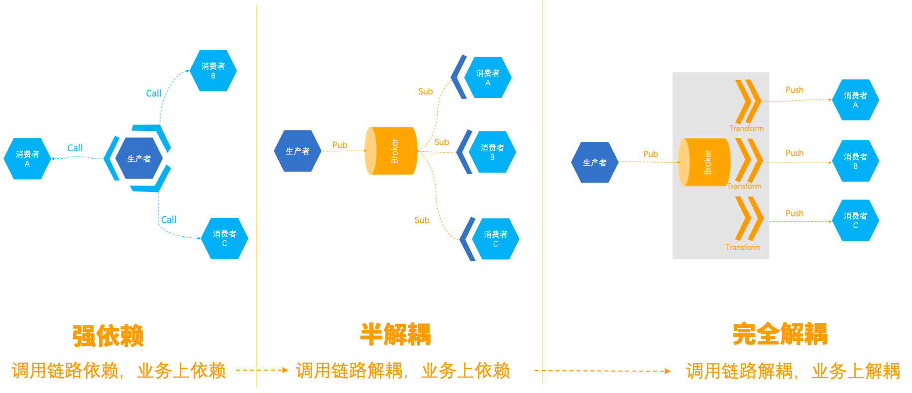
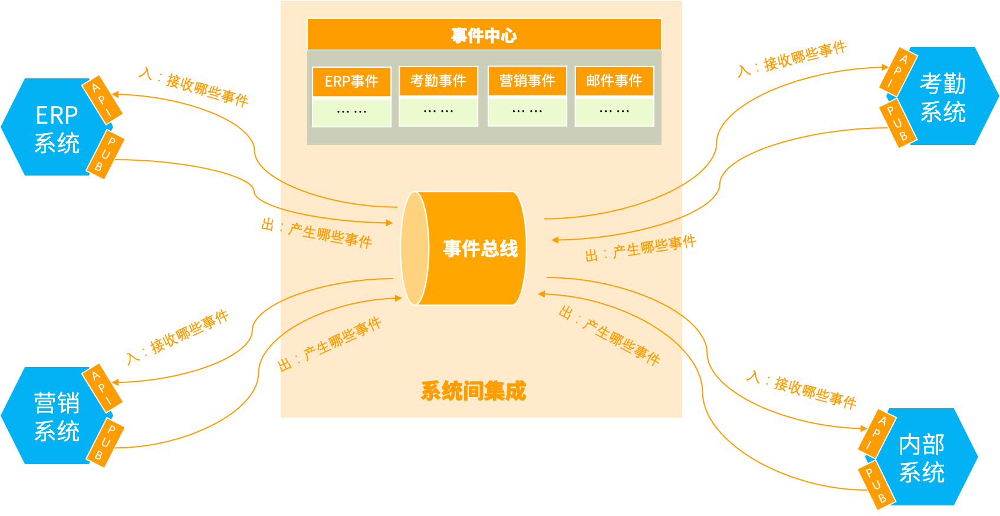
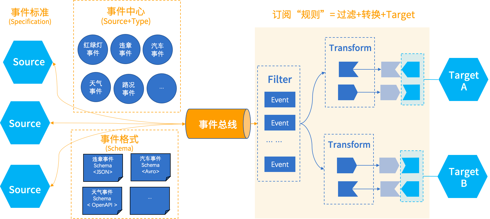

# RocketMQ EventBridge Overview

RocketMQ EventBridge is dedicated to helping users build high-reliability, low-coupling, and high-performance event-driven architectures. In event-driven architecture, microservices do not need to actively subscribe to external messages, but can instead centralize all entries that trigger changes in the microservice system to the API, and only need to focus on the current microservice's own business domain model definition and design of the API, without having to adapt and parse external service messages through a lot of glue code. EventBridge is responsible for safely and reliably adapting and delivering external service-generated events to the API designed by the current microservice.

When do we use RocketMQ messages and when do we use EventBridge events? What is the meaning of events, and what is the difference with messages?

## Message&Event
We have defined events as follows:
```text
Events refer to things that have already happened, especially important things.
```
The relationship between events and messages is as follows：


Messages include Command messages and Event messages. Command messages are operation commands sent by external systems to this system (as shown in the left part of the figure); Event messages are events that occur after the system receives a Command operation request and internal changes (as shown in the right part of the figure);

## Four characteristics of an event
### 1. Happened
Events are always "already happened." "Already happened" also means they are immutable. This feature is very important, when we process events and analyze events, it means that we can absolutely trust these events, as long as we receive the events, they must be true behaviors of the system.

Command represents an operation request, whether it truly happens or not cannot be known. For example：
```text
* Turning on the kitchen lights
* Someone pressed the doorbell
* Account A received 100,000.
```

An event is a clear occurrence that has already happened, such as
```text
* The kitchen light being turned on
* Someone pressing the doorbell
* Account A receiving 100,000
```

### 2. Without expectation
```text
An event is an objective description of a change in the state or attribute value of a thing, but it does not make any expectations about how to handle the event itself. In contrast, both Command and Query have expectations, they hope the system will make changes or return results, but the Event is just an objective description of a change in the system.
```
For example: the traffic signal, from green to yellow, just describes an objective fact, and there is no objective expectation in itself. In different countries and regions, different expectations are given to this event. For example, in Japan, yellow is equivalent to red, while in Russia, running a yellow light is tolerated.

Compared to Command messages：
* Events: are a bit like "market economy", goods are produced and placed in the large window of the shopping mall, consumers buy them back if they feel good, if no one buys them, the goods may expire and be wasted.
* Command message: is a bit like "planned economy", production is based on demand, designated distribution objects, and there is little waste.

### 3. Naturally ordered and unique
```text
The same entity cannot have both A and B occur at the same time, there must be a temporal relationship; if so, these two events must belong to different event types.
```
For example: for the same traffic light, it can't turn green and red at the same time, it can only turn into one state at a given moment. If we see two events with the same content, then it must have occurred twice and one happened before the other. This is valuable for processing data consistency and system behavior analysis (such as ABA scenarios): we not only see the final result of the system, but also the intermediate process that led to that result.


### 4. Semblance
Events try to record the "crime scene" as completely as possible, because events do not know how consumers will use them, so they will be as detailed as possible. Including:
```text
When did the event occur?
Who generated it?
What type of event is it?
What is the content of the event? What is the structure of the content?
... ...
```
Compared to common messages we see, as the upstream and downstream are generally determined, often in order to improve performance and transmission efficiency, messages will be as concise as possible, as long as it meets the consumer's needs specified by the "planned economy".
## RocketMQ EventBridge's typical application scenarios
### Scenario 1: Event Notification

In microservices, we often encounter situations where messages produced in one microservice need to be notified to other consumers. Here we compare three ways:

**A: Strong dependency method**

The producer actively calls the consumer's microservice and adapts the consumer's API. This design is undoubtedly very bad, the producer is strongly dependent on the consumer, deeply coupled. If a call to a consumer has an exception and no effective isolation is done, it is very likely to cause the entire microservice to hang. It is very poor when new consumers come in.

**B: Semi-decoupling method**

The producer sends the message to the message service, and the consumer subscribes to the message service to get the message and converts the message into the data format required by its own business domain model. This method achieved decoupling on the call chain, greatly reducing system risks, but for consumers, they still need to understand and parse the producer's business semantics and convert the message into the format needed for their own business domain. Under this method, when the consumer needs to subscribe to data from multiple producers, a large amount of glue code is needed to adapt to each message produced by the producer. In addition, when the upstream producer's message format changes, there is also a risk and operational cost.

**C: Complete decoupling method**

Under this method, consumers do not need to introduce SDK to subscribe to Broker, they only need to design API according to their own business domain model, and the message service will filter and convert upstream




### Scenario 2: Inter-system integration

Scenario 1 mainly focuses on the event communication between microservices within a single product. Scenario 2 mainly focuses on event communication between multiple products. In an enterprise, we often use multiple products, and many of these products may not be developed by ourselves, but are purchased as external SaaS services. In this case, it is difficult to make events flow between different external SaaS products, because these external SaaS products are not developed by ourselves and it is not easy to modify their code. The event center capability provided by EventBridge can help collect events generated by various products and organize and manage them well, just like the goods in a department store window, carefully arranged and equipped with instructions, for consumers to choose from, and also providing home delivery service.



## RocketMQ EventBridge how to work？
In order to address the problems mentioned in the above two scenarios, EventBridge approaches from five aspects:

**1. Determine event standards:**

 Because events are not for oneself, but for everyone. It has no clear consumer, and all are potential consumers. Therefore, we need to standardize the definition of events, so that everyone can understand, and be easy to understand. Currently, CloudEvent under CNCF has gradually become a widely recognized factual standard, so we choose CloudEvent as our EventBridge event standard.

**2. Establish event center:** 

The event center contains all the events registered by various systems. This is like the market economy department store we mentioned above, which has a variety of events classified and arranged, and everyone can come in to see which events may be needed, and then buy them back.

**3. Define event format:**

 Event format is used to describe the specific contents of events. This is equivalent to a sales contract in a market economy. The event format sent by the producer must be determined and cannot always change; the format in which the consumer receives events must also be determined, otherwise the entire market will be in chaos.

**4. Subscription "rules":** 

We need to give consumers the ability to deliver events to the target end, and filter and transform events before delivery so that it can adapt to the format of the target end API receiving parameters. We call this process creating a subscription rule.

**5. Event Bus:**
Finally, we also need a place to store events, that is the event bus in the middle of the diagram.

