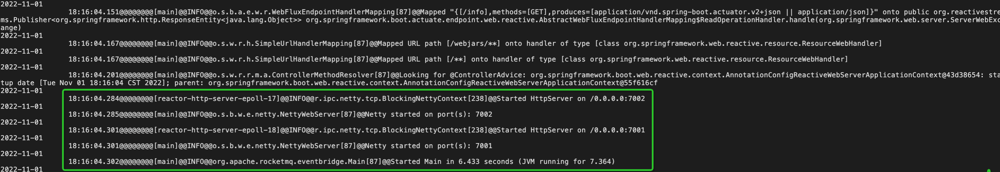

# RocketMQ EventBridge Quick Start

RocketMQ EventBridge requires a message service to store events and a runtime to subscribe and push events. In this case, we choose Apache RocketMQ as our message service and Apache RocketMQ Connect as our runtime for subscribing and pushing events. Of course, you can also choose other message services instead, EventBridge does not impose any restrictions on this. In the future, EventBridge also plans to implement its own runtime based on OpenMessaging Connect API in order to better provide event-driven services.

System requirements:

- 64-bit operating system, Linux/Unix/macOS is recommended
- 64-bit JDK 1.8+

## Deploy Apache RocketMQ

Apache RocketMQ is a great message service and we choose it as the default storage for EventBus. You can quickly deploy it according to this manual: [Apache RocketMQ Quick Start](https://rocketmq.apache.org/docs/quick-start/)

## Deploy Apache RocketMQ Connect

We use Apache RocketMQ Connect as our default runtime to connect to external upstream and downstream services. You can complete the deployment according to the manual: [RocketMQ Connect Quick Start](https://github.com/apache/rocketmq-connect). Before deploying Apache RocketMQ Connect, you should download the following plugins and put them in the directory defined by the "pluginPaths" configuration parameter in rocketmq-connect.


* [rocketmq-connect-eventbridge-jar-with-dependencies.jar](https://cn-hangzhou-eventbridge.oss-cn-hangzhou.aliyuncs.com/rocketmq-connect-eventbridge-0.0.1-SNAPSHOT-jar-with-dependencies.jar)
* [rocketmq-connect-dingtalk-jar-with-dependencies.jar](https://cn-hangzhou-eventbridge.oss-cn-hangzhou.aliyuncs.com/rocketmq-connect-dingtalk-1.0-SNAPSHOT-jar-with-dependencies.jar)
* [connect-cloudevent-transform-jar-with-dependencies.jar](https://cn-hangzhou-eventbridge.oss-cn-hangzhou.aliyuncs.com/connect-cloudevent-transform-1.0.0-SNAPSHOT-jar-with-dependencies.jar)
* [connect-filter-transform-jar-with-dependencies.jar](https://cn-hangzhou-eventbridge.oss-cn-hangzhou.aliyuncs.com/connect-filter-transform-1.0.0-SNAPSHOT-jar-with-dependencies.jar)
* [connect-eventbridge-transform-jar-with-dependencies.jar](https://cn-hangzhou-eventbridge.oss-cn-hangzhou.aliyuncs.com/connect-eventbridge-transform-1.0.0-SNAPSHOT-jar-with-dependencies.jar)

## Deploy RocketMQ EventBridge

* Download EventBridge

  You can download the binary package of EventBridge from [here](https://www.apache.org/dyn/closer.cgi?path=rocketmq/rocketmq-eventbridge/1.0.0/rocketmq-eventbridge-1.0.0-bin-release.zip) : rocketmq-eventbridge-xxx-bin-release.zip. After downloading, unzip it and you will get a directory as follows:

  ```
  /rocketmq-eventbridge-xxx-bin-release/
  |——bin
  |   |——runserver.sh
  |   |——eventbridge.sh
  |——config
  |   |——application.properties
  |——jar
  |   |——rocketmq-eventbridge.jar
  ```


* Configuring EventBridge

  Before running, we need to configure the runtime environment for EventBridge by modifying the config/application.properties file, as follows：

  ```
  # Mysql database address
  spring.datasource.url=jdbc:mysql://xxxx:3306/xxxx?characterEncoding=utf8
  spring.datasource.username=xxx
  spring.datasource.password=xxxx
  
  # RocketMQ nameserver address
  rocketmq.namesrvAddr=xxxxx:9876
  
  # RocketMQ cluster name
  rocketmq.cluster.name=DefaultCluster
  
  # RocketMQ Connect address
  rocketmq.connect.endpoint=xxxxxx:8082
  
  # log default configuration
  log.path=～
  log.level=INFO
  app.name=rocketmq-eventbridge
  ```

* Start EventBridge

  ```shell
  sh bin/eventbridge.sh start 
  ```

  The log directory by default is located at ~ /rocketmq-eventbridge/rocketmq-eventbridge.log, it can be modified by changing the log.path and app.name. The log can be used to check if the service has started properly.：
  

* Test EventBridge

Once the service is started, we can use the following demo cases to test and verify EventBridge.

## Demo

* Create Event Bus

  ```text
  POST /bus/createEventBus HTTP/1.1
  Host: demo.eventbridge.com
  Content-Type: application/json; charset=utf-8
  {
  "eventBusName":"demo-bus",
  "description":"a demo bus."
  }
  ```

* Create Source Event

  ```
  POST /source/createEventSource HTTP/1.1
  Host: demo.eventbridge.com
  Content-Type: application/json; charset=utf-8
  {
  "eventBusName":"demo-bus",
  "eventSourceName":"demo-source",
  "description":"A demo source."
  }
  ```

* Create Event Rules

  ```
  POST /rule/createEventRule HTTP/1.1
  Host: demo.eventbridge.com
  Content-Type: application/json; charset=utf-8
  {
    "eventBusName":"demo-bus",
    "eventRuleName":"demo-rule",
    "description":"A demo rule.",
    "filterPattern":"{}"
  }
  ```

* Create Event Target

  Create an event target that delivers to EventBridge in the cloud.

  ```
  POST /target/createEventTargets HTTP/1.1
  Host: demo.eventbridge.com
  Content-Type: application/json; charset=utf-8
  {
      "eventBusName":"demo-bus",
      "eventRuleName":"demo-rule",
      "eventTargets":[
              {
              "eventTargetName":"eventbridge-target",
              "className":"acs.eventbridge",
                  "config":{
                  "RegionId":"cn-hangzhou",
                  "AliyunEventBus":"rocketmq-eventbridge"
                  }
              }
          ]
  }
  ```

  Creating an event target that delivers notifications to a DingTalk robot：

  ```
  POST /target/createEventTargets HTTP/1.1
  Host: demo.eventbridge.com
  Content-Type: application/json; charset=utf-8
  {
      "eventBusName":"demo-bus",
      "eventRuleName":"demo-rule",
      "eventTargets":[
          {
              "eventTargetName":"dingtalk-target",
              "className":"acs.dingtalk",
              "config":{
              "WebHook":"https://oapi.dingtalk.com/robot/send?access_token=b43a54b702314415c2acdae97eda1e092528b7a9dddb31510a5b4430be2ef867",
              "SecretKey":"SEC53483bf496b8f9e0b4ab0ab669d422208e6ccfaedfd5120ea6b8426b9ecd47aa",
              "Body":"{\"template\":\"{\\\"text\\\":{\\\"content\\\":\\\"${content}\\\"},\\\"msgtype\\\":\\\"text\\\"}\",\"form\":\"TEMPLATE\",\"value\":\"{\\\"content\\\":\\\"$.data.body\\\"}\"}"
              }
          }
      ]
  }
  ```

* Send Event to EventBus

  Finally, we will send an event through the API and verify if the Target endpoint receives the corresponding event as expected.

  ```
  POST /putEvents HTTP/1.1
  Host: demo.eventbridge.com
  Content-Type:"application/cloudevents+json; charset=UTF-8"
  {
    "specversion" : "1.0",
    "type" : "com.github.pull_request.opened",
    "source" : "https://github.com/cloudevents/spec/pull",
    "subject" : "123",
    "id" : "A234-1234-1234",
    "time" : "2018-04-05T17:31:00Z",
    "datacontenttype" : "application/json",
    "data" : {
      "body":"demo"
    },
    "aliyuneventbusname":"demo-bus"
  }
  ```
