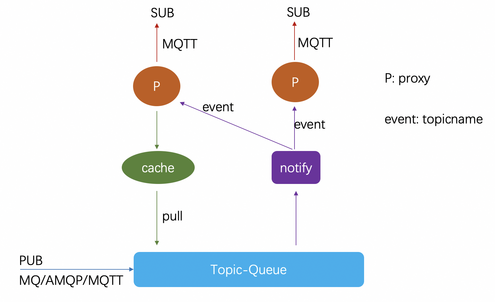
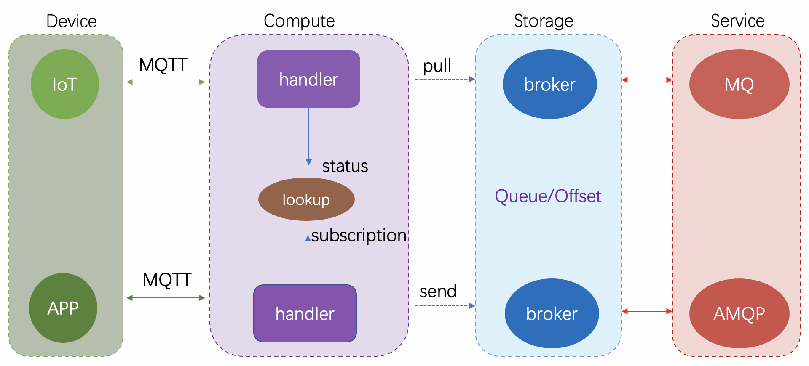

# RocketMQ MQTT Overview
The traditional message queue MQ is mainly used for message communication between services (ends), such as transaction messages, payment messages, logistics messages, etc. in the e-commerce field. However, under the general category of messages, there is another very important and common message field, that is, IoT terminal device messages. In recent years, we have seen the explosive growth of IoT device-oriented news arising from smart home and industrial interconnection, and the news on the mobile APP side of the mobile Internet, which has been developed for more than ten years, is still orders of magnitude huge. The order of magnitude of messages for terminal devices is many orders of magnitude larger than that of traditional servers and is still growing rapidly.

If there is a unified message system (product) to provide multi-scenario computing (such as stream, event) and multi-scenario (IoT, APP) access, it is actually very valuable, because messages are also important data. There is only one system, which can minimize storage costs and effectively avoid the consistency problems and challenges caused by data synchronization between different systems.

Based on this, we introduced the RocketMQ-MQTT extension project to realize RocketMQ's unified access to the messages of IoT devices and servers, and provide integrated message storage and intercommunication capabilities.

## MQTT  Protocol
In the IoT terminal scenario, the MQTT protocol is widely used in the industry at present, which is a standard open protocol defined by the OASIS Alliance that originated from the IoT scenario of the Internet of Things. Because there are many types of IoT devices and different operating environments, a standard access protocol is particularly critical.

The MQTT protocol defines a Pub/Sub communication model, which is similar to RocketMQ, but it is more flexible in the way of subscription, and can support multi-level Topic subscriptions (such as "/t/t1/t2"), and can even support Wildcard subscription (such as "/t/t1/+").

## Model introduction
### Queue Storage Model

We have designed a topic queue model for multi-dimensional distribution. As shown in the figure above, messages can come from various access scenarios (such as MQ/AMQP on the server side and MQTT on the client side), but only one copy will be written and stored in the commitlog, and then Distribute the queue index (ConsumerQueue) of multiple demand scenarios. For example, the server-side scenario (MQ/AMQP) can perform traditional server-side consumption according to the first-level Topic queue, and the client-side MQTT scenario can consume according to MQTT multi-level Topic and wildcard subscription. 

Such a queue model can support the access and message sending and receiving of the server and terminal scenarios at the same time, achieving the goal of integration.
### Push-Pull Model

The above figure shows a push-pull model. The P node in the figure is a protocol gateway or broker plug-in, and the terminal device is connected to the gateway node through the MQTT protocol. Messages can be sent from a variety of scenarios (MQ/AMQP/MQTT). After being stored in the Topic queue, there will be a notify logic module to sense the arrival of the new message in real time, and then a message event (that is, the topic name of the message) will be generated. The event is pushed to the gateway node, and the gateway node performs internal matching according to the subscription status of the connected terminal devices, finds which terminal devices can be matched, and then triggers a pull request to the storage layer to read the message and push it to the terminal device.

## Architecture Overview

Our goal is to achieve an integrated and self-closed loop based on RocketMQ, but we don't want Broker to be invaded into more scenario logic. We abstract a protocol computing layer, which can be a gateway or a broker plug-in. Broker focuses on solving Queue issues and doing some Queue storage adaptation or transformation to meet the above computing needs. The protocol computing layer is responsible for protocol access and must be pluggable and deployed.